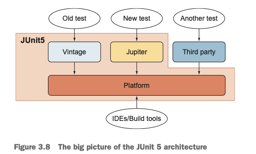
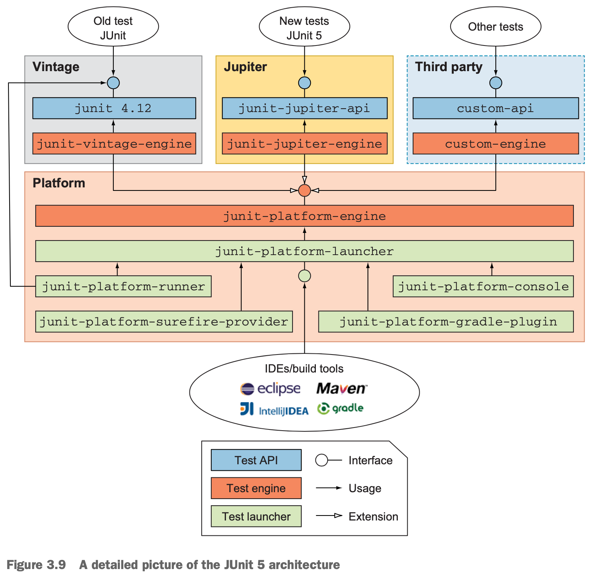

> [JUnit in Action, Third Edition](https://book.douban.com/subject/36226463/)

## 

## JUnit5 architecture

- JUnit Platform 

  作为在JVM上运行测试框架的基础。提供API给控制台，IDEs以及构建工具来执行测试

- JUnit Jupiter

  写测试以及对JUnit5进行拓展

- Junit Vintage

  兼容JUnit3以及JUnit4

---

## Test types

- Unit testing（单元测试）
- Integration testing（集成测试）
- System testing（系统测试）
- Acceptance testing（验收测试）
- Black-box testing（黑盒测试）
- White-box testing（白盒测试）

