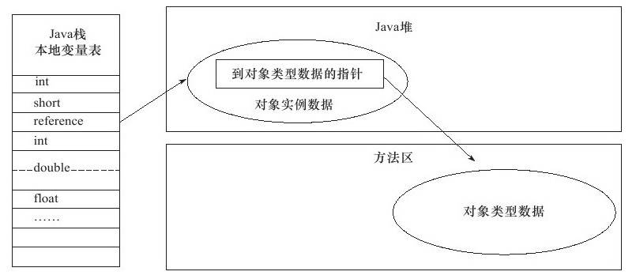
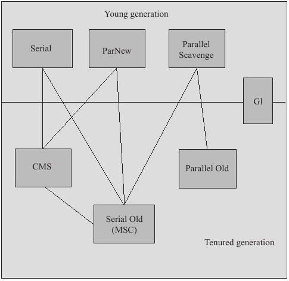
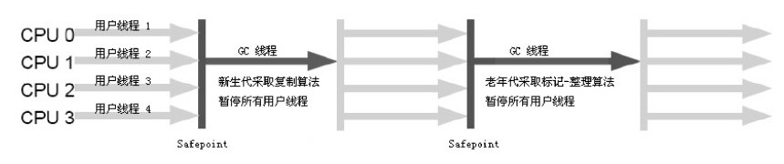
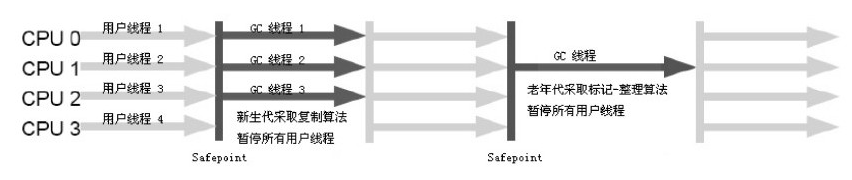
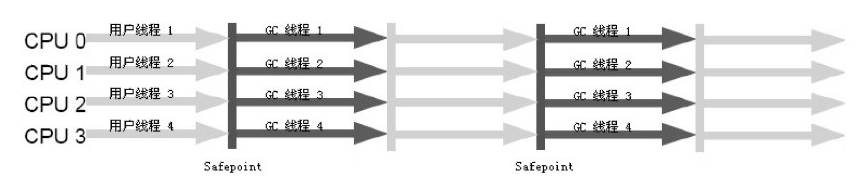
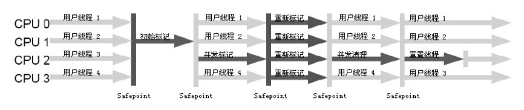
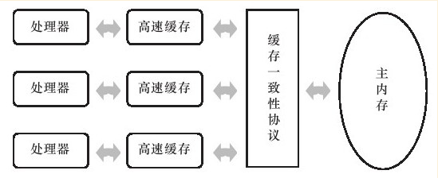
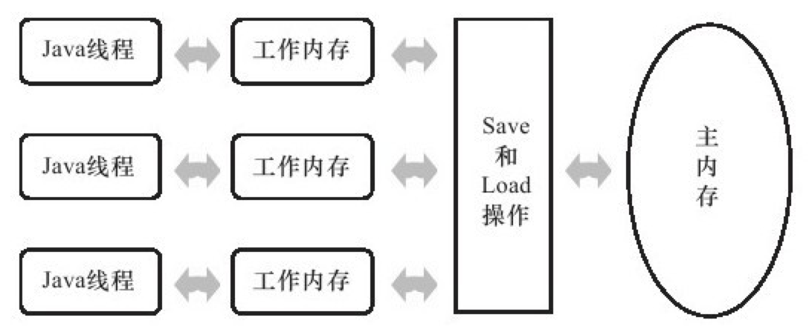

>   《深入理解 Java 虚拟机》 笔记

### 2.2 运行时数据区域

Java 虚拟机所管理的内存包括以下几个运行时数据区域：


#### 2.2.1 程序计数器

`程序计数器 (Program Counter Register)` 是一块较小的内存空间，可以看作是当前线程所执行的字节码的行号指示器。

字节码解析器就是通过改变这个计数器的值来选取下一条需要执行的字节码指令，分支、循环、跳转、异常处理、线程恢复等基础功能都需要依赖计数器来完成。

由于 Java 虚拟机的多线程是通过线程轮询并分配处理器执行时间的方式来实现的，在任何一个确定的时刻，一个处理器都会执行一条线程中的指令。因此，为了线程切换后能恢复到正确的执行位置，每条线程都需要一个独立的程序计数器，各线程之间计数器互不影响，独立存储，我们称这类内存区域为 "线程私有" 的内存。

如果线程正在执行的是一个 Java 方法，这个计数器记录的是正在执行的虚拟机字节码指令的地址。
如果正在执行的是 `Native` 方法，这个计数器值则为空 (`Undefined`)。

此内存区域是唯一一个在 Java 虚拟机规范中没有规定任何 `OutOfMemoryError` 情况的区域。

#### 2.2.2 Java 虚拟机栈

`Java 虚拟机栈 (Java Virtual Machine Stacks)` 也是线程私有的，它的生命周期与线程相同。

虚拟机栈描述的就是 Java 方法执行的内存模型：每个方法在执行的同时都会创建一个**栈帧** (`Stack Frame`) 用于存储局部变量表、操作数栈、动态链接、方法出口等信息。每一个方法从调用到执行完成的过程，就对应一个栈帧在虚拟机栈中入栈到出栈。

**局部变量表**存放了编译期可知的各种基本数据类型、对象引用和 `returnAddress` 类型。

>   **基本数据类型 :** boolean、byte、char、short、int、float、long、double  
>   **对象引用 :** reference 类型，它不等同于对象本身，可能是一个指向对象起始地址的引用指针，也可能是指向一个代表对象的句柄或其它与此对象相关的位置。  
>   **`returnAddress` 类型 :** 指向一条字节码指令的地址。

64 位长度的 `long` 和 `double` 类型的数据会占用 2 个局部变量空间 (slot)，其余的数据类型只占用 1 个。
局部变量表所需的内存空间在编译期间完成分配，当进入一个方法时，这个方法需要在帧中分配多大的局部变量空间是完全确定的，在方法运行期间不会改变局部变量表的大小。

Java 虚拟机规范对这个区域规定了两种异常情况：

-   如果线程请求的栈深度大于虚拟机所允许的深度，将抛出 `StackOverflowError` 异常

-   如果虚拟机栈可以动态扩展，在扩展时无法申请到足够的内存，将会抛出 `OutOfMemoryError` 异常。

    >   大部分的 Java 虚拟机都可以动态扩展，只不过 Java 虚拟机规范中也允许固定长度的虚拟机栈。

#### 2.2.3 本地方法栈

`本地方法栈 (Native Method Stack)` 与虚拟机栈的作用相似，不同点在于虚拟机栈为虚拟机执行 Java 方法 ( 字节码 ) 服务，而本地方法栈则为虚拟机使用到的 `Native` 方法服务。

在虚拟机规范中，对本地方法栈中方法使用的语言、使用方式与数据结构并没有强制规定，所以虚拟机可以自由实现它。

>   有的虚拟机 (例 : Sun HotSpot 虚拟机) 直接将本地方法栈与虚拟机栈合二为一。

与虚拟机栈一样，本地方法栈区域也会抛出 `StackOverflowError` 和 `OutOfMemoryError` 异常。

#### 2.2.4 Java 堆

`堆 (Heap)` 是被所有线程共享的一块内存区域，在虚拟机启动时创建。

此内存区域的唯一目的就是存放对象实例，几乎所有的对象实例都在这里分配内存。

>   栈上分配、标量替换优化技术会有一点不同

堆是垃圾收集器管理的主要区域，因此也被称为 "GC 堆" (`Garbage Collected Heap`)。

从内存回收的角度看，由于现在收集器基本都采用**分代收集算法**，所以堆还可以细分为 : 新生代和老年代；还可以再细分为 `Eden` 空间、`From Survivor` 空间、`To Survivor` 空间。

从内存分配的角度看，线程共享的堆中可以划分出多个线程私有的**分配缓冲区** (`Thread Local Allocation Buffer, TLAB`)。

根据 Java 虚拟机规范，堆可以处于物理上不连续的内存空间中，只要逻辑上是连续的即可。在实现时，既可以实现成固定大小的，也可以是可扩展的。如果在堆中没有内存完成实例分配，并且堆也无法再扩展时，将会抛出 `OutOfMemoryError` 异常。

#### 2.2.5 方法区

`方法区 (Method Area)` 与堆一样，是各个线程共享的内存区域，它用于存储已被虚拟机加载的类信息、常量、静态变量、即时编译器编译后的代码等数据。

方法区与永久代（Permanent Generation）本质上两者并不等价，仅仅是因为 HotSpot 虚拟机的设计团队选择把 GC 分代收集扩展至方法区，或者说使用永久代来实现方法区。

根据 Java 虚拟机规范，当方法区无法满足内存分配需求时，将抛出 `OutOfMemoryError` 异常。

#### 2.2.6 运行时常量池

`运行时常量池 (Runtime Constant Pool)` 是方法区的一部分。

`Class` 文件中除了有类的版本、字段、方法、接口等描述信息外，还有常量池 (`Constant Pool Table`)，用于存放编译期生成的各种字面量和符号引用，这部分内容在类加载后进入方法区的运行时常量池存放。

Java 虚拟机规范对运行时常量池没有做任何细节的要求，不同的提供商实现的虚拟机可以按照自己的需要来实现这个内存区域。
一般来说，除了保存 `Class` 文件中描述的符号引用外，还会把翻译出来的直接引用也存储在运行时常量池中。

并不一定只有编译期产生的常量才能进入方法区运行时常量池，运行期间也可能将新的常量放入池中。

>   例如：String.intern() 方法

作为方法区的一部分，受到方法区内存的限制，当常量池无法再申请到内存时会抛出 `OutOfMemoryError` 异常。

#### 2.2.7 直接内存

`直接内存 (Direct Memory)` 既不是虚拟机运行时数据区的一部分，也不是 Java 虚拟机规范中定义的内存区域。

本机直接内存的分配不会受到 Java 堆大小的限制，但是肯定会受到本机总内存大小以及处理器寻址空间的限制。如果在配置虚拟机参数时，忽略了直接内存，使得各个内存区域总和大于物理内存限制，会导致动态扩展时出现 `OutOfMemoryError` 异常。

### 2.3 HotSpot 虚拟机对象探秘

深入探讨 HotSpot 虚拟机在 Java 堆中对象分配、布局和访问的全过程。

>   对象仅限于普通 Java 对象，不包括数组和 Class 对象

#### 2.3.1 对象的创建

虚拟机遇到一条 `new` 指令时，首先将会去检查这个指令的参数是否能在常量池中定位到一个类的符号引用，并且检查这个符号引用代表的类是否已被加载、解析和初始化过。如果没有，则先执行相应的类加载过程。

在类加载检查通过后，虚拟机将为新生对象分配内存。对象所需内存的大小在类加载后可以完全确定，为对象分配空间的任务等同于把一块确定大小的内存从 Java 堆中划分出来。

内存的分配方式：

-   **指针碰撞 (Bump the Pointer)** : 假设 Java 堆中内存是绝对规整的，所有用过的内存放在一边，空闲的内存放在另一边，中间放着一个指针作为分界点的指示器，那分配内存就仅仅是把指针向空闲空间那边挪动一段与对象大小相等的距离。
-   **空闲列表 (Free List)** : 如果 Java 堆中的内存并不是规整的，已使用的内存和空闲的内存相互交错，那就没有办法简单地进行指针碰撞了，虚拟机必须维护一个列表，记录哪些内存是可用的，在分配的时候从列表中找到一块足够大的空间划分给对象实例，并更新列表上的记录。

在使用 **Serial (串行)**、**ParNew (并行)** 等带有压缩整理的收集器时，系统采用的分配算法是指针碰撞，而使用基于**标记清除算法 (Mark-Sweep)** 的 **CMS (Concurrent Mark Sweep)** 收集器时，通常采用空闲列表。

由于在虚拟机中，对象创建是非常频繁的行为，所以在并发情况下需要保证线程安全。  
解决这个问题的两种方案如下：

-   对分配内存空间的动作进行同步处理，采用 *CAS* 的方式保证更新操作的原子性。

-   把内存分配的动作按照线程划分在不同的空间之中进行。即每个线程在 Java 堆中预先分配一小块内存，也就是本地线程分配缓冲区 (Thread Local Allocation Buffer, TLAB)。哪个线程需要分配内存，就在哪个线程的 `TLAB` 上分配，只有 `TLAB` 用完并分配新的 `TLAB` 时，才需要同步锁定。

    >   虚拟机是否使用 TLAB，可以通过 `-XX:+/-UseTLAB` 来设置

内存分配完成后，虚拟机将分配到的内存空间都初始化为零值 (不包括对象头)。如果使用 TLAB，这个过程将会在 `TLAB` 分配时进行。  
这一步操作保证了对象的实例字段在 Java 代码中可以不赋初始值就直接使用，程序能访问到这些字段的数据类型所对应的零值。

接下来，虚拟机对对象的一些信息进行设置，将这些信息保存在**对象头 (Object Header)** 中。

>   例如这个对象是哪个类的实例、如何才能找到类的元数据信息、对象的哈希码、对象的 GC 分代年龄等信息

根据虚拟机当前的运行状态的不同，对象头会有不同的设置方式。

>   例如是否使用偏向锁等

在上面的工作都完成了之后，从虚拟机的角度来看，一个新的对象已经产生了，但是从 Java 程序的角度看，对象创建才刚刚开始，因为 `<init>` 方法还没有执行，所有的字段都还为零。所以，一般来说，执行 `new` 指令后会执行 `<init>` 方法，把对象按照程序员的意愿进行初始化，这时候一个可用的对象才算初始化完全。

#### 2.3.2 对象的内存布局

在 HotSpot 虚拟机中，对象在内存中存储的布局分为 3 块区域：对象头 (`Head`)、实例数据 (`Instance Data`)、对齐填充 (`Padding`)。

**对象头**包含两部分信息：

-   存储对象自身的运行时数据

    >   例如：哈希码 (`HashCode`)、GC 分带年龄、锁状态标志、线程持有的锁、偏向线程 ID、偏向时间戳等

    这部分数据的长度在 32 位和 64 位的虚拟机 (未开启压缩指针) 中分别为 `32bit` 和 `64bit`，称为 `Mark Word`。

-   类型指针。即对象指向它的类元数据的指针，虚拟机通过这个指针来确定这个对象是哪个类的实例。

    >   但是不是所有的虚拟机实现都必须在对象数据上保留类型指针，也就是说，查找对象的元数据信息并不一定要经过对象本身。
    >
    >   如果对象是一个 Java 数组，那么在对象头还必须有一块用于记录数组长度的数据，因为虚拟机可以通过普通 Java 对象的元数据信息确定 Java 对象的大小，但是从数组的元数据中却无法确定数组的大小。

**实例数据部分**是对象真正存储的有效信息。也就是程序代码中定义的各种类型的字段内容。这部分的存储顺序会受到虚拟机分配策略参数 (`FieldsAllocationStyle`) 和字段在 Java 源码中定义顺序的影响。

HotSpot 虚拟机默认的分配策略为 `longs/doubles`、`ints`、`shorts/chars`、`bytes/booleans`、`oops (Ordinary Object Pointers)`，从分配策略中可以看出来，相同宽度的字段总是被分配到一起。在满足这个前提条件的情况下，在父类中定义的变量会出现在子类之前。如果 `CompactFields` 参数值为 `true` (默认为 `true`)，那么子类中较窄的变量也可能会插入到父类变量的空隙之中。

**对齐填充**不是必然存在的，它仅仅起到占位符的作用。因为 HotSpot VM 的自动内存管理系统要求对象起始地址必须是 8 字节的整数倍，也就是说，对象的大小必须是 8 字节的整数倍。而对象头部分正好是 8 字节的倍数 (1 倍或 2 倍)，所以当对象实例数据没有对齐时，就需要通过对齐填充来补全。

#### 2.3.3 对象的定位访问

Java 程序需要通过栈上的 `reference` 数据来操作堆上的具体对象。由于 `referenece` 类型在 Java 虚拟机规范中只规定了一个指向对象的引用，并没有定义这个引用应该通过何种方式去定位、访问堆中对象的具体位置，所以对象的访问方式也是取决于虚拟机的实现。

主要有如下两种访问方式：

-   **句柄访问** : Java 堆中将会划分出一块内存来作为句柄池，`reference` 中存储的就是对象的句柄地址，而句柄中包含了对象实例数据与类型数据各自的具体地址信息。

    

-   **直接指针访问** : Java 堆对象的布局中放置访问类型数据的相关信息，`reference` 中存储对象的地址。

    

使用句柄访问的最大好处是 `reference` 中存储的是稳定的句柄地址，在对象被移动时（垃圾收集时会移动对象）只会改变句柄中的实例数据指针，而 `reference` 本身不需要修改。

使用直接指针访问的最大好处是速度更快，它节省了一次指针定位的时间开销。

>   Sun HotSpot 使用第二种方式进行对象访问

#### 2.4.1 Java 堆溢出

Java 堆用于存储对象实例，只要不断地创建对象，并且保证 `GC Roots` 到对象之间有可达路径来避免垃圾回收机制清除这些对象，那么在对象数量到达最大堆的容量限制后就会产生内存溢出异常。

>   将堆的最小值 `-Xms` 参数与最大值 `-Xmx` 参数设置为一样可避免堆自动扩展

#### 2.4.2 虚拟机栈和本地方栈溢出

由于在 HotSpot 虚拟机中并不区分虚拟机栈和本地方法栈，所以 `-Xoss` 参数（设置本地方法栈大小）存在，但实际上是无效的，栈容量只由 `-Xss` 参数设定。

关于虚拟机栈和本地方法栈，在 Java 虚拟机规范中描述了两种异常：

-   如果线程请求的栈深度大于虚拟机所允许的最大深度，将抛出 `StackOverflowError` 异常。
-   如果虚拟机在扩展栈时无法申请到足够的内存空间，则抛出 `OutOfMemoryError` 异常。

>   经测试

在单线程下，无论是由于栈帧太大还是虚拟机栈容量太小，当内存无法分配的时候，虚拟机抛出的都是 `StackOverflowError` 异常。

在多线程下，为每个线程的栈分配的内存越大，越容易产生内存溢出异常。

在多线程情况下导致的内存溢出，在不能减少线程数或更换 64 位虚拟机的情况下，可以通过减少最大堆和减少栈容量来换取更多的线程。

#### 2.4.3 方法区和运行时常量池溢出

在 JDK1.6 中，`intern()` 方法会把首次遇到的字符串实例复制到永久代中，返回的也是永久代中这个字符串实例的引用。

在 JDK1.7 中，`intern()` 方法的实现不会再复制实例，只是在常量池中记录首次出现的实例引用。

方法区用于存放 Class 的相关信息，如类名、访问修饰符、常量池、字段描述、方法描述等。当前的很多主流框架，如 Spring 在对类进行增强时会使用到 `CGLib` 这类字节码技术，增强的类越多，就需要越大的方法区来保证动态生成的 Class 可以加载到内存。

#### 2.4.4 本机直接内存溢出

**直接内存**可以通过 `-XX:MaxDirectMemorySize` 指定，如果不指定，则默认与 Java 堆最大值（`-Xmx` 指定） 一样。

### 3.2 对象已死吗

垃圾收集器在对堆进行回收之前，第一件事情就是要确定哪些对象不再被使用，即判断对象是否还存活。

#### 3.2.1 引用计数算法

给对象中添加一个引用计数器，每当有一个地方引用它时，计数器值就加 1；当引用失效时，计数器值就减 1；任何时候计数器为 0 的对象就是不会再被使用的。

但是该算法很难解决对象之间相互循环引用的问题。

#### 3.2.2 可达性分析算法

通过一系列称为”GC Roots"的对象作为起始点，从这些节点开始向下搜索，搜索所走过的路径称为引用链（Reference Chain），当一个对象到 GC Roots 没有任何引用链相连时，则证明此对象是不可用的。

<div align="center"></div>
<div align="center">GC Roots</div>
在 Java 中，可作为 GC Roots 的对象为一下几种：

-   虚拟机栈（栈帧中的本地变量表）中引用的对象
-   方法区中类静态属性引用的对象
-   方法区中常量引用的对象
-   本地方法中 JNI （即 `Native` 方法）引用的对象

#### 3.2.3 再谈引用

JDK 1.2 之前，Java 中对引用的定义为，如果 `referenece` 类型的数据中存储的数值代表的是另外一块内存的起始地址，就成这块内存代表着一个引用。

JDK 1.2 之后，将引用分为如下四种：

-   强引用（Strong Reference）

    强引用在程序中普遍存在，类似 `Object obj = new Object()` 这类的引用。只要强引用还存在，垃圾收集器永远不会回收掉被引用的对象。

-   软引用（Soft Reference）

    用来描述那些还有用但是并非必需的对象。对于软引用关联着的对象，在系统将要发生内存溢出异常之前，将会把这些对象列进回收范围之中进行二次回收。如果这次回收还没有足够的内存，将会抛出内存溢出异常。使用 `SoftReference` 类实现软引用。

-   弱引用（Weak Reference）

    也是用来描述非必需对象，但是它的强度比软引用更弱一些，被弱引用关联的对象只能生存到下一次垃圾收集发生之前。使用 `WeakReference` 类来实现弱引用。

-   虚引用（Phantom Reference）

    它是最弱的一种引用关系。一个对象是否有虚引用的存在，完全不会对其生存时间构成影响，也无法通过虚引用来取得一个对象实例。为一个对象设置虚引用关联的唯一目的就是能在这个对象被收集器回收时收到一个系统通知。使用 `PhantomReference` 类来实现虚引用。

这 4 种引用强度依次逐渐减弱。

#### 3.2.4 生存还是死亡

一个对象是否被回收要经历两次标记过程：如果对象在进行可达性分析后发现没有与 GC Roots 相连接的引用链，那么它将会被第一次标记并且进行一次筛选，筛选的条件是此对象是否有必要执行 `finalize()` 方法。

当对象没有覆盖 `finalize()` 方法，或者 `finalize()` 方法已经被虚拟机调用过，虚拟机将这两种情况都视为没有必要执行。

如果这个对象被判定为有必要执行 `finalize()` 方法，那么这个对象将会被放置在一个叫做 `F-Queue` 的队列中，并在稍后由一个由虚拟机自动建立的、低优先级的 `Finalizer` 线程去执行它。

>   执行的意思是指：虚拟机会触发这个方法，但并不保证会等待它运行结束。因为，如果一个对象在 `finalize()` 方法中执行缓慢，或者发生了死循环，将可能会导致 `F-Queue` 队列中其他对象永久处于等待，甚至导致整个内存回收体系崩溃

稍后 GC 会对 `F-Queue` 中的对象进行第二次小规模的标记，如果对象在 `finalize()` 方法中重新与引用链上的任何一个对象建立关联（比如把自己赋值给某个类变量或者对象的成员变量），那么第二次标记时它将被移出队列。如果对象没有重新与引用链上的其它对象相关联，那么就会被回收了。

>   任何一个对象的 `finalize()` 方法都只会被系统自动调用一次，如果对象面临下一次回收，它的 `finalize()` 方法不会被再次执行。

#### 3.2.5 回收方法区

Java 虚拟机规范中不要求虚拟机在方法区实现垃圾收集。在方法区进行垃圾收集的效率比较低。

>   在堆中，尤其是在新生代中，进行一次垃圾收集一般可以回收 70%~95% 的空间，而永久代的垃圾收集效率远低于此。

永久代的垃圾收集主要回收两部分内容：废弃常量和无用的类。

回收废弃常量与回收 Java 堆中的对象非常类似。

>   以常量池中字面量的回收为例，假如一个字符串“abc”已经进入了常量池中，但是没有任何 `String` 对象引用常量池中的“abc”常量，也没有其他地方引用了这个字面量，如果这时发生了垃圾回收，而且有必要的话，这个“abc”常量就会被系统清理出常量池。

常量池中的其他类、接口、方法、字段的符号引用也与此类似。

判断一个类是否是无用的类需要同时满足以下 3 个条件：

-   该类所有的实例都已经被回收，也就是 Java 堆中不存在该类的任何实例
-   加载该类的 `ClassLoader` 已经被回收
-   该类对应的 `java.lang.Class` 对象没有在任何地方被引用，无法在任何地方通过反射访问该类的方法

虚拟机可以对满足了上述 3 个条件的无用类进行回收。但是并不是和对象一样，不使用了就必然会被回收。是否对类进行回收，HotSpot 虚拟机提供了 `-Xnoclassgc` 参数进行控制。

### 3.3 垃圾收集算法

介绍几种算法的思想以及发展过程。

#### 3.3.1 标记-清除算法（Mark-Sweep）

首先标记出所有需要回收的对象，在标记完成后统一回收所有被标记的对象。

缺点：

-   效率问题。标记和清除的效率都不高。
-   空间问题。标记清除之后会产生大量不连续的内存碎片，空间碎片太多可能会导致以后在程序运行过程中需要分配较大的对象时，无法找到足够的连续内存而不得不提前触发另一次垃圾收集动作。

#### 3.3.2 复制算法（Copying）

将可用内存按容量划分为大小相等的两块，每次只使用其中的一块。当这一块的内存用完了，就将还存活着的对象复制到另外一块上面，然后再把已使用过的内存空间一次清理掉。

这样每次都是对整个半区进行内存回收，内存分配时就不用考虑内存碎片的问题，只要移动堆顶指针，按顺序分配内存即可。

只是该算法的代价是将内存缩小为原来的一半。

>   现在的商业虚拟机都是采用这种收集算法来回收新生代

新生代中的内存分为一块较大的 `Eden` 空间和两块较小的 `Survivor` 空间，每次使用 `Eden` 和其中的一块 `Survivor`。当回收时，将 `Eden` 和 `Survivor` 中还存活着的对象一次性地复制到另外一块 `Survivor` 空间上，最后清理掉 `Eden` 和刚才用过的 `Survivor` 空间。

HotSpot 虚拟机默认 `Eden` 和 `Survivor` 的大小比例为 8:1。也就是每次新生代中可用内存空间为整个新生代容量的 90%，只有 10% 的内存会被浪费。

但是我们没有办法保证每次回收后，`Survivor` 中都有足够的空间来存放存活的对象，这时就需要依赖其它内存（老年代）进行分配担保（`Handle Promotion`）。

>   **分配担保**：如果另外一块 `Survivor` 空间没有足够的空间来存放上一次新生代收集下来的存活对象时，这些对象将直接通过分配担保机制进入老年代。

#### 3.3.3 标记-整理算法（Mark-Compact）

复制收集算法在对象存活比较高的情况下需要进行比较多的复制操作，效率将会变低。而且可能还需要额外的空间进行分配担保，以应对被使用的内存中所有对象都 100% 存活的极端情况，所以在老年代一般不选用这种算法。

标记-整理算法的标记过程跟标记-清除算法一样，但是后续不是直接对可回收对象进行清理，而是让所有存活的对象都向一端移动，然后直接清理掉端边界以外的内存。

#### 3.3.4 分代收集算法（Generational Collection）

>   现在商业虚拟机的垃圾收集都采用分带收集算法

根据对象存活周期的不同将内存划分为几块。

一般是把 Java 堆分为新生代和老年代，根据各个年代的特点采用最适当的收集算法。  
在新生代中，每次垃圾收集时发现大量的对象死去，只有少量存活，则选用复制算法。  
老年代因为对象存活率高、没有额外的空间对它进行分配担保，则使用标记-清除或者标记-整理算法来进行回收。

### 3.4 HotSpot 的算法实现

在 HotSpot 虚拟机上实现这些算法时，还必须保证虚拟机高效运行。

#### 3.4.1 枚举根节点

>   以可达性分析中从 GC Roots 节点查找引用链操作为例

可作为 GC Roots 的节点主要在全局性的引用（如常量或类静态属性）与执行上下文（如栈帧中的本地变量表）中，但是现在很多应用仅仅方法区就有数百兆，如果逐个检查这里面的引用，将会消耗很多时间。

而且，可达性分析对执行时间的敏感还体现在 GC 停顿上，因为分析工作必须在一个能确保一致性的快照中进行。

>   一致性：在整个分析期间，整个执行系统看起来就像被冻结在某个时间点上，不可以出现分析过程中对象引用关系还在不断变化的情况，这点是导致 GC 时必须停顿所有 Java 执行线程（Sun 称之为 Stop The World）的一个重要的原因

目前主流 Java 虚拟机使用的都是**准确式 GC**。

>   虚拟机可以知道内存中某个位置的数据具体是什么类型

所以当执行系统停顿下来后，并不需要一个不漏的检查完所有执行上下文和全局的引用位置。虚拟机可以知道哪些地方存放着对象引用。

>   在 HotSpot 的实现中，使用一组称为 OopMap 的数据结构，在类加载完成时，HotSpot 就把对象内什么偏移量上是什么类型的数据计算出来，在 JIT 编译过程中，会在*特定的位置*记录栈和寄存器中哪些位置是引用。

#### 3.4.2 安全点（Safepoint）

在 OopMap 的协助下，HotSpot 可以快速准确地完成 GC Roots 枚举。但是有一个问题就是：可能导致引用关系变化，或者说 OopMap 内容变化的指令非常多，如果为每一条指令都生成对应的 OopMap，需要大量的额外空间，这样 GC 的空间成本会变得更高。

实际上，HotSpot 没有为每条指令都生成 OopMap，只在特定的位置记录这些信息，这些位置被称为**安全点**。

即程序执行时并不是在所有地方都能停顿下来开始 GC，只有在到达安全点时才能暂停。

安全点的选定如果太少会导致 GC 等待时间太长，太多会导致增大运行时的负荷。所以安全点的选定基本上是以程序“是否具有让程序长时间执行的特征”为标准进行选定。

>   因为每条指令执行的时间都非常短暂，程序不太可能因为指令流太长而长时间运行。“长时间执行”最明显的特征就是指令序列复用，例如方法调用、循环跳转、异常跳转等，具有这些功能的指令才会产生安全点。

对于安全点，另一个需要考虑的问题是，如何在 GC 发生时让所有线程在安全点上停下来。

有如下两种方案：

-   **抢先式中断（Preemptive Suspension）**：不需要线程的执行代码主动去配合，在 GC 发生时，首先把所有线程全部中断，如果发现有线程中断的地方不在安全点上，就恢复该线程，让它跑到安全点上。

    >   现在很少有虚拟机采用这种方式来暂停线程

-   **主动式中断（Voluntary Suspension）**：当 GC 需要中断线程时，不直接对线程操作，仅仅是设置一个标志，各个线程执行时主动去轮询这个标志，发现中断为真时就自己中断挂起。轮询标志的地方与安全点是重合的，再加上创建对象需要分配内存的地方。

#### 3.4.3 安全区域（Safe Region）

安全点机制保证了程序执行时，在不太长的时间内就会遇到可进入 GC 的安全点。但是在线程处于 Sleep 或者 Blocked 状态时，线程无法响应 JVM 的中断请求，JVM 也不会等待线程重新被分配 CPU 时间。

对于这种情况，可以使用安全区域来解决。

安全区域是指在一段代码片段之中，引用关系不会发生变化。在这个区域中的任意地方开始 GC 都是安全的。

当线程执行到安全区域中的代码时，首先标识自己已经进入了安全区域，在这段时间里 JVM 发起 GC 时，就不用管标识自己为安全区域状态的线程。
当线程要离开安全区域时，它要检查系统是否已经完成了根节点枚举（或者整个 GC 过程），如果完成了，那线程就继续执行，否则它必须等待直到收到可以安全离开安全区域的信号为止。

### 3.5 垃圾收集器

<div align="center"></div>
>   上图展示了 7 种作用于不同分代的收集器，如果两个收集器之间存在连线，就说明它们可以搭配使用。虚拟机所处的区域表示它是属于新生代还是老年代收集器

#### 3.5.1 Serial 收集器

一个单线程的收集器，说它是单线程并不是说它只会使用一个 CPU 或一条收集线程去完成垃圾收集工作。而是在它进行垃圾收集时，必须暂停其它所有的工作线程，直到它收集结束。这项工作实际上是由虚拟机在后台自动发起和自动完成的，在用户不可见的情况下把用户正常工作的线程全部停掉。这对很多应用来说都是难以接受的。

>   Serial / Serial Old 收集器的运行过程



但是，Serial 收集器是虚拟机运行在 Client 模式下的默认新生代收集器。它的优势在于：对于限定单个 CPU 的环境来说，Serial 收集器由于没有线程交互的开销，专心做垃圾收集可以获得最高的单线程收集效率。在用户的桌面应用场景中，分配给虚拟机管理的内存一般来说也不会很大，收集几十兆甚至一两百兆的新生代，停顿时间可以控制在几十毫秒到一百多毫秒以内，只要不是频繁反生，这点停顿是可以接受的。

所以，Serial 收集器对于运行在 Client 模式下的虚拟机来说是一个很好的选择。

#### 3.5.2 ParNew 收集器

ParNew 收集器相当于 Serial 收集器的多线程版本，除了使用多线程进行垃圾收集外，其它的行为包括 Serial 收集器可用的所有控制参数、收集算法、对象分配规则、回收策略等都与 Serial 收集器完全一样，在实现上，两者共用了大量的代码。

>   ParNew 收集器的工作过程



ParNew 收集器是许多运行在 Server 模式下的虚拟机中首选的新生代收集器，其中有一个与性能无关但是很重要的原因是，除了 Serial 收集器外，目前只有它能与 CMS 收集器配合工作。

ParNew 收集器在单 CPU 的环境中不会比 Serial 收集器有更好的效果，甚至由于存在线程交互的开销，在通过超线程技术实现的两个 CPU 的环境中不能百分之百的保证可以超越 Serial 收集器。但是随着可以使用的 CPU 数量的增加，它对于 GC 时系统资源的有效利用还是有好处的。

ParNew 收集器默认开启的收集线程数与 CPU 的数量相同，可以通过 `-XX:ParallelGCThreads` 来限制垃圾收集的线程数。

#### 3.5.3 Parallel Scavenge 收集器

Parallel Scavenge 收集器是一个新生代收集器，使用复制算法，并行的多线程收集器。

Parallel Scavenge 收集器的目标是达到一个可控制的吞吐量（Throughput）。

>   吞吐量：CPU 用于运行用户代码的时间与 CPU 总消耗时间的比值，即吞吐量 = 运行用户代码的时间 / （运行用户代码的时间 + 垃圾收集的时间）。  
>   例如：虚拟机总共运行了 100 分钟，其中垃圾收集花掉 1 分钟，那吞吐量就是 99%。

Parallel Scavenge 收集器提供了两个参数来精确控制吞吐量。

-   `-XX:MaxGCPauseMillis`：允许的值为一个大于 0 的毫秒数，收集器将尽可能的保证内存回收花费的时间不超过设定值。

    >   把这个参数的值设置的小一点并不是说就能使得系统的垃圾收集速度变得更快，GC 停顿时间的缩短是以牺牲吞吐量和新生代空间来换取的。

-   `-XX:GCTimeRatio`：值为一个大于 0 且小于 100 的整数，用于设置垃圾收集时间占总时间的比率。公式为：`1/(1+n)`

    >   如果此参数的值为 19，那允许的最大 GC 时间就占总时间的 5%

Parallel Scavenge 收集器可以通过一个开关参数 `-XX:+UseAdaptiveSizePolicy` 来动态调整新生代的大小、Eden 和 Survivor 区的比例，晋升老年代对象年龄等参数。这种调节方式称为**GC 自适应的调节策略（GC Ergonomics）**。

#### 3.5.4 Serial Old 收集器

Serial Old 是 Serial 收集器的老年代版本，也是一个单线程收集器，使用“标记-整理”算法。这个收集器主要给 Client 模式下的虚拟机使用。

如果在 Server 模式下，主要有两大用途：

-   在 JDK 1.5 以及之前的版本中与 Parallel Scavenge 收集器搭配使用
-   作为 CMS 收集器的后备预案，在并发收集发生 Concurrent Mode Failure 时使用。

Serial Old 收集器的工作过程如下图：


#### 3.5.5 Parallel Old 收集器

Parallel Old 是 Parallel Scavenge 收集器的老年代版本，使用多线程和“标记-整理”算法。

在注重吞吐量以及 CPU 资源敏感的场合，都可以优先考虑 Parallel Scavenge 加 Parallel Old 收集器。工作过程如下：


#### 3.5.6 CMS 收集器

CMS（Concurrent Mark Sweep）收集器是一种以获取最短回收停顿时间为目标的收集器，使用“标记-清除”算法。运作过程分为一下 4 个步骤：

-   初始标记（CMS initial mark）
-   并发标记（CMS concurrent mark）
-   重新标记（CMS remark）
-   并发清除（CMS concurrent sweep）

初始标记、重新标记这两个步骤需要“Stop The World”。

初始标记仅仅只是标记一下 GC Roots 能直接关联到的对象，速度很快。  
并发标记就是进行 GC RootsTracing 的过程。  
重新标记则是为了修正并发标记期间因用户程序继续运作而导致标记产生变动的那一部分对象的标记记录。这个阶段的停顿时间比初始标记阶段稍长，但是远比并发标记的时间短。

由于整个过程中耗时最长的并发标记和并发清除过程收集器线程都可以与用户线程一起工作，所以，总体上来说，CMS 收集器的内存回收过程是与用户线程一起并发执行的。运行示意图如下：



CMS 虽然有并发收集、低停顿的优点，但是也有以下 3 个明显的缺点：

-   CMS 收集器对 CPU 资源非常敏感。在并发阶段，它虽然不会导致用户线程停顿，但是会因为占用了一部分线程或者说 CPU 资源而导致应用程序变慢，总吞吐量会降低。

-   CMS 收集器无法处理浮动垃圾（Floating Garbage），可能出现“Concurrent Mode Failure”失败而导致另一次 Full GC 的产生。

    >   由于 CMS 并发清理阶段用户线程还在运行，程序运行自然就会有新的垃圾不断产生，这一部分垃圾出现在标记过程之后，CMS 无法在当次收集中处理掉它们，只好留到下一次 GC 时再清理掉。这一部分来及被称为“浮动垃圾”。
    >
    >   也是由于在垃圾收集阶段用户线程还需要运行，也就还需要预留有足够的内存空间给用户线程使用，因此 CMS 收集器不能像其他收集器那样等到老年代几乎完全被填满了再进行收集，需要预留一部分空间提供并发收集时的程序运作使用。

-   由于 CMS 是基于“标记-清除”算法实现的收集器，在收集结束时会产生大量的空间碎片。空间碎片过多时，将会给大对象分配带来很大的麻烦，会出现老年代还有很大空间剩余，但是无法找到足够大的连续空间来分配当前对象，不得不提前触发一次 Full GC。

#### 3.5.7 G1 收集器

与其它收集器相比，G1 具备如下特点：

-   并行与并发
-   分代收集
-   空间整合
-   可预测的停顿

#### 3.5.8 理解 GC 日志

如下两段典型的 GC 日志：

```java
33.125:[ GC[ DefNew: 3324K -> 152K(3712K), 0.0025925 secs] 3324K -> 152K(11904K), 0.0031680 secs]

100.667:[ Full GC[ Tenured: 0K -> 210K(10240K), 0.0149142 secs] 4603K -> 210K(19456K), [ Perm: 2999K -> 2999K(21248K)], 0.0150007 secs] [ Times: user=0.01 sys=0.00, real=0.02 secs]
```

-   `33.125 和 100.667`：GC 发生的时间。这个数字表示从 Java 虚拟机启动以来经过的秒数

-   `[GC 和 [Full GC`：垃圾收集的停顿类型。Full 表示这次 GC 发声了 Stop The World。如果是调用 `System.gc()` 方法所触发的收集，那么将显示 [Full GC (System)。

-   `[DefNew、[Tenured、[Perm`：GC 发生的区域。显示的区域名称与使用的 GC 收集器是密切相关的。

    >   Serial 收集器中新生代名为“Default New Generation”，所以显示的是 [DefNew  
    >   如果是 ParNew 收集器，新生代名称就会变为 [ParNew，表示“Parallel New Generation”  
    >   如果采用 Parallel Scavenge 收集器，那么将会显示 PSYoungGen  
    >   老年代和永久代同理，名称也由收集器决定。

-   `3324K -> 152K(3712K)`：GC 前该内存区域已使用容量 -> GC 后该内存区域已使用容量（该内存区域总容量）

-   `3324K -> 152K(11904K)`：GC 前 Java 堆已使用容量 -> GC 后 Java 堆已使用容量（Java 堆总容量）

-   `0.0025925 secs`：该内存区域 GC 所占用的时间，单位是秒。

    >   有的收集器会给出更具体的时间数据，例如“[Times:user=0.01 sys=0.00 real=0.02 secs]”，这里的 user、sys、real 与 Linux 的 time 命令所输出的时间含义一致，分别表示用户态消耗的 CPU 时间、内核态消耗的 CPU 时间和操作从开始到结束所经过的墙钟时间（Wall Clock Time）。  
    >   CPU 时间与墙钟时间的区别是，墙钟时间包括各种非运算的等待耗时，例如等待磁盘 I/O、等待线程阻塞，而 CPU 时间不包括这些耗时。  
    >   当系统有多 CPU 或者多核时，多线程操作会叠加 CPU 时间，所以 user 或 sys 时间超过 real 时间是完全正常的。

### 内存分配与回收策略

对象的内存分配，往大方向讲，就是在堆上分配，对象主要分配在新生代的 Eden 区，如果启动了本地线程分配缓冲，将按线程优先在 TLAB 上分配。少数情况下也可能直接分配在老年代中，分配的规则取决于当前使用的是哪一种垃圾收集器组合，还有虚拟机中与内存相关的参数设置。

>   接下来讲解几条最普遍的内存分配规则，测试代码 Client 模式虚拟机运行，没有手工指定收集器组合，也就是说验证的是在使用 Serial/Serial Old 收集器下的内存分配和回收的策略。

#### 3.6.1 对象优先在 Eden 分配

大多数情况下，对象在新生代 Eden 区中分配。当 Eden 区没有足够空间进行分配时，虚拟机将发起一次 Minor GC。

>   通过 `-XX:+PrintGCDetails` 参数，告诉虚拟机在发生垃圾收集行为时打印内存回收日志，并且在进程退出时输出当前内存各个区域的分配情况。


---


### 12.3 硬件的效率与一致性

绝大多数的运算任务都不可能只靠处理器“计算”就能完成，处理器至少要与内存交互，如读取运算数据、存储运算结果等，这个I/O操作是很难消除的（无法仅靠寄存器来完成所有运算任务）。

由于计算机的存储设备与处理器的运算速度有几个数量级的差距，所以现代计算机系统都不得不加入一层读写速度尽可能接近处理器运算速度的高速缓存（Cache）来作为内存与处理器之间的缓冲：将运算需要使用到的数据复制到缓存中，让运算能快速进行，当运算结束后再从缓存同步回内存之中，这样处理器就无须等待缓慢的内存读写了。

基于高速缓存的存储交互很好地解决了处理器与内存的速度矛盾，但是也为计算机系统带来更高的复杂度，因为它引入了一个新的问题：缓存一致性（Cache Coherence）。在多处理器系统中，每个处理器都有自己的高速缓存，而它们又共享同一主内存（Main Memory）。如下图所示：

<div align="center">  </div>
<div align="center">处理器、高速缓存、主内存间的交互关系</div>
<div></div>
当多个处理器的运算任务都涉及同一块主内存区域时，将可能导致各自的缓存数据不一致，如果真的发生这种情况，那同步回到主内存时以谁的缓存数据为准呢？为了解决一致性的问题，需要各个处理器访问缓存时都遵循一些协议，在读写时要根据协议来进行操作，这类协议有MSI、MESI（Illinois Protocol）、MOSI、Synapse、Firefly及Dragon Protocol等。

除了增加高速缓存之外，为了使得处理器内部的运算单元能尽量被充分利用，处理器可能会对输入代码进行乱序执行（Out-Of-Order Execution）优化，处理器会在计算之后将乱序执行的结果重组，保证该结果与顺序执行的结果是一致的，但并不保证程序中各个语句计算的先后顺序与输入代码中的顺序一致，因此，如果存在一个计算任务依赖另外一个计算任务的中间结果，那么其顺序性并不能靠代码的先后顺序来保证。与处理器的乱序执行优化类似，Java虚拟机的即时编译器中也有类似的指令重排序（Instruction Reorder）优化。

### 12.3 Java内存模型

一种Java内存模型（Java Memory Model, JMM）来屏蔽掉各种硬件和操作系统的内存访问差异，以实现让Java程序在各种平台下都能达到一致的内存访问效果。

#### 12.3.1 主内存与工作内存

Java内存模型的主要目标是定义程序中各个变量的访问规则，即在虚拟机中将变量存储到内存和从内存中取出变量这样的底层细节。此处的变量（Variables）与Java编程中所说的变量有所区别，它包括了实例字段、静态字段和构成数组对象的元素，但不包括局部变量与方法参数，因为后者是线程私有的<sup><a href="#note3">[3]</a></sup>，不会被共享，自然就不会存在竞争问题。

> [3]<a name="note3"></a>：如果局部变量是一个reference类型，它引用的对象在Java堆中可被各个线程共享，但是reference本身在Java栈的局部变量表中，它是线程私有的。

Java内存模型规定了所有的变量都存储在主内存（Main Memory）中，每条线程还有自己的工作内存（Working Memory），线程的工作内存中保存了被该线程使用到的变量的主内存副本拷贝<sup><a href="#note4">[4]</a></sup>，线程对变量的所有操作（读取、赋值等）都必须在工作内存中进行，而不能直接读写主内存中的变量。不同的线程之间也无法直接访问对方工作内存中的变量，线程间变量值的传递均需要通过主内存来完成。

> [4]<a href="note4"></a>：“假设线程中访问一个10MB的对象，也会把这10MB的内存复制一份拷贝出来吗？”，事实上并不会如此，这个对象的引用、对象中某个在线程访问到的字段是有可能存在拷贝的，但不会有虚拟机实现成把整个对象拷贝A一次。

<div align="center"></div>
<div align="center">线程、主内存、工作内存三者的交互关系</div>
<div></div>

#### 12.3.2 内存间交互操作

一个变量如何从主内存拷贝到工作内存、如何从工作内存同步回主内存之类的实现细节，Java内存模型中定义了以下8种操作来完成，虚拟机实现时必须保证下面提及的每一种操作都是原子的、不可再分的。

> 对于double和long类型的变量来说，load、store、read和write操作在某些平台上允许有例外

- lock（锁定）：作用于主内存的变量，它把一个变量标识为一条线程独占的状态。

- unlock（解锁）：作用于主内存的变量，它把一个处于锁定状态的变量释放出来，释放后的变量才可以被其他线程锁定。
- read（读取）：作用于主内存的变量，它把一个变量的值从主内存传输到线程的工作内存中，以便随后的load动作使用。
- load（载入）：作用于工作内存的变量，它把read操作从主内存中得到的变量值放入工作内存的变量副本中。
- use（使用）：作用于工作内存的变量，它把工作内存中一个变量的值传递给执行引擎，每当虚拟机遇到一个需要使用到变量的值的字节码指令时将会执行这个操作。
- assign（赋值）：作用于工作内存的变量，它把一个从执行引擎接收到的值赋给工作内存的变量，每当虚拟机遇到一个给变量赋值的字节码指令时执行这个操作。
- store（存储）：作用于工作内存的变量，它把工作内存中一个变量的值传送到主内存中，以便随后的write操作使用。
- write（写入）：作用于主内存的变量，它把store操作从工作内存中得到的变量的值放入主内存的变量中。

如果要把一个变量从主内存复制到工作内存，那就要顺序地执行read和load操作，如果要把变量从工作内存同步回主内存，就要顺序地执行store和write操作。

> Java内存模型只要求上述两个操作必须按顺序执行，而没有保证是连续执行。也就是说，read与load之间、store与write之间是可插入其他指令的，如对主内存中的变量a、b进行访问时，一种可能出现顺序是read a、read b、load b、load a。

除此之外，Java内存模型还规定了在执行上述8种基本操作时必须满足如下规则：

- 一个变量在同一个时刻只允许一条线程对其进行lock操作，但lock操作可以被同一条线程重复执行多次，多次执行lock后，只有执行相同次数的unlock操作，变量才会被解锁。
- 如果对一个变量执行lock操作，那将会清空工作内存中此变量的值，在执行引擎使用这个变量前，需要重新执行load或assign操作初始化变量的值。
- 对一个变量执行unlock操作之前，必须先把此变量同步回主内存中（执行store、write操作）。
- ... ...

#### 12.3.3 对于volatile型变量的特殊规则

当一个变量定义为volatile之后，它将具备两种特性，第一是保证此变量对所有线程的可见性，这里的“可见性”是指当一条线程修改了这个变量的值，新值对于其他线程来说是可以立即得知的。

由于volatile变量只能保证可见性，适合使用在以下场景中：

- 运算结果并不依赖变量的当前值，或者能够确保只有单一的线程修改变量的值。
- 变量不需要与其他的状态变量共同参与不变约束。

使用volatile变量的第二个语义是禁止指令重排序优化。

有volatile修饰的变量，赋值后多执行了一个带有lock前缀的空操作（lock addl$0x0, (%esp)），这个操作相当于一个内存屏障（Memory Barrier或Memory Fence，指重排序时不能把后面的指令重排序到内存屏障之前的位置）。只有一个CPU访问内存时，并不需要内存屏障；但如果有两个或多个CPU访问同一块内存，且其中有一个在观测另一个，就需要内存屏障来保证一致性。

lock前缀的作用是使得本CPU的Cache写入了内存，该写入动作也会引起别的CPU或者别的内核无效化（Invalidate）其Cache，这种操作相当于对Cache中的变量做了一次前面介绍Java内存模式中所说的“store和write”操作。所以通过这样一个空操作，可让前面volatile变量的修改对其他CPU立即可见。

看一下Java内存模型中对volatile变量定义的特殊规则。假定T表示一个线程，V和W分别表示两个volatile型变量，那么在进行read、load、use、assign、store和write操作时需要满足如下规则：

- load、read动作相关联，必须连续一起出现

  > 这条规则要求在工作内存中，每次使用V前都必须先从主内存刷新最新的值，用于保证能看见其他线程对变量V所做的修改后的值。

- store、write动作相关联，必须连续一起出现

  > 这条规则要求在工作内存中，每次修改V后都必须立刻同步回主内存中，用于保证其他线程可以看到自己对变量V所做的修改

- （这条更复杂的规则则是保证要求volatile修饰的变量不会被指令重排序优化，保证代码的执行顺序与程序的顺序相同）

#### 12.3.5 原子性、可见性与有序性

原子性（Atomicity）：Java内存模型保证的原子性操作包括read、load、assign、use、store和write，所以基本数据类型的访问读写是具备原子性的。

Java内存模型还提供了lock和unlock操作来满足这种需求，尽管虚拟机未把lock和unlock操作直接开放给用户使用，但是却提供了更高层次的字节码指令monitorenter和monitorexit来隐式地使用这两个操作，这两个字节码指令反映到Java代码中就是同步块——synchronized关键字，因此在synchronized块之间的操作也具备原子性。

可见性（Visibility）：可见性是指当一个线程修改了共享变量的值，其他线程能够立即得知这个修改。

普通变量与volatile变量的区别是，volatile的特殊规则保证了新值能立即同步到主内存，以及每次使用前立即从主内存刷新。因此，可以说volatile保证了多线程操作时变量的可见性，而普通变量则不能保证这一点。

synchronized和final这两个关键字能实现可见性：

- 同步块的可见性是由“对一个变量执行unlock操作之前，必须先把此变量同步回主内存中（执行store、write操作）”这条规则获得的
- final关键字的可见性是指：被final修饰的字段在构造器中一旦初始化完成，并且构造器没有把"this"的引用传递出去（this引用逃逸是一件很危险的事情，其他线程有可能通过这个引用访问到“初始化了一半”的对象），那在其他线程中就能看见final字段的值。

#### 12.3.6 先行发生原则

先行发生是Java内存模型中定义的两项操作之间的偏序关系，如果说操作A先行发生于操作B，其实就是说在发生操作B之前，操作A产生的影响能被操作B观察到。“影响”包括修改了内存中共享变量的值、发送了消息、调用了方法等。

