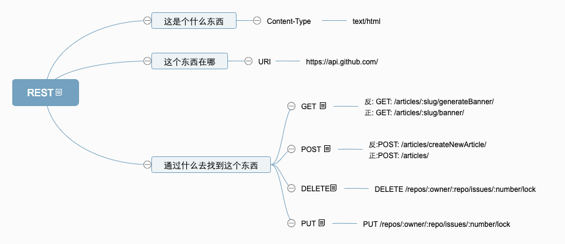

参考：
> [REST，以及RESTful的讲解](https://blog.csdn.net/qq_21383435/article/details/80032375)  
> [RESTful API Design: 13 Best Practices to Make Your Users Happy](https://blog.florimondmanca.com/restful-api-design-13-best-practices-to-make-your-users-happy)  
> [理解RESTful架构](http://www.ruanyifeng.com/blog/2011/09/restful.html)  

