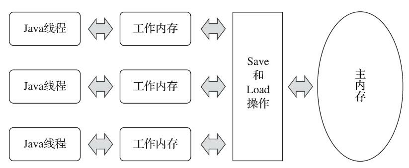

> 深入理解Java虚拟机：JVM高级特性与最佳实践（第3版）周志明

**7.4.2 双亲委派模型**

站在Java虚拟机的角度，只存在两种不同的类加载器：

- 一种是启动类加载器（Bootstrap ClassLoader）
- 另外一种就是其他所有的类加载器 这些类加载器都由Java语言实现，独立存在于虚拟机外部，并且全都继承自抽象类java.lang.ClassLoader 在JDK 8及之前版本的Java中什么是三层类加载器：
- 启动类加载器（Bootstrap Class Loader） 负责加载存放在`<JAVA_HOME>\lib`目录中的类库
- 扩展类加载器（Extension Class Loader） 负责加载`<JAVA_HOME>\lib\ext`目录中的类库
- 应用程序类加载器（Application Class Loader） 负责加载用户类路径（ClassPath）上所有的类库

类加载器双亲委派模型

不过这里类加载器之间的父子关系一般不是以继承（Inheritance）的关系来实现的，而是通常使用组合（Composition）关系来复用父加载器的代码。

双亲委派模型的工作过程是：如果一个类加载器收到了类加载的请求，它首先不会自己去尝试加载这个类，而是把这个请求委派给父类加载器去完成，每一个层次的类加载器都是如此，因此所有的加载请求最终都应该传送到最顶层的启动类加载器中，只有当父加载器反馈自己无法完成这个加载请求（它的搜索范围中没有找到所需的类）时，子加载器才会尝试自己去完成加载

**7.4.3 破坏双亲委派模型**

- 继承java.lang.ClassLoader重写loadClass()方法
- 线程上下文类加载器（Thread Context ClassLoader）

通过`java.lang.Thread`类的`setContextClassLoader()`方法进行设置

如果创建线程时还未设置，它将会从父线程中继承一个，如果在应用程序的全局范围内都没有设置过的话，那这个类加载器默认就是应用程序类加载器

例如JNDI、JDBC等都是通过SPI（Service Provider Interface，服务提供者接口）来完成加载

- 代码热部署

  > 完全弄懂了OSGi的实现，就算是掌握了类加载器的精粹

## 12.2 硬件的效率与一致性

由于计算机的存储设备与处理器的运算速度有着几个数量级的差距，所以现代计算机系统都加入了一层或多层读写速度尽可能接近处理器运算速度的高速缓存（Cache）来作为内存与处理器之间的缓冲：将运算需要使用的数据复制到缓存中，让运算能快速进行，当运算结束后再从缓存同步回内存之中，这样处理器就无须等待缓慢的内存读写了

**缓存一致性（Cache Coherence）：**

在多路处理器系统中，每个处理器都有自己的高速缓存，而它们又共享同一主内存（Main Memory），这种系统称为共享内存多核系统（Shared Memory Multiprocessors System）。当多个处理器的运算任务都涉及同一块主内存区域时，将可能导致各自的缓存数据不一致

处理器、高速缓存、主内存间的交互关系

为了解决一致性的问题，需要各个处理器访问缓存时都遵循一些协议，在读写时要根据协议来进行操作。比如：MESI等

### 12.3.1 主内存与工作内存

Java内存模型的主要目的是定义程序中各种变量的访问规则，即关注在虚拟机中把变量值存储到内存和从内存中取出变量值这样的底层细节

> 此处的变量（Variables）与Java编程中所说的变量有所区别，它包括了实例字段、静态字段和构成数组对象的元素，但是不包括局部变量与方法参数，因为后者是线程私有的，不会被共享，自然就不会存在竞争问题
>
> 如果局部变量是一个reference类型，它引用的对象在Java堆中可被各个线程共享，但是reference本身在Java栈的局部变量表中是线程私有的

---

Java内存模型规定了所有的变量都存储在主内存（Main Memory）中

> 此处的主内存与物理硬件中的主内存名字一样，两者也可以类比，但物理上它仅是虚拟机内存的一部分

每条线程还有自己的工作内存（Working Memory），线程的工作内存中保存了被该线程使用的变量的主内存副本

> 对象的引用以及线程访问对象的某个字段是有可能被复制的，但不会有虚拟机把整个对象复制一次

线程对变量的所有操作（读取、赋值等）都必须在工作内存中进行，而不能直接读写主内存中的数据

不同的线程之间也无法直接访问对方工作内存中的变量，线程间变量值的传递均需要通过主内存来完成

线程、主内存、工作内存三者的交互关系

