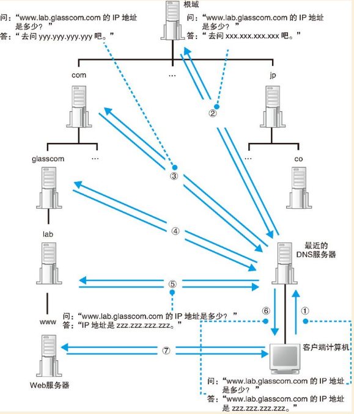

- `equals()` 与 `==` 的区别

  `==` 用来判断两个对象的地址是否相等

  `equals` 在没有重写时通过 `==` 来进行判断；否则通过具体的重写规则来判断

- `hashCode()` 与 `equals()` (在没有重写时的情况) 的关系

  如果两个对象通过 `equals()` 比较相等，那么它们的 `hashCode()` 值一定相等

  但是如果它们的 `hashCode()` 值相等，并不能说明它们使用 `equals()` 比较会相等

- `simhash` 算法

  用于海量文本去重。具有局部敏感性。

  >   参考：
  >
  >   [simhash算法原理及实现](http://www.lanceyan.com/tech/arch/simhash_hamming_distance_similarity.html)
  >
  >   [海量数据相似度计算之simhash和海明距离](http://www.lanceyan.com/tech/arch/simhash_hamming_distance_similarity.html)

- **Comparable** 接口与 **Comparator** 接口的区别

  1. `Comparable` 接口一般用于自然排序，`Comparator` 接口常常用于自定义排序。
  2. 原始类都实现了 `Comparable` 接口。除非是自定义了实现了 `Comparator`，否则排序为自然排序。
  3. 没有实现 `Comparable` 接口的类在调用 `Arrays.sort` 时会抛出 `ClassCastException` 异常。

- 冒泡排序

  依次比较两个相邻的元素，如果第一个元素比第二个元素大，则交换它们的位置。

  每次比较完一轮，最大的元素会排到最后。接着对剩下的元素重复这个过程。

  具体实现：[BubbleSort](https://github.com/YLongo/javademo/blob/master/src/main/java/github/io/YLongo/algorithm/sort/BubbleSort.java)

- 插入排序

- 快速排序

- 归并排序

- 二分查找

- HashMap

- LinkedHashMap

- ConcurrentHashMap

- ArrayList

- LinkedList

- HashSet  

- TreeSet  

- Hashtable、HashMap、TreeMap 有什么不同

  Hashtable 支持同步，不支持 null 键和值。

  HashMap 不支持同步，支持 null 键和值。通常情况下，put 或 get 操作，可以达到常数时间的性能。

  TreeMap 是基于红黑树的实现，提供顺序访问的 Map。put 或 get 或 remove 操作都是 O(log(n)) 的时间复杂度。具体顺序可以为自然顺序或者根据 Comparator 来判断。

- `HashMap` 什么情况下会产生死循环

  JDK1.7，在并发的情况下，rehash 操作会形成环形链表导致死循环。

  JDK1.8 不会出现这个问题。

  > 参考：[疫苗：JAVA HASHMAP的死循环](https://coolshell.cn/articles/9606.html)

- `hashcode()` 与 `equals()`

  1.  如果两个对象通过 equals() 方法返回相等，那么它们的 hashcode 必须相等
  2.  在应用程序中对同一个对象多次调用 hashcode() 方法，返回值相同。
      但是在多次执行应用程序期间不需要保持相同。 
  3.  如果对象通过 equals() 方法返回不相等，那么不要求它们的 hashcode 也不相等。也就是说不同的对象，可能 hashcode 值相同。

  >   参考：[override-hashcode-in-java-example](https://javarevisited.blogspot.com/2011/10/override-hashcode-in-java-example.html)

- ArrayList、LinkedList、Vector的区别

- HashMap、ConcurrentHashMap的区别

- HashMap、LinkedHashMap的区别

- ConcurrentHashMap 是怎么实现线程安全的

- HashMap 的长度为什么是 2 的幂次方

- HashMap 在 JAVA8 做了什么优化 

- 创建线程的方式

- 如何控制线程的执行顺序

  - 通过 `join` 方法
  - 通过 `Executors.newSingleThreadExecutor()` 线程池

- 线程池

- Runnable 接口和 Callable 接口的区别

- `wait()` 和 `sleep()` 的区别

  1.  wait 需要在同步的环境中被调用，sleep 没有这个要求
  2.  wait 的线程需要通过 notify() 或 notifyAll() 方法来唤醒，但是 sleep 则不需要
  3.  wait 通常是有条件的，但是 sleep 则没有
  4.  wait 会释放锁，但是 sleep 则不会
  5.  wait 在同步块锁定的对象上调用，但是 sleep 通过线程调用

- `yield()` 与 `sleep()` 的区别

  1.  `yield()` 会临时暂停当前线程，将机会让给其余等待的线程去执行。但是如果其它的线程优先级比较低或者没有其它等待的线程，那么该线程将会继续执行。
  2.  `sleep()` 暂停当前线程指定的时间。

- ReentrantLock

- ReadWriteLock

- CAS

  Compare And Swap 即比较并交换。

  例：`compareAndSwapLong(Object obj, long offset, long expect, long update)`

  比较对象 `obj` 中偏移量为 `offset` 的变量的值是不是和 `expect` 相等，相等则使用 `update` 值更新，然后返回 `true`，否者返回 `false`。

  `CAS` 会有如下问题：

  - `ABA` 问题

    > 1. 线程1 想将 A 替换成 C，但是在未替换成功的时候被阻塞。
    >
    > 2. 线程2 将 A 替换成 B，再替换成 A。
    > 3. 线程1 发现内存中的值还是 A，则将 A 替换成 B。

  - 长时间自旋问题

    > 如果 CAS 长时间更新不成功，会给 CPU 带来非常大的开销

  > 两个疑问 (待解决)：
  >
  > 1. 既然 CAS 有 ABA 问题，为什么 JUC 包还大量使用？是因为发生的概率比较低吗？
  > 2. 为什么长时间自旋会给 CPU 带来非常大的开销？

- 悲观锁

- 乐观锁

- volatile

  被`volatile`修饰的变量，具备了两层语义：

  - 保证了不同线程对这个变量进行操作时的可见性，即一个线程修改了某个变量的值，这新值对其他线程来说是立即可见的。

  - 禁止进行指令重排序。

    > 禁止指令重排序有两层意思：
    >
    > 当程序执行到`volatile`变量的读操作或者写操作时，在其前面的操作的更改肯定全部已经进行，且结果已经对后面的操作可见；在其后面的操作肯定还没有进行；
    >
    > 在进行指令优化时，不能将在对`volatile`变量访问的语句放在其后面执行，也不能把`volatile`变量后面的语句放到其前面执行。

  使用`volatile`必须具备以下2个条件：

  - 对变量的写操作不依赖于当前值
  - 该变量没有包含在具有其他变量的不变式中

  > 参考：[Java并发编程：volatile关键字解析](https://www.cnblogs.com/dolphin0520/p/3920373.html)

- ThreadLocal

- 创建线程池的4种方式

- ThreadPoolExecutor 的内部工作原理

- 分布式环境下，怎么保证线程安全

- synchronized

- lock

- CountDownLatch 

- CyclicBarrier  

- Semaphore  

- 垃圾回收算法

- 类加载的过程

- 双亲委派模型

- 什么情况会打破双亲委派机制 

- 有哪些类加载器，原理是怎样  

- 设计模式

- MySQL 事务

  > 漫话编程公众号：[什么是数据库的脏读、不可重复读和幻读](https://mp.weixin.qq.com/s/vkMG5A_DhMs7_wGUzgE1JA)

  事务的隔离性从低到高可能会产生的读现象为：脏读、不可重复读、幻读。

  脏读：读到了未提交的数据。

  不可重复读：一次事务内的多次相同的查询，读取到了不同的结果。

  幻读：不可重复读的特殊场景。一次事务内的多次范围查询，读取到了不同的结果 (新增或者删除了记录)。

  写的时候加锁，可以解决脏读。

  读的时候加锁，可以解决不可重复读。

  串行化可以解决幻读。	

- MySQL 储存引擎的区别

- 父子线程穿透如何解决 

- JVM 如何加载类  

- 什么是 IOC

- Spring 事务

- B 树

- 二叉树

- B+ 树

- trie 树

- 双数组 trie 树

- 分布式锁的实现

- Spring Bean 的生命周期

- Spring IOC

  博客：[Spring IOC的原理及详解](https://www.cnblogs.com/wang-meng/p/5597490.html)

- Spring AOP

  慕课网视频：[探秘Spring AOP](https://www.imooc.com/learn/869)

- Spring 跟 SpringBoot 的区别

- Redis 的数据类型

  - string（字符串）

  - hash（哈希）
  - list（列表）
  - set（集合）
  - zset(sorted set：有序集合)

- HTTP 3 次握手 

- HTTP

- DNS (域名系统：Domain Name System)

    >   参考：https://draveness.me/dns-coredns

    因为服务器的 IP 地址可能会经常变动，如果没有了 DNS，那么可能 IP 地址一旦发生了更改，当前服务器的客户端就没有办法连接到目标的服务器了，如果我们为 IP 地址提供一个『别名』并在其发生变动时修改别名和 IP 地址的关系，那么我们就可以保证集群对外提供的服务能够相对稳定地被其他客户端访问。

    

    >   图片来源：《网络是怎样连接的》1.3.3 章节

- TCP

- IP 

- NIO

- BIO

- AIO

- GC 调优 

- GC 原理 

- JAVA 内存模型 

- 数据结构

### 算法 

**贪婪法（Greedy Algorithm）**
> 原文：https://gitbook.cn/gitchat/column/5b6d05446b66e3442a2bfa7b/topic/5b8ba1b315deb02924cdd6c7

又称贪心算法，是寻找最优解问题的常用方法，这种方法模式一般将求解过程分成若干个步骤，但每个步骤都应用贪心原则，选取当前状态下最好的或最优的选择（局部最有利的选择），并以此希望最后堆叠出的结果也是最好或最优的解。

贪婪法的每次决策都以当前情况为基础并根据某个最优原则进行选择，不从整体上考虑其他各种可能的情况。

贪婪法只在很少的情况下可以得到真正的最优解，比如最短路径问题、图的最小生成树问题。

具体实现见: [Greedy](https://github.com/YLongo/javademo/blob/master/src/main/java/github/io/YLongo/algorithm/greedy/Greedy.java)

**分治法 (Divide and Conquer)**
分治，顾名思义，分而治之。将无法着手解决的大问题分解成一系列规模较小的相同问题，然后逐个解决小问题，
分治法产生的子问题与原始问题相同，只是规模减小，反复使用分治方法，可以使得子问题的规模不断减小，直到能够被直接求解为止。

应用：最轻、最重问题 (在一堆形状相同的物品中找出最重或最轻的那一个)；矩阵乘法；大整数乘法；快速排序；归并排序；快速傅里叶变换算法。

