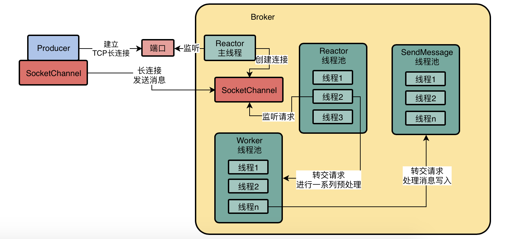
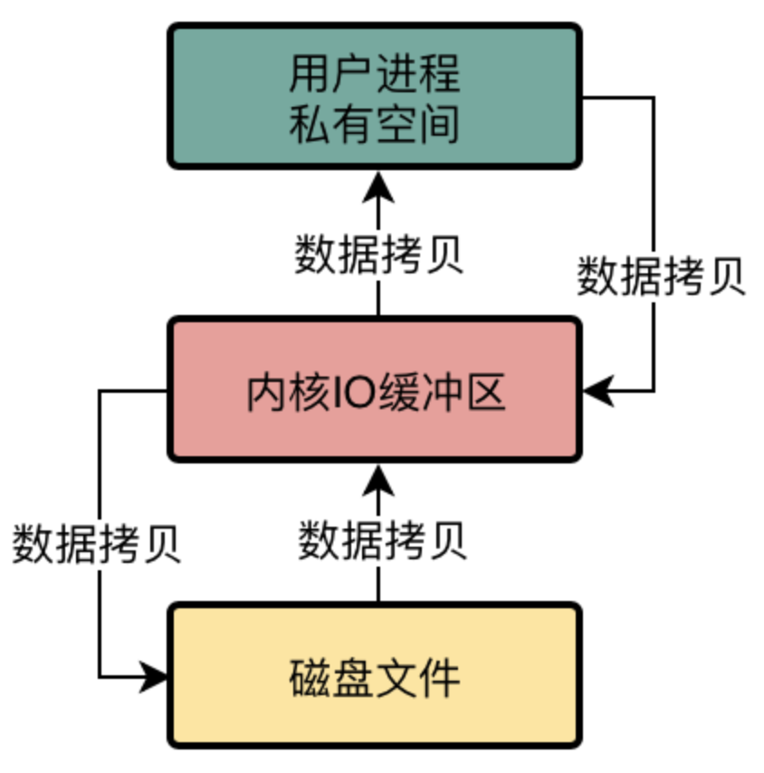
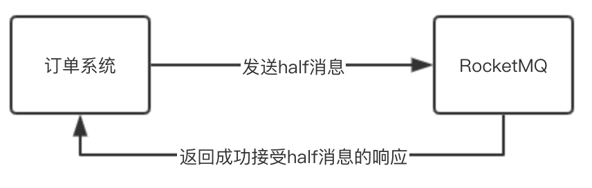

##### 17 Kafka、RabbitMQ 以及 RocketMQ 进行技术选型调研

**Kafka的优势和劣势**

- 优势

  Kafka的吞吐量几乎是行业里最优秀的，在常规的机器配置下，一台机器可以达到每秒十几万的QPS。Kafka性能也很高，基本上发送消息给Kafka都是毫秒级的性能。可用性也很高，Kafka是可以支持集群部署的，其中部分机器宕机是可以继续运行的。

- 劣势

  Kafka收到消息之后会写入一个磁盘缓冲区里，并没有直接落地到物理磁盘上去，所以要是机器本身故障了，可能会导致磁盘缓冲区里的数据丢失。

  功能非常的单一，主要是支持收发消息。

Kafka一般用在用户行为日志的采集和传输上，因为日志适当丢失数据是没有关系的，而且一般量特别大，要求吞吐量要高，一般就是收发消息，不需要太多的高级功能。

**RabbitMQ的优势和劣势**

- 优势

  可以保证数据不丢失，也能保证高可用性，即集群部署的时候部分机器宕机可以继续运行，然后支持部分高级功能，比如说死信队列，消息重试。
  
- 缺点

  吞吐量比较低，一般就是每秒几万的级别，所以如果遇到特别特别高并发的情况下，支撑起来是有点困难的。

  在进行集群扩展的时候比较麻烦。

  开发语言是erlang，国内很少有精通erlang语言的工程师，因此也没办法去阅读他的源代码，甚至修改他的源代码。

**RocketMQ的优势和劣势**

- 优势

  吞吐量很高，单机可以达到10万QPS以上，而且可以保证高可用性，性能很高，而且支持通过配置保证数据绝对不丢失，可以部署大规模的集群，还支持各种高级的功能，比如说延迟消息、事务消息、消息回溯、死信队列、消息积压，等等。

  基于Java开发，符合国内大多数公司的技术栈。

- 劣势

  文档相对简单

---

##### 21 消息中间件路由中心的架构原理是什么

`NameServer`可以进行集群化部署。每个`Broker`启动时向所有的`NameServer`进行注册。

生产者和消费者会主动去`NameServer`获取`Broker`的路由信息，通过这些信息，每个系统可以知道发送或者获取消息去哪个`Broker`节点。

`Broker`每隔`30s`会给所有的`NameServer`发送心跳，`NameServer`收到一个`Broker`的心跳，就会更新它的心跳时间。
`NameServer`每隔`10s`会运行一个任务，去检查每个`Broker`的心跳时间，如果某个`Broker`超过`120s`都没有发送心跳，就认为这个`Broker`已经挂掉了。

---

##### 23 Broker的主从架构原理是什么

- Master Broker是如何将消息同步给Slave Broker的？

  RocketMQ的Master-Slave模式采取的是Slave Broker不停的发送请求到Master Broker去拉取消息，也就是通过**Pull模式**拉取消息

- 消费者的系统在获取消息的时候，是从Master Broker获取的？还是从Slave Broker获取的？

  有可能从Master Broker获取消息，也有可能从Slave Broker获取消息

  消费者的系统在获取消息的时候会先发送请求到Master Broker上去，请求获取一批消息，此时Master Broker是会返回一批消息给消费者系统的。

  然后Master Broker在返回消息给消费者系统的时候，会根据当时Master Broker的负载情况和Slave Broker的同步情况，向消费者系统建议下一次拉取消息的时候是从Master Broker拉取还是从Slave Broker拉取。

##### 消息中间件生产部署架构

- Broker跟NameServer之间的通信是基于什么协议来进行的？

  Broker会跟每个NameServer都建立一个TCP长连接，然后定时通过TCP长连接发送心跳请求过去。

  每个Broke在进行定时的心跳汇报给NameServer的时候，都会告诉NameServer自己当前的数据情况，比如有哪些Topic的哪些数据在自己这里，这些信息都是属于路由信息的一部分。

---

##### 31 进行OS内核参数和JVM参数的调整

os内核参数

- `vm.overcommit_memory`

  这个参数有三个值可以选择，0、1、2。

  如果值是0的话（默认），在中间件系统申请内存的时候，os内核会检查可用内存是否足够，如果足够的话就分配内存，如果剩余内存不是太够了，就会拒绝申请，进而导致中间件系统异常出错。

  因此一般需要将这个参数的值调整为1，意思是把所有可用的物理内存都允许分配给你，只要有内存就给你来用，这样可以避免申请内存失败的问题。

  2表示禁止。

- `vm.max_map_count`

  会影响中间件系统可以开启的线程的数量，默认值是65536。

- `vm.swappiness`

  用来控制进程的swap行为。默认值是60。

  os会把一部分磁盘空间作为swap区域，然后如果有的进程现在可能不是太活跃，就会被操作系统把进程调整为睡眠状态，把进程中的数据放入磁盘上的swap区域，然后让这个进程把原来占用的内存空间腾出来，交给其他活跃运行的进程来使用。

  如果这个参数的值为0，意思是尽量别把任何一个进程放到磁盘swap区域去，尽量大家都用物理内存。

  如果这个参数的值为100，意思是尽量把一些进程给放到磁盘swap区域去，内存腾出来给活跃的进程使用。

- `ulimit`

  控制linux上的最大文件链接数的，默认值是1024

JVM G1垃圾回收器参数

- `-XX:G1ReservePercent`

  在G1管理的老年代里预留指定的空闲内存，保证新生代对象晋升到老年代的时候有足够空间，避免老年代内存都满了，新生代有对象要进入老年代没有充足内存

- `-XX:-OmitStackTraceInFastThrow`

  有时候JVM会抛弃一些异常堆栈信息，因此这个参数设置之后，就是禁用这个特性，要把完整的异常堆栈信息打印出来

- `-XX:+AlwaysPreTouch`

  刚开始指定JVM用多少内存，不会真正分配给他，会在实际需要使用的时候再分配给他。

  使用这个参数之后，就是强制让JVM启动的时候直接分配我们指定的内存，不要等到使用内存的时候再分配

- `-XX:MaxDirectMemorySize`

  限定了direct buffer最多申请多少

- `-XX:-UseLargePages`

  禁用大内存页

- `-XX:-UseBiasedLocking`

  禁用偏向锁

---

##### 39 MQ使用方式

生产者发送消息的方式：

- 同步发送模式

  发送消息等待MQ的返回结果再继续往下执行
  
- 异步发送模式
  
  发送消息之后不需要等待MQ的返回，当MQ返回时调用回调函数
  
- 单向消息模式

  发送消息后，不关注MQ返回的结果是成功还是失败，直接往下执行。

消费者获取消息的方式：

- push模式

  `Broker`主动把消息发送给消费者

- pull模式

  消费者主动发送请求到`Broker`拉取消息

---

##### 45 基于MQ实现秒杀订单系统的异步化架构

对于一个秒杀系统而言，比较重要的有以下几点：

- 在前端/客户端设置秒杀答题，错开大量人下单的时间，阻止作弊器刷单

- 独立出来一套秒杀系统，专门负责处理秒杀请求

  防止秒杀下单请求耗尽了订单系统的资源，或者导致系统不稳定，然后导致其他普通下单请求也出现问题，没有办法完成的下单。

- 优先基于Redis进行高并发的库存扣减，一旦库存扣完则秒杀结束

  将每个秒杀商品的库存提前写入Redis中，然后当请求到来之后，就直接对Redis中的库存进行扣减，

  Redis是可以轻松用单机抗每秒几万高并发的

- 秒杀结束之后，Nginx层过滤掉无效的请求，大幅度削减转发到后端的流量

  Redis中的库存被扣减完之后，就说明商品已经被抢购完毕了。此时我们可以让Nginx在接收到后续请求的时候，直接就把后续请求过滤掉。

  比如一旦商品抢购完毕，可以在ZooKeeper中写入一个秒杀完毕的标志位，然后ZK会反向通知Nginx中我们自己写的Lua脚本，通过Lua脚本后续在请求过来的时候直接过滤掉，不要向后转发了。

- 瞬时生成的大量下单请求直接进入RocketMQ进行削峰，订单系统慢慢拉取消息完成下单操作

  秒杀成功了需要生成订单，此时就直接发送一个消息到RocketMQ中，然后让普通订单系统从RocketMQ中消费秒杀成功的消息进行常规性的流程处理即可。

---

##### 49 生产者是如何发送消息的

- **Topic、MessageQueue以及Broker之间到底是什么关系**

  MessageQueue就是RocketMQ中非常关键的一个数据分片机制，他通过MessageQueue将一个Topic的数据拆分为了很多个数据分片，然后在每个Broker机器上都存储一些MessageQueue。通过这个方法，就可以实现Topic数据的分布式存储。

- **生产者发送消息的时候写入哪个MessageQueue**

  生产者再跟NameServer进行通信时会获取Topic的路由数据。

  所以生产者从NameServer中就会知道，一个Topic有几个MessageQueue，哪些MessageQueue在哪台Broker机器上，哪些MesssageQueue在另外一台Broker机器上。

  基于不同的写入策略，让一个Topic中的数据分散在多个不同的MessageQueue中。

- **如果某个Broker出现故障该怎么办**

  通过在Producer中通过参数`sendLatencyFaultEnable`来开启自动容错机制：在一个Broker故障之后，自动回避一段时间不访问这个Broker，过段时间再去访问他。

  过一段时间之后，可能这个Master Broker就已经恢复好了，比如它的Slave Broker切换为了Master。

---

##### 51 Broker是如何持久化存储消息的

- 当生产者的消息发送到一个Broker上的时候，会对消息做什么？

  把消息直接顺序写入磁盘上的一个日志文件，叫做CommitLog。

  CommitLog有很多磁盘文件，每个文件限定最多1GB，Broker收到消息之后就直接追加写入这个文件的末尾。如果一个CommitLog写满了1GB，就会创建一个新的CommitLog文件。

- MessageQueue是怎么存储数据的

  在Broker中，对Topic下的每个MessageQueue都会有一系列的ConsumeQueue文件。

  每个ConsumeQueue文件里存储的是一条消息对应在CommitLog文件中的offset偏移量。

  所以Topic的每个MessageQueue都对应了Broker机器上的多个ConsumeQueue文件，保存了这个MessageQueue的所有消息在CommitLog文件中的物理位置，也就是offset偏移量。

  在ConsumeQueue中存储的每条数据不只是消息在CommitLog中的offset偏移量，还包含了消息的长度，以及tag hashcode等等。

- Broker是通过什么方法来提高写入CommitLog文件的性能的

  - 首先Broker是以顺序的方式将消息写入CommitLog磁盘文件。

    也就是每次写入就是在文件末尾追加一条数据就可以了，对文件进行顺序写的性能要比对文件随机写的性能提升很多

  - 数据写入CommitLog文件的时候，不是直接写入底层的物理磁盘文件的，而是先进入OS的PageCache内存缓存中，然后后续由OS的后台线程选一个时间，异步化的将OS PageCache内存缓冲中的数据刷入底层的磁盘文件

---

##### 53 基于DLedger技术的Broker主从同步原理

- DLedger技术可以干什么

  使用DLedger来管理CommitLog，然后Broker还是可以基于DLedger管理的CommitLog去构建出来机器上的各个ConsumeQueue磁盘文件。

- DLedger是如何基于Raft协议选举Leader Broker的

  他确保有人可以成为Leader的核心机制就是一轮选举不出来Leader的话，就让大家随机休眠一下，先苏醒过来的人会投票给自己，其他人苏醒过后发现自己收到选票了，就会直接投票给那个人。

  只有Leader可以接收数据写入，Follower只能接收Leader同步过来的数据。

- DLedger是如何基于Raft协议进行多副本同步的

  数据同步会分为两个阶段，一个是uncommitted阶段，一个是commited阶段

  首先Leader Broker上的DLedger收到一条数据之后，会标记为uncommitted状态，然后他会通过自己的DLedgerServer组件把这个uncommitted数据发送给Follower Broker的DLedgerServer。

  接着Follower Broker的DLedgerServer收到uncommitted消息之后，必须返回一个ack给Leader Broker的DLedgerServer，然后如果Leader Broker收到超过半数的Follower Broker返回ack之后，就会将消息标记为committed状态。

  然后Leader Broker上的DLedgerServer就会发送commited消息给Follower Broker机器的DLedgerServer，让他们也把消息标记为comitted状态。

  这个就是基于Raft协议实现的两阶段完成的数据同步机制。

---

##### 55 消费者是如何获取消息处理以及进行ACK的

- 什么是消费者组

  每个系统的每台机器的消费者组名字都是同一个，那么这几台机器就属于同一个消费者组。

  例如：库存系统部署了4台机器，每台机器上的消费者组的名字都是“stock_consumer_group”，那么这4台机器就同属于一个消费者组

- 同一个消费组中，是否是全部机器都会获取到同一条消息

  一般情况下，只有一台机器会获取到某一条消息

- 集群模式和广播模式的区别是什么

  如果消费组内部有多台机器，到底是只有一台机器可以获取到这个消息，还是每台机器都可以获取到这个消息

- 什么是集群模式

  默认情况下是集群模式。

  一个消费组获取到一条消息，只会交给组内的一台机器去处理，不是每台机器都可以获取到这条消息。

- 什么是广播模式

  一个消费组获取到一条消息，组内每台机器都可以获取到这条消息

- MessageQueue与消费者的关系

  一个Topic的多个MessageQueue会均匀分摊给消费组内的多个机器去消费。

  一个MessageQueue只能被一个消费者机器去处理，但是一台消费者机器可以负责多个MessageQueue的消息处理。

- 什么是Push模式

  消费者发送请求到Broker去拉取消息，如果有新的消息可以消费那么就会立马返回一批消息到消费机器去处理，处理完之后会接着立刻发送请求到Broker机器去拉取下一批消息。

  当你的请求发送到Broker，结果他发现没有新的消息给你处理的时候，就会让请求线程挂起，默认是挂起15秒，在这个期间他会有后台线程每隔一段时间就去检查一下是否有的新的消息给你，另外如果在这个挂起过程中，如果有新的消息到达了会主动唤醒挂起的线程，然后把消息返回给你。

  Push模式本质上也是消费者不停的发送请求到Broker去拉取一批一批的消息。

- Broker是如何将消息读取出来返回给消费机器的

  根据要消费的MessageQueue以及开始消费的位置，去找到对应的ConsumeQueue读取里面对应位置的消息在CommitLog中的物理offset偏移量，然后到CommitLog中根据offset读取消息数据，返回给消费者机器。

- 消费者机器如何处理消息进行ACK以及提交消费进度

  当我们处理完一批消息之后，消费者机器就会提交我们目前的一个消费进度到Broker上去，然后Broker就会存储我们的消费进度，将一个名为ConsumeOffset的东西记录到ConsumeQueue中。
  
  下次这个消费组只要再次拉取这个ConsumeQueue的消息，就可以从Broker记录的消费位置开始继续拉取，不用重头开始拉取了。
  
- 如果消费组中出现机器宕机或者扩容加机器，会怎么处理

  会进入一个rabalance的环节，也就是说重新给各个消费机器分配他们要处理的MessageQueue

---

##### 57 消费者是根据什么策略从Master或Slave上拉取消息

os有一个优化机制：读取一个磁盘文件的时候，会自动把磁盘文件的一些数据缓存到os cache中。

ConsumeQueue文件主要是存放消息的offset，所以每个文件很小，30万条消息的offset就只有5.72MB。所以实际上ConsumeQueue文件们是不占用多少磁盘空间的，他们整体数据量很小，几乎可以完全被os缓存在内存cache里。

在进行消息拉取的时候，先读os cache里的少量ConsumeQueue的数据，这个性能是极高的，然后第二步就是要根据读取到的offset去CommitLog里读取消息的完整数据了。

os cache对于CommitLog而言，主要是提升文件写入性能，当你不停的写入的时候，很多最新写入的数据都会先停留在os cache里。

之后os会自动把cache里的比较旧的一些数据刷入磁盘里，腾出来空间给更新写入的数据放在os cache里，所以大部分的数据都是在磁盘上。

如果Broker发现你很大概率会从磁盘里加载消息出来！他会认为，出现这种情况，很可能是因为自己作为master broker负载太高了，导致没法及时的把消息给你，所以你落后的进度比较多。

这个时候，他就会告诉你，我这次给你从磁盘里读取消息，但是下次你还是从slave broker去拉取吧！

---

##### 58 RocketMQ基于Netty的架构

- Reactor主线程在端口上监听Producer建立连接的请求，建立长连接

- Producer和Broker之间通过SocketChannel建立长连接

- Reactor线程池并发的监听多个连接的请求是否到达

- Worker请求并发的对多个请求进行预处理

  例如SSL加密验证、编码解码、连接空闲检查、网络连接管理，等等

- 业务线程池（SendMessage）并发的对多个请求进行磁盘读写业务操作

  将消息写入CommitLog文件，以及处理ConsumeQueue之类的操作

---

##### 61 基于mmap内存映射实现磁盘文件的高性能读写

- 传统文件IO操作的多次数据拷贝问题

  

    
  

  在写入数据时，必须先把数据写入到用户进程私有空间里去，然后从这里再进入内核IO缓冲区，最后进入磁盘文件里去。

  读取数据过程则相反。

---

##### 68 RocketMQ事务消息的实现流程

  

在基于RocketMQ的事务消息机制中，先让订单系统发送一条half消息到MQ去，这个half消息本质就是一个订单支付成功的消息，只不过这个消息的状态是half状态，这个时候其他系统是看不见这个half消息的。

- 如果发送half消息到MQ失败了，订单系统需要进行一系列的回滚操作

  如果更新订单的状态，通知支付系统进行退款等操作。

  - 如果发送half消息MQ成功了，但是接收响应失败了

    订单系统需要进行一系列的回滚操作。

    MQ回去扫描half消息，如果超过一定时间没有对half消息进行任何操作，则会回调订单系统的接口，询问这条消息的状态，然后订单系统发现这个订单是失败的，就会发送一条rollback请求给MQ。

- half消息成功之后，订单系统就可以更新订单的状态了

  - 如果订单系统更新自己的数据库失败了，会发送rollback请求给MQ，让MQ删除之前的half消息
  
- 订单系统更新完订单状态之后，会发送一条commit请求给MQ，让MQ对之前的half消息执行commit操作，这样其他系统就可以看到这条消息了
  
- 如果rollback或者commit请求发送失败了
  

因为MQ里这条消息的状态一直是half状态，所以过段时间会自动回调订单系统的接口。然后订单系统判断这条订单的状态，再对MQ执行rollback或者commit操作

---

##### 69 事务消息机制的底层实现原理

- half消息是如何对消费者不可见的

  MQ会把half消息写入到自己内部的“RMQ_SYS_TRANS_HALF_TOPIC”这个Topic对应的一个ConsumeQueue里去。

  所以对于事务消息机制之下的half消息，RocketMQ是写入内部Topic的ConsumeQueue的，不是写入消费者指定的Topic下的ConsumeQueue中，所以消费者就不会看到这条half消息。

- 如果因为各种问题，没有执行rollback或者commit会怎么样？

  MQ在后台有定时任务，定时任务会去扫描RMQ_SYS_TRANS_HALF_TOPIC中的half消息，如果超过一定时间还是half消息，它会回调消费者系统的接口，让你判断这个half消息是要rollback还是commit

- 执行rollback操作时，如何对消息回滚

  执行rollback时，本质就是用一个OP操作来标记half消息的状态。

  MQ内部有一个OP_TOPIC，此时可以写一条rollback OP记录到这个Topic里，标记某条half消息需要回滚。

  如果一直没有执行commit/rollback，RocketMQ会回调消费者系统的接口去判断half消息的状态，但是他最多就是回调15次，如果15次之后你都没法告知他half消息的状态，就自动把消息标记为rollback。

- 执行commit操作，如何让消息对消费者系统可见

  执行commit操作后，RocketMQ就会在OP_TOPIC里写入一条记录，标记half消息为commit状态。然后把放在RMQ_SYS_TRANS_HALF_TOPIC中的half消息给写入到指定Topic的ConsumeQueue里去，这样消费者就可以看到这条消息了。

---

##### 72 同步刷盘 + Raft协议主从同步

- 怎么确保消息写入MQ之后，不会丢失数据

  - 修改broker的配置文件，调整MQ的刷盘策略，将其中的flushDiskType配置设置为：SYNC_FLUSH（同步刷盘），默认他的值是ASYNC_FLUSH，即默认是异步刷盘的。

    同步刷盘之后，写入MQ的每条消息，只要MQ告诉我们写入成功了，那么消息就是已经进入磁盘文件了。

  - 对Broker使用主从架构的模式

    必须让一个Master Broker有一个Slave Broker去同步他的数据，而且你一条消息写入成功，必须是让Slave Broker也写入成功，保证数据有多个副本的冗余。

---

##### 73 Consumer消息零丢失方案

消费者在处理完一批消息之后，然后再提交消息的offset给broker。

如果消费者在处理消息的时候，突然挂掉了，那么如果这批消息没有提交offset到broker，broker不会认为这批消息已经处理完成了。当感知消费者挂掉的时候会将这批消息转发给其他消费者去处理。

---

##### 75 生产案例：为什么会重复发优惠券

- 支付系统调用订单系统时，订单系统处理超时，支付系统重试。导致订单系统有两条数据
- 订单系统推送数据到MQ时，MQ处理超时，订单系统重试。导致MQ有两条消息
- 优惠券获取消息之后发送完优惠券给用户，但是还没来得及提交offset到MQ时挂掉了，重启之后又重复处理了一次

---

##### 76 幂等性机制，保证数据不会重复

- 什么是幂等性

  如果别人对你的接口一次请求重试了多次，你必须保证自己系统的数据是正常的，不能多出来一些重复的数据

- 发送消息到MQ的时候如何保证幂等性

  发送消息到MQ的时候不保证幂等性，而让业务方去保证，因为业务方可以去业务数据库查询某条数据的状态是否更改来进行判断是否已经处理过

##### 77 死信队列解决数据库宕机异常

消费者在处理消息发生异常时：

- 返回`RECONSUME_LATER`状态

- MQ会把这批消息放到对应消费组的重试队列中去，重试队列的名称为`%RETRY%消费者组名称`

- 过一段时间后，重试队列中的消息会再次发给消费者处理

  如果再次失败，又返回`RECONSUME_LATER`，那么会过一段时间再次给消费者处理，默认最多重试**16**次。

  重试次数可以通过`messageDelayLevel`进行配置。

  > 例：messageDelayLevel=1s 5s 10s 30s 1m 2m 3m 4m 5m 6m 7m 8m 9m 10m 20m 30m 1h 2h

- 如果重试16次之后还是无法成功处理，这批消息就会自动进入**死信队列**

  死信队列的名字为`%DLQ%消费者组名称`

- 对于死信队列中的数据，消费者可以开一个后台线程对队列中的消息进行不断的重试

##### 78 MQ消息乱序问题

每个`Topic`可以有多个`MessageQueue`，写入消息时，会把消息均匀分发给不同的`MessageQueue`。

消费组中每台机器都会负责消费一部分`MessageQueue`，所以在消费完后，存储时很有可能会出现跟原始数据顺序不一致的情况。

