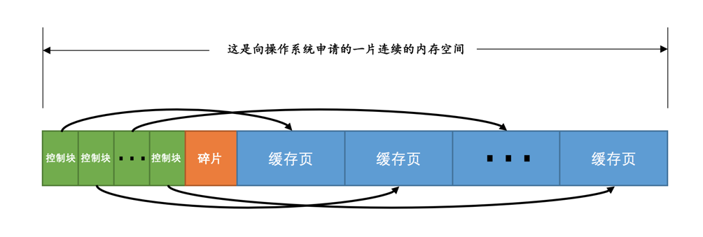
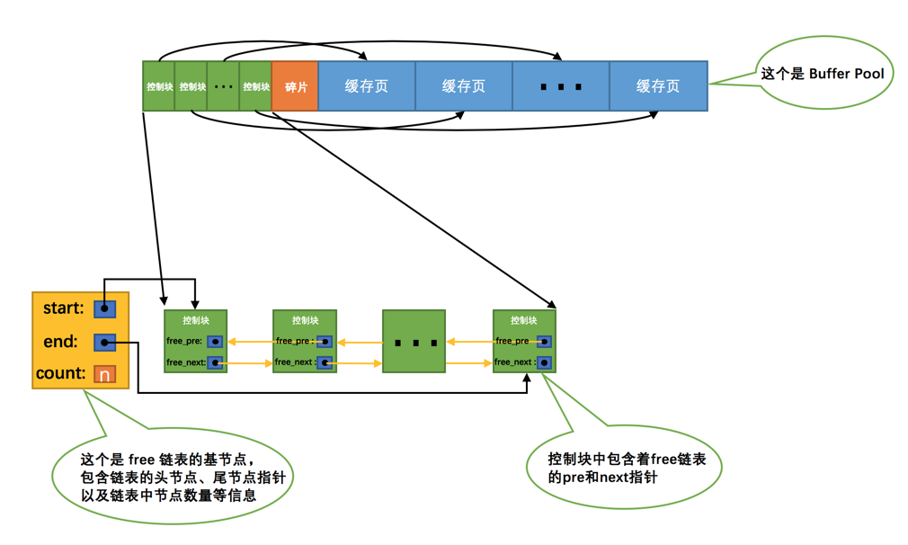
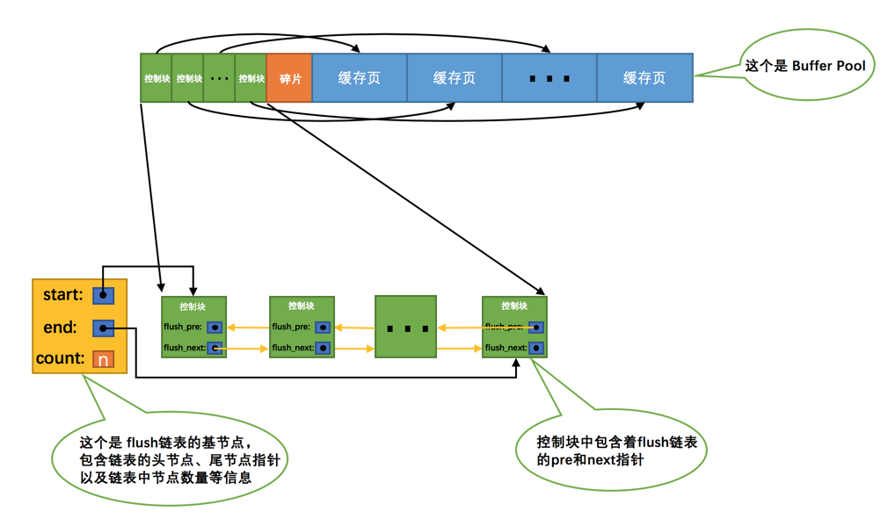
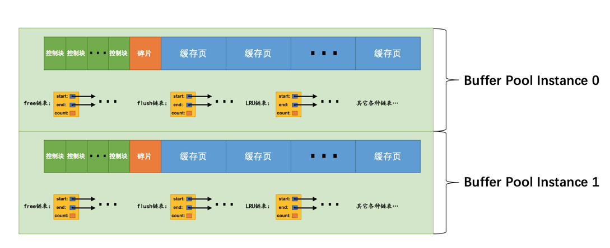
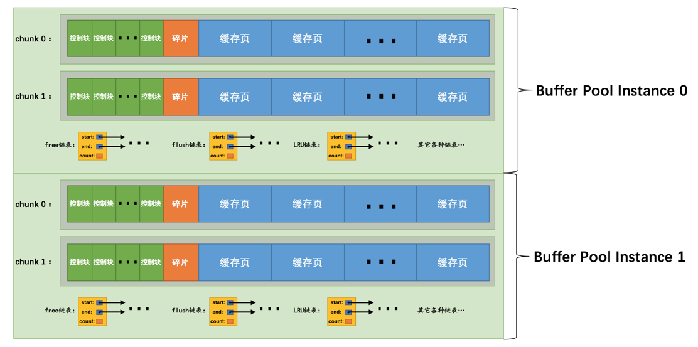

> 来自[InnoDB 的 Buffer Pool](https://juejin.im/book/5bffcbc9f265da614b11b731/section/5c238f0851882521eb44c51f)

### 缓存的重要性

对于使用 `InnoDB` 存储引擎的表来说，不管是存储用户数据的索引还是系统数据，都是以**页**的形式存放在**表空间**中，而**表空间**只是 `InnoDB` 对文件系统上一个或几个实际问价的抽象，也就是说数据其实还是存储在磁盘上的。

`InnoDB` 存储引擎在处理客户端的请求时，当需要访问某个页的数据时，就会把完整页的数据全部加载到内存中。即使我们只需要访问一个页的一条记录，那也需要先把整个页的数据加载到内存中。

将整个页加载到内存中后就可以进行读写访问了，在进行完读写访问之后并不着急把该页对应的内存空间释放掉，而是将其`缓存`起来，这样将来有请求再次访问该页面时，就可以省去磁盘`IO`的开销了。

#### 什么是 Buffer Pool

为了缓存磁盘中的页，在 MySQL 服务器启动的时候就向操作系统申请了一片连续的内存，叫做 `Buffer Pool` (缓冲池)。默认情况下 `Buffer Pool` 只有 `128M` 大小。可以在启动服务器的时候配置 `innodb_buffer_pool_size` 参数的值。如下：

```mysql
[server]
innodb_buffer_pool_size = 268435456
```

> 268435456 的单位是字节，也就是 256M。`Buffer Pool` 的最小值为 `5M` (当小于该值时会自动设置成`5M` )。

#### Buffer Pool内部组成

`Buffer Pool` 中默认的缓存页大小和在磁盘上默认的页大小是一样的，都是 `16KB`。

`InnoDB` 为每一个缓存页都创建了一些`控制信息`，这些控制信息包括该页所属的表空间编号、页号、缓存页在`Buffer Pool `中的地址、链表节点信息、一些锁信息以及 `LSN` 信息。

每个缓存页对应的控制信息占用的内存大小是相同的，我们就把每个页对应的控制信息占用的一块内存称为一个`控制块`，**控制块和缓存页是一一对应的，它们都被存放到 `Buffer Pool` 中，其中控制块被存放到 `Buffer Pool` 的前边，缓存页被存放到 Buffer Pool 后边**，所以整个 `Buffer Pool` 对应的内存空间示意图如下：



> 每一个控制块都对应一个缓存页，那在分配足够多的控制块和缓存页后，可能剩余的那点儿空间不够一对控制块和缓存页的大小，所以就产生了**碎片**

#### free 链表的管理

把所有空闲的缓存页对应的控制块作为一个节点放到一个链表中，这个链表被称作 `free 链表` (空闲链表)。用来记录 Buffer Pool 中哪些缓存页是可用的。刚刚完成初始化的 `Buffer Pool` 中所有的缓存页都是空闲的，所以每一个缓存页对应的控制块都会被加入到 `free 链表` 中。

> 假设该 `Buffer Pool` 中可容纳的缓存页数量为 `n`，`free 链表` 的效果图如下：



`基节点`里边包含了链表的头节点地址，尾节点地址，以及当前链表中节点的数量等信息。

链表的基节点占用的内存空间并不包含在为 `Buffer Pool` 申请的一大片连续内存空间之内，而是单独申请的一块内存空间。

每当需要从磁盘中加载一个页到 `Buffer Pool` 中时，就从 `free 链表` 中取一个空闲的缓存页，并且把该缓存页对应的`控制块`的信息填上（就是该页所在的表空间、页号之类的信息），然后把该缓存页对应的 `free 链表`节点从链表中移除，表示该缓存页已经被使用了。

#### 缓存页的哈希处理

当我们需要访问某个页中的数据时，需要判断该页在不在 `Buffer Pool` 中。通过`表空间号 + 页号`作为 `key`，`缓存页`作为 `value` 创建一个哈希表，在需要访问某个页的数据时，先从哈希表中根据`表空间号 + 页号`看看有没有对应的缓存页，如果有，直接使用该缓存页就好，如果没有，那就从 `free 链表`中选一个空闲的缓存页，然后把磁盘中对应的页加载到该缓存页的位置。

#### flush 链表的管理

如果我们修改了 `Buffer Pool` 中某个缓存页的数据，那它就和磁盘上的页不一致了，这样的缓存页也被称为`脏页` (dirty page)。最简单的做法就是每发生一次修改就立即同步到磁盘上对应的页上，但是频繁的往磁盘中写数据会严重的影响程序的性能。所以每次修改缓存页后，并不着急立即把修改同步到磁盘上，而是在未来的某个时间点进行同步。

我们创建一个存储脏页的链表，也就是 `flush 链表`。凡是修改过的缓存页对应的控制块都会作为一个节点加入到一个链表中，表示这个链表节点对应的缓存页都是需要被刷新到磁盘上的。

> 假设某个时间点 `Buffer Pool` 中的脏页数量为 `n`，对应的 `flush 链表`如下所示：



##### 缓存不够的窘境

如果需要缓存的页占用的内存大小超过了 `Buffer Pool` 大小，也就是 `free 链表`中已经没有多余的空闲缓存页的时候，需要把某些旧的缓存页从 `Buffer Pool` 中移除，然后再把新的页放进来。那么怎么移除哪些缓存页呢？

> 假设我们一共访问了 `n` 次页，那么被访问的页已经在缓存中的次数除以 `n` 就是所谓的`缓存命中率`

##### 简单的 LRU 链表

当 `Buffer Pool` 中不再有空闲的缓存页时，就需要淘汰掉部分最近很少使用的缓存页。由于这个链表是按照`最近最少使用`的原则去淘汰缓存页的，所以这个链表可以被称为 `LRU 链表` (Least Recently Used)。当需要访问某个页时，处理方式如下：

- 如果该页不在 `Buffer Pool` 中，在把该页从磁盘加载到 `Buffer Pool` 中的缓存页时，就把该缓存页对应的`控制块`作为节点塞到 `LRU 链表`的头部。
- 如果该页已经缓存在 `Buffer Pool` 中，则直接把该页对应的`控制块`移动到 `LRU 链表`的头部。

只要我们使用到某个缓存页，就把该缓存页调整到 `LRU 链表`的头部，这样 `LRU 链表`尾部就是最近最少使用的缓存页。所以当 `Buffer Pool` 中的空闲缓存页使用完时，到 `LRU 链表`的尾部找些缓存页淘汰就可以了。

##### 划分区域的 LRU 链表

简单的 `LRU 链表`存在两个问题：

- `InnoDB` 提供了**预读** (read ahead) 的功能。

  > `InnoDB` 认为执行当前的请求可能之后会读取某些页面，就预先把它们加载到 `Buffer Pool` 中

  预读分为两种：

  - 线性预读

    `InnoDB` 提供了一个系统变量 `innodb_read_ahead_threshold`，如果顺序访问了某个区 (extent) 的页面超过这个系统变量的值，就会触发一次`异步`读取下一个区中全部的页面到 `Buffer Pool` 的请求。

    > `innodb_read_ahead_threshold` 系统变量的值默认是 `56`，可以在服务器启动时通过启动参数或者服务器运行过程中直接调整该系统变量的值。它是一个全局变量，使用 `SET GLOBAL` 命令来修改。

  - 随机预读

    如果 `Buffer Pool` 中已经缓存了某个区的 13 个连续的页面，不论这些页面是不是顺序读取的，都会触发一次`异步`读取本区中所有其的页面到 `Buffer Pool` 的请求。`InnoDB` 提供了`innodb_random_read_ahead` 系统变量，它的默认值为 `OFF`。如果想开启该功能，可以通过修改启动参数或者直接使用 `SET GLOBAL` 命令把该变量的值设置为 `ON`。

  如果预读到 `Buffer Pool` 中的页成功的被使用到，那就可以极大的提高语句执行的效率。可是如果用不到，这些预读的页都会放到 `LRU` 链表的头部，但是如果此时 `Buffer Pool` 的容量不太大而且很多预读的页面都没有用到的话，这就会导致处在 `LRU 链表`尾部的一些缓存页会很快的被淘汰掉，会大大降低缓存命中率。

- 扫描全表的查询语句

  扫描全表意味着将访问到该表所在的所有页，当需要访问这些页时，会把它们统统都加载到 `Buffer Pool` 中，也就是 `Buffer Pool` 中的所有页都被换了一次，其他查询语句在执行时又得执行一次从磁盘加载到 `Buffer Pool` 的操作。这严重影响到其他查询对 `Buffer Pool` 的使用，大大降低了缓存命中率。

因为有这两种情况的存在，所以 `InnoDB` 把这个 `LRU 链表`按照一定比例分成两截，分别是：

- 一部分存储使用频率非常高的缓存页，所以这一部分链表也叫做`热数据`，或者称 `young 区域`。
- 另一部分存储使用频率不是很高的缓存页，所以这一部分链表也叫做`冷数据`，或者称 `old 区域`。

示意图如下：


`InnoDB` 通过查看系统变量 `innodb_old_blocks_pct` 的值来确定 `old` 区域在 `LRU 链表`中所占的比例。

可以在启动时修改 `innodb_old_blocks_pct` 参数来控制 `old `区域在 `LRU 链表`中所占的比例，如下：

```mysql
[server]
innodb_old_blocks_pct = 40
```

> 表示 `old` 区域占 `LRU 链表`的比例为 `40%`

在服务器运行期间，也可以修改这个系统变量的值，如下：

```mysql
SET GLOBAL innodb_old_blocks_pct = 40;
```

`InnoDB` 针对上边提到的两种可能降低缓存命中率的情况进行了如下优化：

- 针对预读的页面可能不进行后续访情况的优化

  当磁盘上的某个页面在初次加载到 `Buffer Pool` 中的某个缓存页时，该缓存页对应的控制块会被放到 `old` 区域的头部。这样针对预读到 `Buffer Pool` 却不进行后续访问的页面就会被逐渐从 `old` 区域逐出，而不会影响 `young` 区域中被使用比较频繁的缓存页。

- 针对全表扫描时，短时间内访问大量使用频率非常低的页面情况的优化

  在进行全表扫描时，虽然首次被加载到 `Buffer Pool` 的页被放到了 `old` 区域的头部，但是后续会被马上访问到，每次进行访问的时候又会把该页放到 `young` 区域的头部，这样仍然会把那些使用频率比较高的页面给顶下去。但是，全表扫描有一个特点，那就是它的执行频率非常低，而且在执行全表扫描的过程中，即使某个页面中有很多条记录，也就是去多次访问这个页面所花费的时间也是非常少的。所以，**在对某个处在 `old` 区域的缓存页进行第一次访问时就在它对应的控制块中记录下来这个访问时间，如果后续的访问时间与第一次访问的时间在某个时间间隔内，那么该页面就不会被从 `old` 区域移动到 `young` 区域的头部，否则将它移动到 `young` 区域的头部。**

  > 这个间隔时间是由系统变量 `innodb_old_blocks_time` 控制的，默认值为 `1000`，单位为毫秒。可以在服务器启动或运行时进行设置。

##### 更进一步优化 LRU 链表

对于 `young` 区域的缓存页来说，我们每次访问一个缓存页就要把它移动到 `LRU 链表`的头部，这样开销太大了。因为在 `young` 区域的缓存页都是热点数据，也就是可能被经常访问的，这样频繁的对 `LRU 链表`进行节点移动操作不太好。

为了解决这个问题，可以提出一些优化策略，如果某个缓存页对应的节点在 `young` 区域的 `1/4` 中，再次访问该缓存页时也不会将其移动到 `LRU` 链表头部。

#### 刷新脏页到磁盘

后台有专门的线程每隔一段时间负责把脏页刷新到磁盘，这样可以不影响用户线程处理正常的请求。主要有两种刷新路径：

- 从 `LRU 链表`的冷数据中刷新一部分页面到磁盘

  后台线程会定时从 `LRU 链表`尾部开始扫描一些页面，扫描的页面数量可以通过系统变量 `innodb_lru_scan_depth` 来指定，如果从里边儿发现脏页，会把它们刷新到磁盘。这种刷新页面的方式被称之为 `BUF_FLUSH_LRU`。

- 从 `flush 链表`中刷新一部分页面到磁盘

  后台线程也会定时从 `flush 链表`中刷新一部分页面到磁盘，刷新的速率取决于当时系统是不是很繁忙。这种刷新页面的方式被称之为 `BUF_FLUSH_LIST`。

有时候后台线程刷新脏页的进度比较慢，导致用户线程在准备加载一个磁盘页到 `Buffer Pool` 时没有可用的缓存页，这时就会尝试看看 `LRU 链表`尾部有没有可以直接释放掉的未修改页面，如果没有的话会不得不将 `LRU 链表`尾部的一个脏页同步刷新到磁盘（和磁盘交互是很慢的，这会降低处理用户请求的速度）。这种刷新单个页面到磁盘中的刷新方式被称之为 `BUF_FLUSH_SINGLE_PAGE`。

#### 多个 Buffer Pool 实例

`Buffer Pool` 本质是 `InnoDB` 向操作系统申请的一块连续的内存空间，在多线程环境下，访问 `Buffer Pool` 中的各种链表都需要加锁处理，在 `Buffer Pool` 特别大而且多线程并发访问特别高的情况下，单一的 `Buffer Pool` 可能会影响请求的处理速度。所以在 `Buffer Pool` 特别大的时候，我们可以把它们拆分成若干个小的 `Buffer Pool`，每个 `Buffer Pool` 都称为一个`实例`，它们都是独立的，在多线程并发访问时并不会相互影响，从而提高并发处理能力。

可以在服务器启动的时候进行设置：

```mysql
[server]
innodb_buffer_pool_instances = 2
```

> 表示要创建 2 个 `Buffer Pool` 实例

示意图如下：



每个 `Buffer Pool` 实例占用的大小，可以通过公式计算得出：

```mysql
innodb_buffer_pool_size/innodb_buffer_pool_instances
```

`Buffer Pool `实例并不是创建的越多越好，分别管理各个 `Buffer Pool` 也需要性能开销。`InnoDB` 规定：**当 innodb_buffer_pool_size 的值小于 1G 的时候设置多个实例是无效的，InnoDB 会默认把 innodb_buffer_pool_instances 的值修改为 1。**

#### innodb_buffer_pool_chunk_size

在 `MySQL 5.7.5` 之前，`Buffer Pool` 的大小只能在服务器启动时通过配置 `innodb_buffer_pool_size` 启动参数来调整大小，在服务器运行过程中是不允许调整该值的。在之后的版本中支持了在服务器运行过程中调整 `Buffer Pool` 大小的功能。

不过不再一次性为某个 `Buffer Pool` 实例向操作系统申请一大片连续的内存空间，而是以一个所谓的 `chunk` 为单位向操作系统申请空间。也就是说一个 `Buffer Pool` 实例其实是由若干个 `chunk` 组成的，一个 `chunk` 就代表一片连续的内存空间，里边儿包含了若干缓存页与其对应的控制块。示意图如下：



在服务器运行期间调整 `Buffer Pool` 的大小时就是以 `chunk` 为单位增加或者删除内存空间，而不需要重新向操作系统申请一片大的内存，然后进行缓存页的复制。

`chunk` 的大小是我们在启动操作 MySQL 服务器时通过 `innodb_buffer_pool_chunk_size` 启动参数指定的，它的默认值是 `134217728`，也就是 `128M`。

> innodb_buffer_pool_chunk_size 的值只能在服务器启动时指定，在服务器运行过程中是不可以修改的

