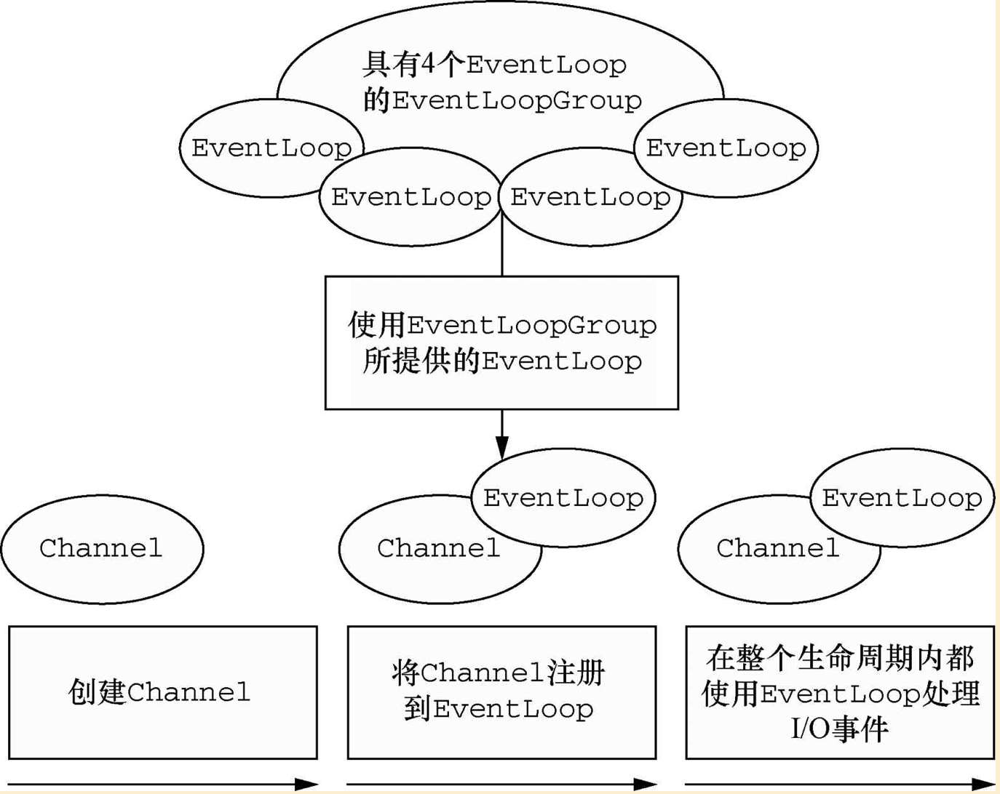

### 1.3 Netty 的核心组件

- Channel
- 回调
- Future
- 事件和 ChannelHandler

#### 1.3.1 Channel

Channel 代表一个到实体（如一个硬件设备、一个文件、一个网络套接字或者一个能够执行一个或者多个不同的 I/O 操作的程序组件）的开放连接，如读操作和写操作。

可以把 Channel 看作是传入（入站）或者传出（出站）数据的载体。因此，它是可以被打开或者被关闭。

#### 1.3.2 回调

一个回调其实就是一个方法。

> 例：被回调触发的 ChannelHandler
>
> ```java
> public class ConnectHandler extends ChannelInboundHandlerAdapter {
>      
>        // 当一个新的连接已经被建立时，channelActive(ChannelHandlerContext)将会被调用
>        @Override
>        public void channelActive(ChannelHandlerContext ctx) throws Exception {
>            System.out.println("Client " + ctx.channel().remoteAddress() + " connected");
>        }
> }
> ```

#### 1.3.3 Future

Future 可以看作是一个异步操作的结果的占位符，它将在未来的某个时刻完成，并提供对结果的访问。

Netty 提供了 `ChannelFuture` 用于在执行异步操作时使用。每个 Netty 的出站 I/O 操作都将返回一个 `ChannelFuture`，它们都不会被阻塞。
`ChannelFuture` 提供了几种方法使得我们能够注册一个或者多个 `ChannelFutureListener` 实例。监听器的回调方法 `operationComplete()` 将会在对应的操作完成时被调用。然后监听器可以判断该操作是成功还是出错，如果出错了，我们可以检索产生的 `Throwable`。

> 例：异步的建立连接
>
> ```java
> Channel channel = ...;
> // 异步的连接到远程节点
> ChannelFuture future = channel.connect(new InetSocketAddress("127.0.0.1", 25));
> ```
>
> 例：回调实战
>
> ```java
> Channel channel = ...;
> ChannelFuture future = channel.connect(new InetSocketAddress("127.0.0.1", 25));
> // 注册一个 ChannelFutureListener 以便在操作完成时获得通知
> future.addListener(new ChannelFutureListener() {
>     
>     @Override
>     public void operationComplete(ChannelFuture future) {
>         // 如果操作成功
>         if (future.isSuccess()) {
>             Unpooled.copiedBuffer("Hello", Charset.defaultCharset());
>             // 将数据异步的发送到远程节点
>             ChannelFuture wf = future.channel().writeAndFlush(buffer);
>         } else {
>             // 如果发生错误
>             Throwable cause = future.cause();
>             cause.printStackTrace();
>         }
>     }
> });
> ```

#### 1.3.4 事件和 ChannelHandler

Netty 使用不同的事件来通知我们状态的改变或者是操作的状态，所以我们能够基于已经发生的事件来触发适当的动作。
每个事件都可以被分发给 `ChannelHandler` 类中的某个方法。

#### 2.3.1 ChannelHandler 和业务逻辑

- `channelRead()` 对于每个传入的消息都要调用

- `channelReadComplete` 通知 `ChannelInboundHandler` 最后一个对 `channelRead()` 的调用是当前批量读取中的最后一个消息

- `exceptionCaught()` 在读取操作期间，有异常抛出时会调用

  > 如果不捕获异常会发生什么？
  >
  > 每个 `Channel` 都拥有一个与之相关联的 `ChannelPipeline`，其持有一个 `ChannelHandler` 的实例链。在默认情况下，`ChannelHandler` 会把对它的方法的调用转发给链中的下一个 `ChannelHandler`。所以，如果 `exceptionCaught()` 方法没有被该链中的某处实现，那么所接收的异常将会被传递到 `ChannelPipeline` 的尾端并被记录。因此，应该至少提供一个实现了 `exceptionCaught()` 方法的 `ChannelHandler`。
  > 

#### 2.4.1 通过 ChannelHandler 实现客户端逻辑

- `channelActive()` 在到服务器的连接已经建立之后将被调用
- `channelRead0()` 当从服务器接收到一条消息时被调用
- `exceptionCaught()` 在处理过程中引发异常时被调用

在客户端，当 `channelRead0()` 方法完成时，`SimpleChannelInboundHandler` 负责释放指向保存该消息的 `ByteBuf` 的内存饮用。

在服务端，`write()` 操作是异步的，直到 `channelRead()` 方法返回后可能仍然没有完成，`ChannelInboundHandlerAdabter` 在这个时间点上不会释放消息。消息在 `channelReadComplete()` 方法中，当 `writeAndFlush()` 方法被调用时被释放。

### 3.1 Channel、EventLoop 和 ChannelFuture

- `Channel`：Socket
- `EventLoop`：控制流、多线程处理、兵法
- `ChannelFuture`：异步通知

#### 3.1.1 Channel 接口

基本的 I/O 操作（`bind()`、`connect()`、`read()`、`write()`）依赖于底层网络传输所提供的原语。在基于 Java 的网络编程中，其基本的构造是 `Socket` 类。Netty 的 `Channel` 接口所提供的 API 降低了直接使用 `Socket` 类的复杂性。

#### 3.1.2 EventLoop 接口

`EventLoop` 用于处理连接的生命周期中所发生的事件。

> Channel、EventLoop、Thread 以及 EventLoopGroup 之间的关系



- 一个 `EventLoopGroup` 包含一个或者多个 `EventLoop`
- 一个 `EventLoop` 在它的生命周期内只和一个 `Thread` 绑定
- 所有由 `EventLoop` 处理的 I/O 事件都将在它专有的 `Thread` 上被处理
- 一个 `Channel` 在它的生命周期内只注册一个 `EventLoop`
- 一个 `EventLoop` 可能会被分配给一个或多个 `Channel`

> 在这种设计中，一个给定 `Channel` 的 I/O 操作都是由相同的 `Thread` 执行的，所以消除了对于同步的要求

#### 3.1.3 ChannelFuture 接口

Netty 中所有的 I/O 操作都是异步的，因此一个操作可能不会立即返回，所以我们需要一种确定其结果的方法。Netty 提供了 `ChannelFuture` 接口，其 `addListener()` 方法注册了一个 `ChannelFutureListener`，以便在某个操作完成时（无论是否成功）得到通知。

