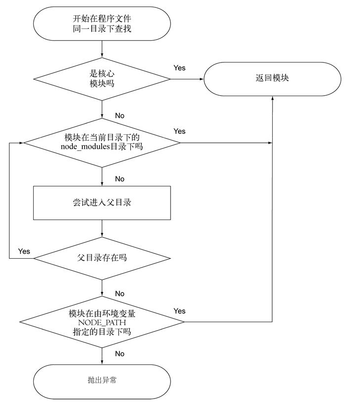
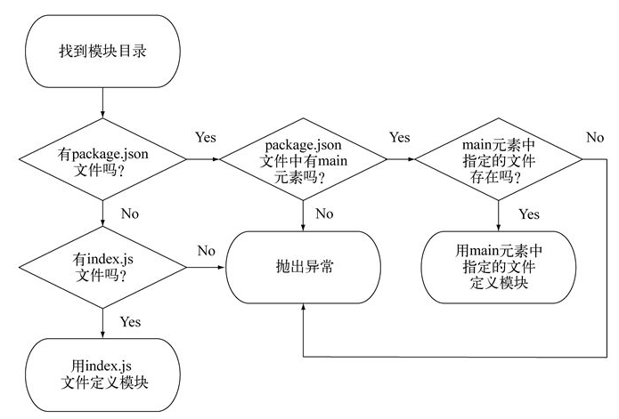

> 《Node.js 实战》

### 3.1 Node 功能的组织及重用

Node 模块允许你从被引入文件中选择要暴露给程序的函数和变量。如果模块返回的函数或变量不止一个，那它可以通过设定 `exports` 对象的属性来指明它们。但如果模块只返回一个函数或变量，则可以设置 `module.exports` 属性。

#### 3.1.1 创建模块

模块既可以是一个文件，也可以是包含一个或多个文件的目录。如果模块是个目录，Node 通常会在这个目录下找一个名为 `index.js` 的文件作为模块的入口（这个默认设置可以被更改）。

典型的模块是一个包含 `exports` 对象属性定义的文件，这些属性可以是任意类型的数据。

> 数据的类型可以是字符串，对象和函数

使用模块需要用到 Node 的 `require` 函数，该函数以模块的路径作为参数。Node 以同步的方式寻找它，定位到这个模块并加载文件中的内容。

> **关于 `require` 和同步 I/O**
>
> `require` 是少数几个同步 I/O 操作之一。因为经常使用到模块，并且一般都是在文件的顶部引入，把 `require` 做成同步的有助于保持代码的整洁、有序、增强可读性。
>
> 但是在 I/O 密集的地方尽量不要使用 `require`，所有的同步调用都会阻塞 Node。所以通常只在程序最初加载时才使用 `require` 和其它的同步操作。

用路径 `./` 表示模块跟程序放在同一个目录下，在引入时，`.js` 扩展名可以忽略。

> `var currency = require("./currency");`
> 如果想把模块放在子目录中，比如 `lib`，则引入方式为：
>
> `var currency = require("./lib/currency");`

#### 3.1.2 用 module.exports 微调模块的创建

用 `module.exports` 可以对外提供单个变量、函数或对象。如果创建了一个既有 `exports` 又有 `module.exports` 的模块，那它会返回 `module.exports`，而 `exports` 会被忽略。

> **导出的究竟是什么**
>
> 最终在程序里面导出的是 `module.exports`。
> `exports` 只是对 `module.exports` 的一个全局引用，最初被定义为一个可以添加属性的空对象。所以 `exports.myFunc` 只是 `module.exports.myFunc` 的简写。

#### 3.1.3 用 node_modules 重用模块

如果引入模块的时候省略了 `./`，即 `require("currency")`，那么 Node 会按下图的规则进行寻找：



> 环境变量 `NODE_PATH` 可以改变 Node 模块的默认路径。

#### 3.1.4 注意事项

如果模块是目录，在模块目录中定义模块的文件必须被命名为 `index.js`，除非在这个目录下的 `package.json` 文件通过定义一个 JSON 对象，其中名为 `main` 的键指明模块目录内主文件的路径。



> 在 package.json 中指定 currency.js 为主文件
>
> ```json
> {
>     "main": "./currency.js"
> }
> ```

Node 能把模块作为对象缓存起来。如果程序中有两个文件引入了相同的模块，第一个文件会把模块返回的数据存到程序的内存中，这样第二个文件就不用再去访问和计算模块的资源文件了。

### 3.2 异步编程技术

**回调**通常用来定义一次性响应逻辑。

**事件监听器**本质上也是一个回调，不同的是，它跟一个事件相关联。

#### 3.2.1 用回调处理一次性事件

回调是一个函数，它被当作参数传给异步函数，它描述了异步操作完成之后要做什么。

