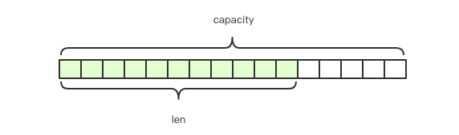

##### Redis基础数据结构

Redis所有的数据结构都是以唯一的key字符串作为名称，然后通过key来获取相应的value数据。不同类型的数据结构的差异就在于value的结构不一样。

- 5种基础数据结构为：

  - string (字符串)

  - list (列表)

  - set (集合)

  - hash (哈希) 

  - zset (有序集合)

- string (字符串)

  Redis的字符串是动态字符串，是可以修改的字符串，内部结构实现上类似于 Java 的 ArrayList，采用预分配冗余空间的方式来减少内存的频繁分配。

  

  内部为当前字符串实际分配的空间 capacity 一般要高于实际字符串长度 len。

  当字符串长度小于 1M 时，扩容都是加倍现有的空间，如果超过 1M，扩容时一次只会多扩 1M 的空间

  > 注意：字符串最大长度为 512M

- list（列表）

  Redis 的列表相当于 Java 语言里面的 LinkedList，注意它是链表而不是数组。

  即 list 的插入和删除操作非常快，时间复杂度为 O(1)，但是索引定位很慢，时间复杂度为 O(n)

- hash (字典)

  Redis 的字典相当于 Java 语言里面的 HashMap，它是无序字典。

  内部实现结构上同 Java 的 HashMap 也是一致的，同样的数组 + 链表二维结构。第一维 hash 的数组位置碰撞时，就会将碰撞的元素使用链表串接起来。

  不同的是：

  - Redis 的字典的值只能是字符串

  - rehash 的方式不一样，Redis 为了高性能，不能堵塞服务，采用了渐进式 rehash 策略

    渐进式 rehash 会在 rehash 的同时，保留新旧两个 hash 结构，查询时会同时查询两个 hash 结构，然后在后续的定时任务中以及 hash 操作指令中，循序渐进地将旧 hash 的内容一点点迁移到新的 hash 结构中。当搬迁完成了，就会使用新的hash结构取而代之

- set (集合)

  Redis 的集合相当于 Java 语言里面的 HashSet，它内部的键值对是无序的唯一的。它的内部实现相当于一个特殊的字典，字典中所有的 value 都是一个`NULL`值

- zset (有序集合)

  类似于 Java 的 SortedSet 和 HashMap 的结合体，一方面它是一个 set，保证了内部 value 的唯一性，另一方面它可以给每个 value 赋予一个 score，代表这个 value 的排序权重。

  它的内部实现用的是一种叫做「跳跃列表」的数据结构

- 容器型数据结构的通用规则

  list/set/hash/zset 这四种数据结构是容器型数据结构，它们共享下面两条通用规则：

  1. create if not exists

     如果容器不存在，那就创建一个，再进行操作

  2. drop if no elements

     如果容器里元素没有了，那么立即删除元素，释放内存

- 过期时间

  Redis 所有的数据结构都可以设置过期时间，时间到了，Redis 会自动删除相应的对象

  > 注意：过期是以对象为单位，比如一个 hash 结构的过期是整个 hash 对象的过期，而不是其中的某个子 key

  如果一个字符串已经设置了过期时间，然后再调用了 set 方法修改了它，它的过期时间会消失

