> 深入理解Java虚拟机：JVM高级特性与最佳实践（第3版）周志明

## 2.2 运行时数据区域

### 2.2.1 程序计数器

程序计数器（Program Counter Register）是一块较小的内存空间，它可以看作是当前线程所执行的字节码的行号指示器

字节码解释器工作时就是通过改变这个计数器的值来选取下一条需要执行的字节码指令，它是程序控制流的指示器，分支、循环、跳转、异常处理、线程恢复等基础功能都需要依赖这个计数器来完成

### 2.2.2 Java虚拟机栈

每个方法被执行的时候，Java虚拟机都会同步创建一个栈帧（Stack Frame）用于存储局部变量表、操作数栈、动态连接、方法出口等信息。每一个方法被调用直至执行完毕的过程，就对应着一个栈帧在虚拟机栈中从入栈到出栈的过程

局部变量表存放了编译期可知的各种Java虚拟机基本数据类型（boolean、byte、char、short、int、float、long、double）、对象引用（reference类型，它并不等同于对象本身，可能是一个指向对象起始地址的引用指针，也可能是指向一个代表对象的句柄或者其他与此对象相关的位置）和returnAddress类型（指向了一条字节码指令的地址）

如果线程请求的栈深度大于虚拟机所允许的深度，将抛出StackOverflowError异常

如果线程申请栈**空间**失败了，会出现OOM异常

### 2.2.3 本地方法栈

本地方法栈（Native Method Stacks）与虚拟机栈所发挥的作用是非常相似的，其区别只是虚拟机栈为虚拟机执行Java方法（也就是字节码）服务，而本地方法栈则是为虚拟机使用到的本地（Native）方法服务

### 2.2.4 Java堆

Java堆（Java Heap）是虚拟机所管理的内存中最大的一块

Java堆是被所有线程共享的一块内存区域，在虚拟机启动时创建。此内存区域的唯一目的就是存放对象实例，Java世界里“几乎”所有的对象实例都在这里分配内存

Java堆可以处于物理上不连续的内存空间中，但在逻辑上它应该被视为连续的，这点就像我们用磁盘空间去存储文件一样，并不要求每个文件都连续存放

### 2.2.5 方法区

方法区（Method Area）与Java堆一样，是各个线程共享的内存区域，它用于存储已被虚拟机加载的类型信息、常量、静态变量、即时编译器编译后的代码缓存等数据

> 虽然《Java虚拟机规范》中把方法区描述为堆的一个逻辑部分，但是它却有一个别名叫作“非堆”（Non-Heap），目的是与Java堆区分开来

> 很多人都更愿意把方法区称呼为“永久代”（PermanentGeneration），或将两者混为一谈。本质上这两者并不是等价的
>
> 因为仅仅是当时的HotSpot虚拟机设计团队选择把收集器的分代设计扩展至方法区，或者说使用永久代来实现方法区而已，这样使得HotSpot的垃圾收集器能够像管理Java堆一样管理这部分内存，省去专门为方法区编写内存管理代码的工作
>
> 原则上如何实现方法区属于虚拟机实现细节，不受《Java虚拟机规范》管束

> JDK 7的HotSpot，已经把原本放在永久代的字符串常量池、静态变量等移至Java堆之中
>
> JDK 8，完全废弃了永久代的概念，改用在本地内存中实现的元空间（Meta-space）来代替，把JDK 7中永久代还剩余的内容（主要是类型信息）全部移到元空间中

方法区的内存回收目标主要是针对常量池的回收和对类型的卸载

### 2.2.6 运行时常量池

运行时常量池（Runtime Constant Pool）是方法区的一部分

Class文件中除了有类的版本、字段、方法、接口等描述信息外，还有一项信息是常量池表（Constant Pool Table），用于存放编译期生成的各种字面量与符号引用，这部分内容将在类加载后存放到方法区的运行时常量池中

### 2.2.7 直接内存

直接内存（Direct Memory）并不是虚拟机运行时数据区的一部分，也不是《Java虚拟机规范》中定义的内存区域

NIO（New Input/Output）类，引入了一种基于通道（Channel）与缓冲区（Buffer）的I/O方式，它可以使用Native函数库直接分配堆外内存，然后通过一个存储在Java堆里面的DirectByteBuffer对象作为这块内存的引用进行操作

这样能在一些场景中显著提高性能，因为避免了在Java堆和Native堆中来回复制数据

本机直接内存的分配不会受到Java堆大小的限制，但是会受到本机总内存（包括物理内存、SWAP分区或者分页文件）大小以及处理器寻址空间的限制

配置虚拟机参数时，如果忽略掉直接内存，使得各个内存区域总和大于物理内存限制（包括物理的和操作系统级的限制），会导致动态扩展时出现OutOfMemoryError异常

### 2.3.1 对象的创建

- 当Java虚拟机遇到一条字节码new指令时，首先将去检查这个指令的参数是否能在常量池中定位到一个类的符号引用，并且检查这个符号引用代表的类是否已被加载、解析和初始化过。如果没有，那必须先执行相应的类加载过程

- 在类加载检查通过后，接下来虚拟机将为新生对象分配内存

  对象所需内存的大小在类加载完成后便可完全确定，为对象分配空间的任务实际上便等同于把一块确定
  大小的内存块从Java堆中划分出来

- 内存分配完成之后，虚拟机必须将分配到的内存空间（但不包括对象头）都初始化为零值

  这步操作保证了对象的实例字段在Java代码中可以不赋初始值就直接使用，使程序能访问到这些字段的数据类型所对应的零值

  > 从虚拟机的视角来看，一个新的对象已经产生了
  >
  > 但是从Java程序的视角看来，对象创建才刚刚开始
  >
  > 因为构造函数，即Class文件中的\<init\>()方法还没有执行，所有的字段都为默认的零值，对象需要的其他资源和状态信息也还没有按照预定的意图构造好

- new指令之后会接着执行\<init\>()方法，按照程序员的意愿对对象进行初始化，这样一个真正可用的对象才算完全被构造出来

### 2.3.2 对象的内存布局

在HotSpot虚拟机里，对象在堆内存中的存储布局可以划分为三个部分：

- 对象头（Object Header）

  - 第一部分用于存储对象自身的运行时数据

    如哈希码（HashCode）、GC分代年龄（Generational GC Age）、锁状态标志、线程持有的锁、偏向线程ID、偏向时间戳等

    这部分数据的长度在32位和64位的Java虚拟机中分别会占用32个或64个比特，官方称它为“MarkWord”

  - 另一部分是类型指针，即对象指向它的类型元数据的指针

    即用于存储指向方法区对象类型数据的指针

    如果是数组对象，还会有一个额外的部分用于存储数组长度

- 实例数据（Instance Data）

- 对齐填充（Padding）

  由于HotSpot虚拟机的自动内存管理系统要求对象起始地址必须是8字节的整数倍，即任何对象的大小都必须是8字节的整数倍

  因此，如果对象实例数据部分没有对齐的话，就需要通过对齐填充来补全

  > 不是必然存在的，也没有特别的含义，仅仅起着占位符的作用

### 2.4.3 方法区和运行时常量池溢出

在JDK 8以后，永久代便完全退出了历史舞台，元空间作为其替代者登场

在默认设置下，正常的动态创建新类型已经很难再产生方法区的溢出异常了

- `-XX:MaxMetaspaceSize`

  设置元空间最大值，默认是-1，即不限制，或者说只受限于本地内存大小

- `-XX:MetaspaceSize`

  指定元空间的初始空间大小，以字节为单位，达到该值就会触发垃圾收集进行类型卸载，同时收集器会对该值进行调整：如果释放了大量的空间，就适当降低该值；如果释放了很少的空间，那么在不超过-XX：MaxMetaspaceSize（如果设置了的话）的情况下，适当提高该值

- `-XX:MinMetaspaceFreeRatio`

  作用是在垃圾收集之后控制最小的元空间剩余容量的百分比，可减少因为元空间不足导致的垃圾收集的频率

- `-XX:MaxMetaspaceFreeRatio`

  用于控制最大的元空间剩余容量的百分比

### 2.4.4 本机直接内存溢出

直接内存（Direct Memory）的容量大小可通过`-XX:MaxDirectMemorySize`参数来指定，如果不去指定，则默认与Java堆最大值（由`-Xmx`指定）一致

`DirectByteBuffer`分配内存会抛出内存溢出异常，但它抛出异常时并没有真正向操作系统申请分配内存，而是通过计算得知内存无法分配就会抛出溢出异常

真正申请分配内存的方法是`Unsafe::allocateMemory()`

## 3.1 概述

程序计数器、虚拟机栈、本地方法栈3个区域随线程而生，随线程而灭，栈中的栈帧随着方法的进入和退出而有条不紊地执行着出栈和入栈操作。每一个栈帧中分配多少内存基本上是在类结构确定下来时就已知的，当方法结束或者线程结束时，内存自然就跟随着回收了

Java堆和方法区这两个区域则有着不确定性：

- 一个接口的多个实现类需要的内存可能会不一样
- 一个方法所执行的不同条件分支所需要的内存也可能不一样

只有处于运行期间，我们才能知道程序究竟会创建哪些对象，创建多少个对象，这部分内存的分配和回收是动态的

### 3.2.1 引用计数算法

在对象中添加一个引用计数器，每当有一个地方引用它时，计数器值就加一；当引用失效时，计数器值就减一

很难解决对象之间相互循环引用的问题

### 3.2.2 可达性分析算法

通过一系列称为GC Roots的根对象作为起始节点集，从这些节点开始，根据引用关系向下搜索，搜索过程所走过的路径称为“引用链”（Reference Chain），如果某个对象到GC Roots间没有任何引用链相连，或者说从GC Roots到这个对象不可达时，则证明此对象是不可能再被使用的

固定可作为GC Roots的对象包括以下几种：

- 在虚拟机栈（栈帧中的本地变量表）中引用的对象

  比如各个线程被调用的方法堆栈中使用到的参数、局部变量、临时变量等

- 在方法区中类静态属性引用的对象

  比如Java类的引用类型静态变量

- 在方法区中常量引用的对象

  比如字符串常量池（String Table）里的引用

- 在本地方法栈中JNI（即通常所说的Native方法）引用的对象

- Java虚拟机内部的引用

  如基本数据类型对应的Class对象，一些常驻的异常对象（比如NullPointExcepiton、OutOfMemoryError）等，还有系统类加载器

- 所有被同步锁（synchronized关键字）持有的对象

- 反映Java虚拟机内部情况的JMXBean、JVMTI中注册的回调、本地代码缓存等。

### 3.2.3 再谈引用

- 强引用（Strongly Reference）

  最传统的“引用”的定义，是指在程序代码之中普遍存在的引用赋值，即类似`Objectobj=new Object()`这种引用关系

  无论任何情况下，只要强引用关系还存在，垃圾收集器就永远不会回收掉被引用的对象

- 软引用（Soft Reference）

  用来描述一些还有用，但非必须的对象

  只被软引用关联着的对象，在系统将要发生内存溢出异常前，会把这些对象列进回收范围之中进行第二次回收，如果这次回收还没有足够的内存，才会抛出内存溢出异常

  在JDK 1.2版之后提供了`SoftReference`类来实现软引用

- 弱引用（Weak Reference）

  用来描述那些非必须对象，但是它的强度比软引用更弱一些，被弱引用关联的对象只能生存到下一次垃圾收集发生为止

  当垃圾收集器开始工作，无论当前内存是否足够，都会回收掉只被弱引用关联的对象

  在JDK 1.2版之后提供了`WeakReference`类来实现弱引用

- 虚引用（Phantom Reference）

  称为“幽灵引用”或者“幻影引用”，它是最弱的一种引用关系

  一个对象是否有虚引用的存在，完全不会对其生存时间构成影响，也无法通过虚引用来取得一个对象实例

  为一个对象设置虚引用关联的唯一目的只是为了能在这个对象被收集器回收时收到一个系统通知

  在JDK 1.2版之后提供了`PhantomReference`类来实现虚引用

### 3.2.4 生存还是死亡

宣告一个对象死亡，至少要经历两次标记过程：

- 如果对象在进行可达性分析后发现没有与GC Roots相连接的引用链，那它将会被第一次标记，随后进行一次筛选

  - 筛选的条件是此对象是否有必要执行`finalize()`方法

    `finalize()`方法是对象逃脱死亡命运的最后一次机会

    - 假如对象没有覆盖`finalize()`方法，或者`finalize()`方法已经被虚拟机调用过，那么虚拟机将这两种情况都视为没有必要执行

    - 如果这个对象被判定为确有必要执行`finalize()`方法

      那么该对象将会被放置在一个名为`F-Queue`的队列之中，并在稍后由一条由虚拟机自动建立的、低调度优先级的`Finalizer`线程去执行它们的`finalize()`方法

      > 这里所说的“执行”是指虚拟机会触发这个方法开始运行，但并不承诺一定会等待它运行结束
      >
      > 这样做的原因是，如果某个对象的finalize()方法执行缓慢，或者更极端地发生了死循环，将很可能导致`F-Queue`队列中的其他对象永久处于等待，甚至导致整个内存回收子系统的崩溃

      

- 稍后收集器将对`F-Queue`中的对象进行第二次小规模的标记

  - 如果对象在`finalize()`中重新与引用链上的任何一个对象建立关联，那么在第二次标记时它将被移出“即将回收”的集合

  - 如果对象这时候还没有逃脱，那基本上它就真的要被回收了

    > 建立关联的方式，比如把自己（this关键字）赋值给某个类变量或者对象的成员变量

> `finalize()`如今已被官方明确声明为不推荐使用的语法

### 3.2.5 回收方法区

方法区的垃圾收集主要回收两部分内容：

- 废弃的常量

  已经没有任何字符串对象引用常量池中的常量，且虚拟机中也没有其他地方引用这个字面量。如果在这时发生内存回收，而且垃圾收集器判断确有必要的话，这个常量就将会被系统清理出常量池

- 不再使用的类型

  - 该类所有的实例都已经被回收

    也就是Java堆中不存在该类及其任何派生子类的实例

  - 加载该类的类加载器已经被回收

    这个条件除非是经过精心设计的可替换类加载器的场景，如OSGi、JSP的重加载等，否则通常是很难达成的

  - 该类对应的`java.lang.Class`对象没有在任何地方被引用，无法在任何地方通过反射访问该类的方法

  Java虚拟机**被允许**对满足上述三个条件的无用类进行回收

在大量使用反射、动态代理、CGLib等字节码框架，动态生成JSP以及OSGi这类频繁自定义类加载器的场景中，通常都需要Java虚拟机具备类型卸载的能力，以保证不会对方法区造成过大的内存压力

## 3.3 垃圾收集算法

> 推荐阅读Richard Jones撰写的《垃圾回收算法手册》的第2～4章的相关内容

### 3.3.1 分代收集理论

- 弱分代假说（Weak Generational Hypothesis）

  绝大多数对象都是朝生夕灭的

- 强分代假说（Strong Generational Hypothesis）

  熬过越多次垃圾收集过程的对象就越难以消亡

这两个分代假说共同奠定了多款常用的垃圾收集器的一致的设计原则：收集器应该将Java堆划分出不同的区域，然后将回收对象依据其年龄（年龄即对象熬过垃圾收集过程的次数）分配到不同的区域之中存储

- 跨代引用假说（Intergenerational Reference Hypothesis）

  跨代引用相对于同代引用来说仅占极少数
  
  这其实是可根据前两条假说逻辑推理得出的隐含推论：存在互相引用关系的两个对象，是应该倾向于同时生存或者同时消亡的
  
  > 举个例子，如果某个新生代对象存在跨代引用，由于老年代对象难以消亡，该引用会使得新生代对象在收集时同样得以存活，进而在年龄增长之后晋升到老年代中，这时跨代引用也随即被消除了
  
  依据这条假说，我们就不应再为了少量的跨代引用去扫描整个老年代，也不必浪费空间专门记录每一个对象是否存在及存在哪些跨代引用

---

一般至少会把Java堆划分为新生代（Young Generation）和老年代（Old Generation）两个区域

> 在新生代中每次垃圾收集时都发现有大批对象死去，而每次回收后存活的少量对象，将会逐步晋升到老年代中存放，老年代则与之相反
>

---

不同分代的名词定义：

- **部分收集（Partial GC）**：指目标不是完整收集整个Java堆的垃圾收集

  其中又分为：

  - **新生代收集（Minor GC/Young GC）**：指目标只是新生代的垃圾收集。

  - **老年代收集（Major GC/Old GC）**：指目标只是老年代的垃圾收集

    目前只有CMS收集器会有单独收集老年代的行为

    > Major GC这个说法现在有点混淆，在不同资料上常有不同所指，读者需按上下文区分到底是指老年代的收集还是整堆收集

  - **混合收集（Mixed GC）**：指目标是收集整个新生代以及部分老年代的垃圾收集

    目前只有G1收集器会有这种行为

- **整堆收集（Full GC）**：收集整个Java堆和方法区的垃圾收集

### 3.3.2 标记-清除算法

> 最基础的垃圾收集算法
>
> 后续的收集算法大多都是以标记-清除算法为基础，对其缺点进行改进而得到的

分为“标记”和“清除”两个阶段：首先标记出所有需要回收的对象，在标记完成后，统一回收掉所有被标记的对象

缺点：

- 执行效率不稳定

  如果Java堆中包含大量对象，而且其中大部分是需要被回收的，这时必须进行大量标记和清除的动作，导致标记和清除两个过程的执行效率都随对象数量增长而降低

- 内存空间的碎片化

  标记、清除之后会产生大量不连续的内存碎片，空间碎片太多可能会导致当以后在程序运行过程中需要分配较大对象时无法找到足够的连续内存而不得不提前触发另一次垃圾收集动作

### 3.3.3 标记-复制算法

>被简称为复制算法
>
>为了解决标记-清除算法面对大量可回收对象时执行效率低的问题

把新生代分为一块较大的Eden空间和两块较小的Survivor空间，每次分配内存只使用Eden和其中一块Survivor

发生垃圾搜集时，将Eden和Survivor中仍然存活的对象一次性复制到另外一块Survivor空间上，然后直接清理掉Eden和已用过的那块Survivor空间

> HotSpot虚拟机默认Eden和Survivor的大小比例是8:1

如果另外一块Survivor空间不足以容纳一次Minor GC之后存活的对象时，这些对象便将通过分配担保机制（Handle Promotion）直接进入老年代、

缺点是：对象存活率较高时就要进行较多的复制操作，效率将会降低。更关键的是需要有额外的空间进行分配担保

### 3.3.4 标记-整理算法（Mark-Compact）

其中的标记过程仍然与“标记-清除”算法一样，但后续步骤不是直接对可回收对象进行清理，而是让所有存活的对象都向内存空间一端移动，然后直接清理掉边界以外的内存

如果移动存活对象，尤其是在老年代这种每次回收都有大量对象存活区域，移动存活对象并更新所有引用这些对象的地方将会是一种极为负重的操作，而且这种对象移动操作必须全程暂停用户应用程序才能进行

> 这种暂停被称为Stop The World

## 3.5 经典垃圾收集器

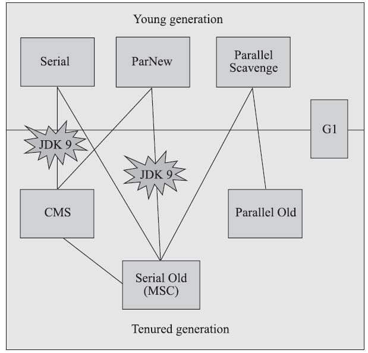

> 如果两个收集器之间存在连线，就说明它们可以搭配使用
>
> 标注JDK 9的表示，在JDK 9中完全取消了这些组合的支持

### 3.5.1 Serial收集器

是一个单线程工作的收集器，它只会使用一个处理器或一条收集线程去完成垃圾收集工作，在它进行垃圾收集时，必须暂停其他所有工作线程，直到它收集结束

> 它是HotSpot虚拟机运行在客户端模式下的默认新生代收集器

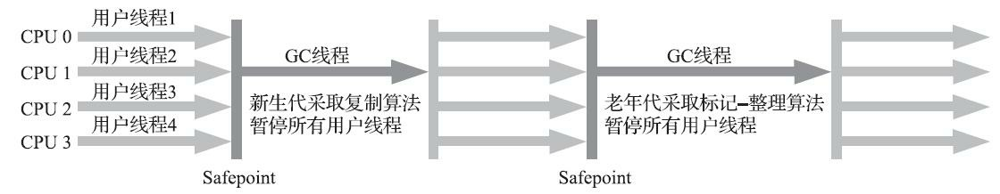

### 3.5.2 ParNew收集器

实质上是Serial收集器的多线程**并行**版本，除了同时使用多条线程进行垃圾收集之外，其余的行为包括Serial收集器可用的所有控制参数（例如：-XX：SurvivorRatio、-XX：PretenureSizeThreshold、-XX：HandlePromotionFailure等）、收集算法、Stop The World、对象分配规则、回收策略等都与Serial收集器完全一致

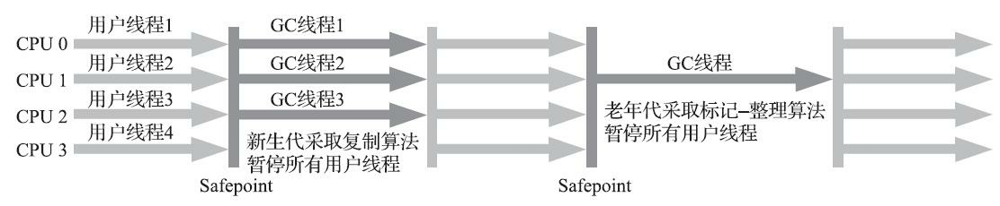

在垃圾收集器的上下文语境中：

- 并行（Parallel）

  描述的是多条垃圾收集器线程之间的关系，说明同一时间有多条这样的线程在协同工作

  通常默认此时用户线程是处于等待状态

- 并发（Concurrent）

  并发描述的是垃圾收集器线程与用户线程之间的关系，说明同一时间垃圾收集器线程与用户线程都在运行

  由于用户线程并未被冻结，所以程序仍然能响应服务请求，但由于垃圾收集器线程占用了一部分系统资源，此时应用程序的处理的吞吐量将受到一定影响

### 3.5.3 Parallel Scavenge收集器

是一款基于标记-复制算法实现的、能够并行收集的多线程、新生代收集器，更关注达到一个可控制的吞吐量（Throughput）

> 吞吐量就是处理器用于运行用户代码的时间与处理器总消耗时间的比值

提供了两个参数用于精确控制吞吐量：

- `-XX:MaxGCPauseMillis`：控制最大垃圾收集停顿时间

  参数的值是一个大于0的毫秒数，收集器将尽力保证内存回收花费的时间不超过用户设定值

- `-XX:GCTimeRatio`：直接设置吞吐量大小

  参数的值则是一个大于0小于100的整数，表示用户期望虚拟机消耗在GC上的时间不超过程序运行时间的`1/(1+N）`

  默认值为99，含义是尽可能保证应用程序执行的时间为收集器执行时间的99倍，也即是收集器的时间消耗不超过总运行时间的1%

---

垃圾收集的自适应的调节策略：虚拟机会根据当前系统的运行情况收集性能监控信息，动态调整这些参数以提供最合适的停顿时间或者最大的吞吐量

Parallel Scavenge收集器提供了一个参数`-XX:+UseAdaptiveSizePolicy`，来配合调节策略：

当这个参数被激活后，就不需要人工指定新生代的大小（-Xmn）、Eden与Survivor区的比例（-XX：SurvivorRatio）、晋升老年代对象大小（-XX：PretenureSizeThreshold）等细节参数

只需要把基本的内存数据设置好（如-Xmx设置最大堆），然后使用-XX：MaxGCPauseMillis参数（更关注最大停顿时间）或-XX：GCTimeRatio（更关注吞吐量）参数给虚拟机设立一个优化目标，那具体细节参数的调节工作就
由虚拟机完成

### 3.5.4 Serial Old收集器

Serial Old是Serial收集器的老年代版本，它同样是一个单线程收集器，使用标记-整理算法

在服务端模式下，有两种用途：

- 一种是在JDK 5以及之前的版本中与Parallel Scavenge收集器搭配使用
- 另一种就是作为CMS收集器发生失败时的后备预案，在并发收集发生Concurrent Mode Failure时使用

### 3.5.5 Parallel Old收集器

Parallel Old是Parallel Scavenge收集器的老年代版本，支持多线程并发收集，基于标记-整理算法实现

> JDK 6时才开始提供

在注重吞吐量或者处理器资源较为稀缺的场合，都可以优先考虑Parallel Scavenge加Parallel Old收集器这个组
合

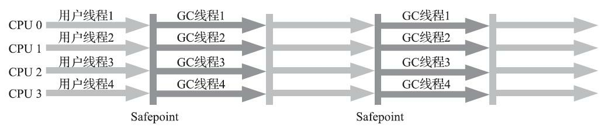

### 3.5.6 CMS收集器

CMS（Concurrent Mark Sweep）收集器是一种以获取最短回收停顿时间为目标的收集器，基于标记-清除算法实现的

运作整个过程分为四个步骤：

- 初始标记（CMS initial mark）

  仅仅只是标记一下GCRoots能直接关联到的对象，速度很快

- 并发标记（CMS concurrent mark）

  从GC Roots的直接关联对象开始遍历整个对象的过程，这个过程耗时较长但是不需要停顿用户线程，可以与垃圾收集线程一起并发运行

- 重新标记（CMS remark）

  为了修正并发标记期间，因用户程序继续运作而导致标记产生变动的那一部分对象的标记记录

  这个阶段的停顿时间通常会比初始标记阶段稍长一些，但也远比并发标记阶段的时间短

- 并发清除（CMS concurrent sweep）

  清理删除掉标记阶段判断的已经死亡的对象，由于不需要移动存活对象，所以这个阶段也是可以与用户线程同时并发的

由于在整个过程中耗时最长的并发标记和并发清除阶段中，垃圾收集器线程都可以与用户线程一起工作，所以从总体上来说，CMS收集器的内存回收过程是与用户线程一起并发执行的

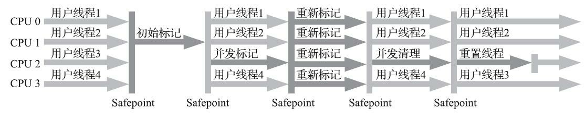

缺点如下：

- CMS收集器对处理器资源非常敏感

  > 事实上，面向并发设计的程序都对处理器资源比较敏感

  在并发阶段，它虽然不会导致用户线程停顿，但却会因为占用了一部分线程（或者说处理器的计算能力）而导致应用程序变慢，降低总吞吐量

  CMS默认启动的回收线程数是**（处理器核心数量+3）/4**，也就是说，如果处理器核心数在四个或以上，并发回收时垃圾收集线程只占用不超过25%的处理器运算资源，并且会随着处理器核心数量的增加而下降

  但是当处理器核心数量不足四个时，CMS对用户程序的影响就可能变得很大

  如果应用本来的处理器负载就很高，还要分出一半的运算能力去执行收集器线程，就可能导致用户程序的执行速度忽然大幅降低

- 无法处理“浮动垃圾”（Floating Garbage）

  在CMS的并发标记和并发清理阶段，用户线程是还在继续运行的，程序在运行自然就还会伴随有新的垃圾对象不断产生，但这一部分垃圾对象是出现在标记过程结束以后，CMS无法在当次收集中处理掉它们，只好留待下一次垃圾收集时再清理掉

  由于在垃圾收集阶段用户线程还需要持续运行，那就还需要预留足够内存空间提供给用户线程使用，因此CMS收集器不能像其他收集器那样等待到老年代几乎完全被填满了再进行收集，必须预留一部分空间供程序运作使用

  > 在JDK5的默认设置下，CMS收集器当老年代使用了68%的空间后就会被激活
  >
  > 如果在实际应用中老年代增长并不是太快，可以适当调高参数`-XX:CMSInitiatingOccupancyFraction`的值来提高CMS的触发百分比，降低内存回收频率，获取更好的性能
  >
  > 到了JDK 6时，CMS收集器的启动阈值默认为92%，这会带来另一种风险：要是CMS运行期间预留的内存无法满足程序分配新对象的需要，就会出现一次“并发失败”（Concurrent Mode Failure），这时候虚拟机将不得不启动后备预案：冻结用户线程的执行，临时启用Serial Old收集器来重新进行老年代的垃圾收集，但这样停顿时间就更长了
  >
  > 所以参数`-XX:CMSInitiatingOccupancyFraction`设置得太高将会很容易导致大量的并发失败产生，性能反而降低，用户应在生产环境中根据实际应用情况来权衡设置

- 空间碎片过多时，将会给大对象分配带来很大麻烦

  收集结束时会有大量空间碎片产生，往往会出现老年代还有很多剩余空间，但就是无法找到足够大的连续空间来分配当前对象，而不得不提前触发一次Full GC的情况

  因此CMS提供了一个`-XX:+UseCMSCompactAtFullCollection`开关参数，用于在CMS收集器在Full GC时开启内存碎片的合并整理过程

  > 默认是开启的，此参数JDK 9开始废弃

  由于这个内存整理必须移动存活对象，（在Shenandoah和ZGC出现前）是无法并发的。这样空间碎片问题是解决了，但停顿时间又会变长

  因此提供了另一个参数`-XX:CMSFullGCsBeforeCompaction`，这个参数的作用是要求CMS收集器在执行过若干次（数量由参数值决定）不整理空间的Full GC之后，下一次进入Full GC前会先进行碎片整理

  > 默认值为0，表示每次进入Full GC时都进行碎片整理
  >
  > 此参数从JDK 9开始废弃

### 3.5.7 Garbage First收集器

Garbage First（简称G1）

> JDK 7 Update 4，Oracle才认为它达到足够成熟的商用程度，移除了“Experimental”的标识

> JDK 8 Update 40，G1提供并发的类卸载的支持，被Oracle官方称为“全功能的垃圾收集器”（Fully-Featured Garbage Collector）

> JDK 9发布之日，G1宣告取代Parallel Scavenge加Parallel Old组合，成为服务端模式下的默认垃圾收集
>
> CMS被声明为不推荐使用
>
> 如果对JDK 9及以上版本的HotSpot虚拟机使用参数`-XX:+UseConcMarkSweepGC`来开启CMS收集器的话，用户会收到一个警告信息，提示CMS未来将会被废弃

G1面向堆内存任何部分来组成回收集（Collection Set，一般简称CSet）进行回收，衡量标准不再是它属于哪个分代，而是哪块内存中存放的垃圾数量最多，回收收益最大，这就是G1收集器的Mixed GC模式

G1把连续的Java堆划分为多个大小相等的独立区域（Region），每一个Region都可以根据需要，扮演新生代的Eden空间、Survivor空间，或者老年代空间。收集器能够对扮演不同角色的Region采用不同的策略去处理

Region中的Humongous区域，专门用来存储大对象。G1认为只要大小超过了一个Region容量一半的对象即可判定为大对象

每个Region的大小可以通过参数`-XX:G1HeapRegionSize`设定，取值范围为1MB～32MB，且应为2的N次幂

对于超过了整个Region容量的超级大对象，将会被存放在N个连续的Humongous Region之中，G1的大多数行为都把Humongous Region作为老年代的一部分来进行看待

将Region作为单次回收的最小单元，即每次收集到的内存空间都是Region大小的整数倍，这样可以有计划地避免
在整个Java堆中进行全区域的垃圾收集，具体的处理思路是：

- 让G1收集器去跟踪各个Region里面的垃圾堆积的价值大小

  **价值**即回收所获得的空间大小以及回收所需时间的经验值

- 然后在后台维护一个优先级列表，每次根据用户设定允许的收集停顿时间，优先处理回收价值收益最大的那些Region

  > 使用参数`-XX:MaxGCPauseMillis`指定，默认值是200毫秒

使用Region划分内存空间，以及具有优先级的区域回收方式，保证了G1收集器在有限的时间内获取尽可能高的收集效率

G1收集器的运作过程大致分为以下四个步骤：

- 初始标记（Initial Marking）

  仅仅只是标记一下GC Roots能直接关联到的对象

  这个阶段需要停顿线程，但耗时很短，而且是借用进行Minor GC的时候同步完成的

  所以G1收集器在这个阶段实际并没有额外的停顿

- 并发标记（Concurrent Marking）

  从GC Root开始对堆中对象进行可达性分析，递归扫描整个堆里的对象图，找出要回收的对象

  当对象图扫描完成以后，还需重新处理在并发时有引用变动的对象

  这阶段耗时较长，但可与用户程序并发执行

- 最终标记（Final Marking）

  对用户线程做另一个短暂的暂停，用于处理并发阶段结束后仍遗留下来的少量的对象

- 筛选回收（Live Data Counting and Evacuation）

  负责更新Region的统计数据，对各个Region的回收价值和成本进行排序，根据用户所期望的停顿时间来制定回收计划，可以自由选择任意多个Region构成回收集，然后把决定回收的那一部分Region的存活对象复制到空的Region中，再清理掉整个旧Region的全部空间

  这里的操作涉及存活对象的移动，是必须暂停用户线程，由多条收集器线程并行完成的

除了并发标记外，其余阶段也是要完全暂停用户线程的

G1并非纯粹地追求低延迟，官方给它设定的目标是在延迟可控的情况下获得尽可能高的吞吐量

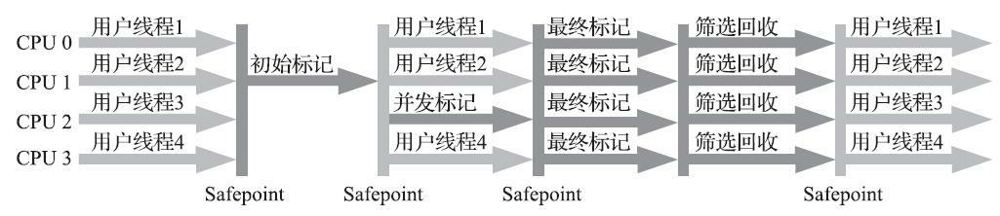

> 虽然G1可以由用户指定期望的停顿时间，但是这个期望值也是有限度的，是要符合预期的，比如：把停顿时间设置为二十毫秒
>
> 很可能出现的结果就是由于停顿目标时间太短，导致每次选出来的回收集只占堆内存很小的一部分，收集器收集的速度逐渐跟不上分配器分配的速度，导致垃圾慢慢堆积
>
> 很可能一开始收集器还能从空闲的堆内存中获得一些喘息的时间，但应用运行时间一长就不行了，最终占满堆引发Full GC反而降低性能
>
> 所以通常把期望停顿时间设置为一两百毫秒或者两三百毫秒是比较合理的

G1从整体来看是基于“标记-整理”算法实现的收集器，但从局部（两个Region之间）上看是基于“标记-复制”算法实现，无论如何，这两种算法都意味着G1运作期间不会产生内存空间碎片，垃圾收集完成之后能提供规整的可用内存

相比较CMS，G1的缺点：

- 内存占用高

  G1需要为堆中每个Region，无论是新生代还是老年代，都需要卡表来记录跨代指针，会占整个堆容量的20%乃至更多的内存空间

  而CMS的卡表只需要记录老年代到新生代的引用

- 执行负载高

  由于两个收集器各自的细节实现特点导致了用户程序运行时的负载会有不同

  CMS用写后屏障来更新维护卡表，G1除此之外，还需要使用写前屏障来跟踪并发时的指针变化情况

经验之谈，在小内存应用上CMS的表现大概率仍然要会优于G1，而在大内存应用上G1则大多能发挥其优势，这个优劣势的Java堆容量平衡点通常在6GB至8GB之间

## 3.6 低延迟垃圾收集器

衡量垃圾收集器的三项最重要的指标是：

- 内存占用（Footprint）
- 吞吐量（Throughput）
- 延迟（Latency）

三者共同构成了一个“不可能三角“，一款优秀的收集器通常最多可以同时达成其中的两项

Shenandoah和ZGC，处于实验状态的收集器，被官方命名为“低延迟垃圾收集器”（Low-Latency Garbage Collector或者Low-Pause-Time Garbage Collector）

### 3.6.1 Shenandoah收集器

### 3.6.2 ZGC收集器

### 3.7.3 虚拟机及垃圾收集器日志

JDK 9以前，HotSpot并没有提供统一的日志处理框架，虚拟机各个功能模块的日志开关分布在不同的参数上

JDK 9以后，HotSpot所有功能的日志都收归到了`-Xlog`参数上

- 查看GC基本信息

  JDK 9之前使用`-XX:+PrintGC`

  JDK 9之后使用`-Xlog:gc`

- 查看GC详细信息

  JDK 9之前使用`-XX:+PrintGCDetails`

  JDK 9之后使用`-Xlog：gc*`，用通配符`*`将GC标签下所有细分过程都打印出来

- 查看GC前后的堆、方法区可用容量变化

  JDK 9之前使用`-XX:+PrintHeapAtGC`

  JDK 9之后使用`-Xlog:gc+heap=debug`

- 查看GC过程中用户线程并发时间以及停顿的时间

  JDK 9之前使用`-XX:+PrintGCApplicationConcurrentTime`以及`-XX:+PrintGCApplicationStoppedTime`

  JDK 9之后使用`-Xlog:safepoint`

- 查看熬过收集后剩余对象的年龄分布信息

  JDK 9之前使用`-XX:+PrintTenuringDistribution`
  JDK 9之后使用`-Xlog:gc+age=trace`

### 3.7.4 垃圾收集器参数总结

### 3.8.1 对象优先在Eden分配

大多数情况下，对象在新生代Eden区中分配。当Eden区没有足够空间进行分配时，虚拟机将发起一次Minor GC

### 3.8.2 大对象直接进入老年代

大对象就是指需要大量连续内存空间的Java对象，最典型的大对象便是那种很长的字符串，或者元素数量很庞大的数组

在Java虚拟机中要避免大对象的原因是：

- 在分配空间时，它容易导致内存明明还有不少空间时就提前触发垃圾收集，以获取足够的连续空间才能安置好它们
- 在复制对象时，有高额的内存复制开销

HotSpot虚拟机提供了`-XX:PretenureSizeThreshold`参数，指定大于该设置值的对象直接在老年代分配

这样避免了在Eden区及两个Survivor区之间来回复制，产生大量的内存复制操作

> 该参数的单位为字节，比如值为3MB需要写成3145728
>
> 只对Serial和ParNew两款新生代收集器有效

### 3.8.3 长期存活的对象将进入老年代

当对象的年龄增加到一定程度（默认为15），就会被晋升到老年代中

对象晋升老年代的年龄阈值，可以通过参数`-XX:MaxTenuringThreshold`设置

### 3.8.4 动态对象年龄判定

如果在Survivor空间中相同年龄所有对象大小的总和大于Survivor空间的一半，年龄大于或等于该年龄的对象就可以直接进入老年代，无须等到`-XX:MaxTenuringThreshold`中要求的年龄

### 3.8.5 空间分配担保

JDK 6 Update 24之后的规则变为：只要老年代的连续空间大于新生代对象总大小或者历次晋升的平均大小，就会进行Minor GC，否则将进行Full GC

## 4.2 基础故障处理工具

如果被监控程序运行于JDK 6或以上版本的虚拟机之上，那JMX管理默认是开启的，虚拟机启动时无须再添加任何参数

### 4.2.1 jps：虚拟机进程状况工具

列出正在运行的虚拟机进程

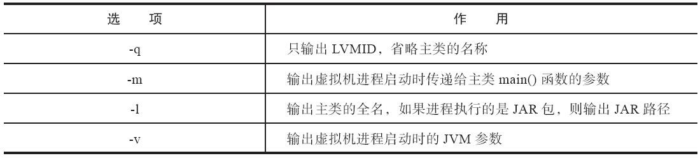

### 4.2.2 jstat：虚拟机统计信息监视工具

用于监视虚拟机各种运行状态信息

` jstat -<option> [-t] [-h<lines>] <vmid> [<interval> [<count>]]`

参数interval和count代表查询间隔和次数，如果省略这2个参数，说明只查询一次

例如，假设需要每250毫秒查询一次进程2764垃圾收集状况，一共查询20次，那命令应当是：

`jstat -gc 2764 250 20`

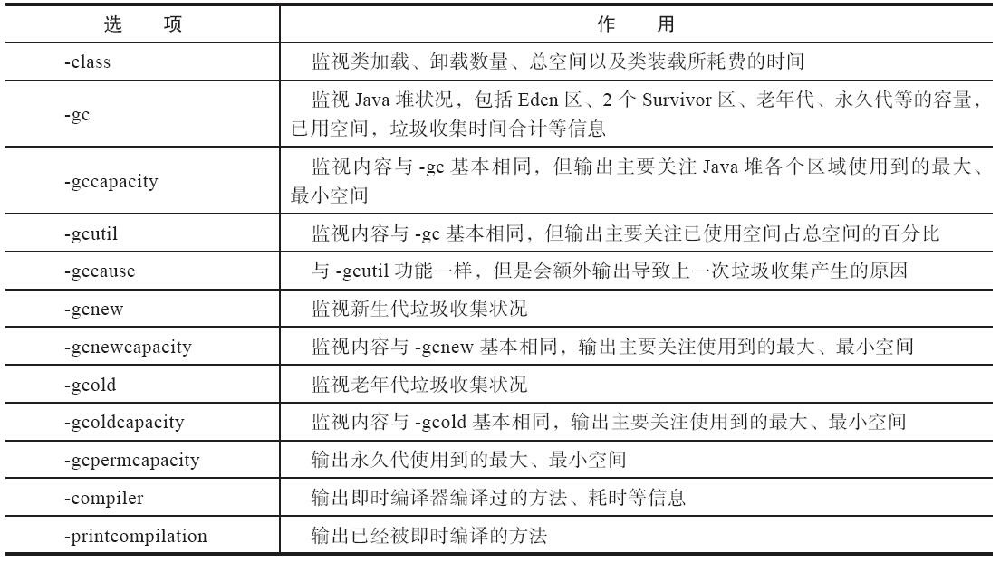

### 4.2.3 jinfo：Java配置信息工具

实时查看和调整虚拟机各项参数

使用`jps`命令的`-v`参数可以查看虚拟机启动时显式指定的参数列表，但如果想知道未被显式指定的参数的系统默认值，可以使用`jinfo`的`-flag`选项进行查询

还可以使用`-sysprops`选项把虚拟机进程的`System.getProperties()`的内容打印出来

### 4.2.4 jmap：Java内存映像工具

用于生成堆转储快照

### 4.2.6 jstack：Java堆栈跟踪工具

用于生成虚拟机当前时刻的线程快照

线程快照就是当前虚拟机内每一条线程正在执行的方法堆栈的集合，生成线程快照的目的通常是定位线程出现长时间停顿的原因

**7.4.2 双亲委派模型**

站在Java虚拟机的角度，只存在两种不同的类加载器：

- 一种是启动类加载器（Bootstrap ClassLoader）
- 另外一种就是其他所有的类加载器 这些类加载器都由Java语言实现，独立存在于虚拟机外部，并且全都继承自抽象类java.lang.ClassLoader 在JDK 8及之前版本的Java中什么是三层类加载器：
- 启动类加载器（Bootstrap Class Loader） 负责加载存放在`<JAVA_HOME>\lib`目录中的类库
- 扩展类加载器（Extension Class Loader） 负责加载`<JAVA_HOME>\lib\ext`目录中的类库
- 应用程序类加载器（Application Class Loader） 负责加载用户类路径（ClassPath）上所有的类库

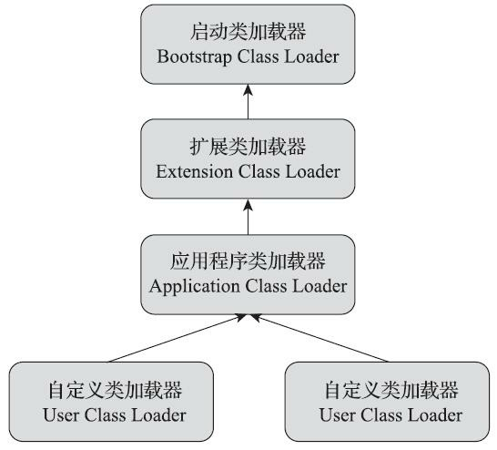

不过这里类加载器之间的父子关系一般不是以继承（Inheritance）的关系来实现的，而是通常使用组合（Composition）关系来复用父加载器的代码。

双亲委派模型的工作过程是：如果一个类加载器收到了类加载的请求，它首先不会自己去尝试加载这个类，而是把这个请求委派给父类加载器去完成，每一个层次的类加载器都是如此，因此所有的加载请求最终都应该传送到最顶层的启动类加载器中，只有当父加载器反馈自己无法完成这个加载请求（它的搜索范围中没有找到所需的类）时，子加载器才会尝试自己去完成加载

**7.4.3 破坏双亲委派模型**

- 继承java.lang.ClassLoader重写loadClass()方法
- 线程上下文类加载器（Thread Context ClassLoader）

通过`java.lang.Thread`类的`setContextClassLoader()`方法进行设置

如果创建线程时还未设置，它将会从父线程中继承一个，如果在应用程序的全局范围内都没有设置过的话，那这个类加载器默认就是应用程序类加载器

例如JNDI、JDBC等都是通过SPI（Service Provider Interface，服务提供者接口）来完成加载

- 代码热部署

  > 完全弄懂了OSGi的实现，就算是掌握了类加载器的精粹

## 12.2 硬件的效率与一致性

由于计算机的存储设备与处理器的运算速度有着几个数量级的差距，所以现代计算机系统都加入了一层或多层读写速度尽可能接近处理器运算速度的高速缓存（Cache）来作为内存与处理器之间的缓冲：将运算需要使用的数据复制到缓存中，让运算能快速进行，当运算结束后再从缓存同步回内存之中，这样处理器就无须等待缓慢的内存读写了

**缓存一致性（Cache Coherence）：**

在多路处理器系统中，每个处理器都有自己的高速缓存，而它们又共享同一主内存（Main Memory），这种系统称为共享内存多核系统（Shared Memory Multiprocessors System）。当多个处理器的运算任务都涉及同一块主内存区域时，将可能导致各自的缓存数据不一致

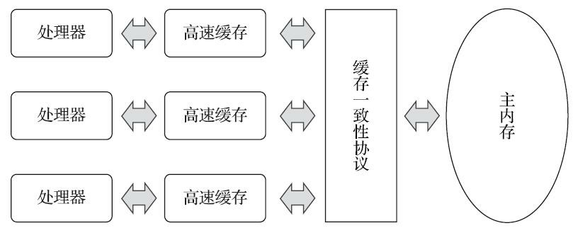

为了解决一致性的问题，需要各个处理器访问缓存时都遵循一些协议，在读写时要根据协议来进行操作。比如：MESI等

### 12.3.1 主内存与工作内存

Java内存模型的主要目的是定义程序中各种变量的访问规则，即关注在虚拟机中把变量值存储到内存和从内存中取出变量值这样的底层细节

> 此处的变量（Variables）与Java编程中所说的变量有所区别，它包括了实例字段、静态字段和构成数组对象的元素，但是不包括局部变量与方法参数，因为后者是线程私有的，不会被共享，自然就不会存在竞争问题
>
> 如果局部变量是一个reference类型，它引用的对象在Java堆中可被各个线程共享，但是reference本身在Java栈的局部变量表中是线程私有的

---

Java内存模型规定了所有的变量都存储在主内存（Main Memory）中

> 此处的主内存与物理硬件中的主内存名字一样，两者也可以类比，但物理上它仅是虚拟机内存的一部分

每条线程还有自己的工作内存（Working Memory），线程的工作内存中保存了被该线程使用的变量的主内存副本

> 对象的引用以及线程访问对象的某个字段是有可能被复制的，但不会有虚拟机把整个对象复制一次

线程对变量的所有操作（读取、赋值等）都必须在工作内存中进行，而不能直接读写主内存中的数据

不同的线程之间也无法直接访问对方工作内存中的变量，线程间变量值的传递均需要通过主内存来完成

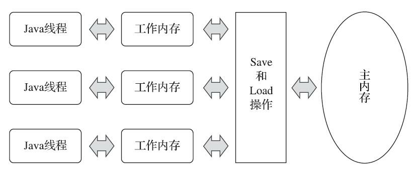

### 12.3.3 对于volatile型变量的特殊规则

当一个变量被定义成`volatile`之后，它将具备两项特性：

- 第一项是保证此变量对所有线程的可见性

  指当一条线程修改了这个变量的值，新值对于其他线程来说是可以立即得知的

- 第二项是禁止指令重排序优化

  只有一个处理器访问内存时，并不需要内存屏障；但如果有两个或更多处理器访问同一块内存，且其中有一个在观测另一个，就需要内存屏障来保证一致性了

  对于`volatile`修饰的变量，赋值后会多执行一个`lock addl$0x0，(%esp)`的操作，这个操作的作用相当于一个内存屏障

  lock前缀的作用是将本处理器的缓存写入了内存，该写入动作会让别的处理器或者别的内核的缓存失效

  通过这样一个空操作，可以让`volatile`变量的修改对其他处理器立即可见

  > `addl$0x0，(%esp)`（把ESP寄存器的值加0）是一个空操作

### 12.3.4 针对long和double型变量的特殊规则

允许虚拟机将没有被`volatile`修饰的64位数据的读写操作划分为两次32位的操作来进行

即允许虚拟机实现自行选择是否要保证64位数据类型操作的原子性

对于32位的Java虚拟机，有可能存在非原子性访问的风险

> 从JDK 9起，HotSpot增加了一个实验性的参数`-XX:+AlwaysAtomicAccesses`来约束虚拟机对所有数据类型进行原子性的访问

### 12.4.1 线程的实现

#### 4. Java线程的实现

主流Java虚拟机的线程模型普遍都被替换为基于操作系统原生线程模型来实现

以HotSpot为例，它的每一个Java线程都是直接映射到一个操作系统原生线程来实现的，而且中间没有额外的间接结构

所以HotSpot自己是不会去干涉线程调度的（可以设置线程优先级给操作系统提供调度建议），全权交给底下的操作系统去处理

所以何时冻结或唤醒线程、该给线程分配多少处理器执行时间、该把线程安排给哪个处理器核心去执行等，都是由操作系统完成的，也都是由操作系统全权决定的

## 13.2

### 13.2.2 线程安全的实现方法

#### 1. 互斥同步

互斥同步（Mutual Exclusion & Synchronization）是一种最常见也是最主要的并发正确性保障手段

**同步**是指在多个线程并发访问共享数据时，保证共享数据在同一个时刻只被一个线程使用

而互斥是实现同步的一种手段，临界区（Critical Section）、互斥量（Mutex）和信号量（Semaphore）都是常见的互斥实现方式

因此互斥是因，同步是果；互斥是方法，同步是目的

---

`synchronized`关键字经过Javac编译之后，会在同步块的前后分别形成`monitorenter`和`monitorexit`这两个字节码指令，这两个字节码指令都需要一个`reference`类型的参数来指明要锁定和解锁的对象：

- 如果代码中的`synchronized`明确指定了对象参数，那就以这个对象的引用作为`reference`
- 如果没有明确指定，那将根据`synchronized`修饰的方法类型（如实例方法或类方法），来决定是取代码所在的对象实例还是取类型对应的Class对象来作为线程要持有的锁

- 在执行`monitorenter`指令时，首先要去尝试获取对象的锁

  如果这个对象没被锁定，或者当前线程已经持有了那个对象的锁，就把锁的计数器的值加1

- 在执行`monitorexit`指令时会将锁计数器的值减1
- 一旦计数器的值为零，锁随即就被释放了。如果获取对象锁失败，那当前线程就应当被阻塞等待，直到请求锁定的对象被持有它的线程释放为止
- 被`synchronized`修饰的同步块对同一条线程来说是可重入的
- 被`synchronized`修饰的同步块在持有锁的线程执行完毕并释放锁之前，会无条件地阻塞后面其他线程的进入

---

`synchronized`与`Lock`的区别：

- `synchronized`是关键字，在JVM层面实现的同步，`Lock`是接口，在类库层面实现同步

  `Lock`的实现类有`ReentrantLock`、`ReentrantReadWriteLock`等

- `Lock`应该确保在`finally`块中释放锁，否则一旦受同步保护的代码块中抛出异常，则有可能永远不
  会释放持有的锁。这一点必须由程序员自己来保证

  `synchronized`可以由Java虚拟机来确保即使出现异常，锁也能被自动释放

#### 2. 非阻塞同步

CAS操作逻辑漏洞：ABA问题

如果一个变量V初次读取的时候是A值，然后它的值被改成B，后来又被改回为A，在准备赋值的时候检查到它仍然为A值，那CAS操作就会误认为它从来没有被改变过

可以通过带有标记的原子引用类`AtomicStampedReference`来解决这个问题，它可以通过控制变量值的版本来保证CAS的正确性

> 不过目前来说这个类处于相当鸡肋的位置，大部分情况下ABA问题不会影响程序并发的正确性，如果需要
> 解决ABA问题，改用传统的互斥同步可能会比原子类更为高效

### 13.3.1 自旋锁与自适应自旋

**自旋锁：**如果物理机器有一个以上的处理器或者处理器核心，能让两个或以上的线程同时并行执行，我们就可以让后面请求锁的那个线程“稍等一会”，但不放弃处理器的执行时间，看看持有锁的线程是否很快就会释放锁。为了让线程等待，我们只须让线程执行一个忙循环（自旋）

> 自旋等待本身虽然避免了线程切换的开销，但它是要占用处理器时间的，所以如果锁被占用的时间很短，自旋等待的效果就会非常好

**自适应自旋（Adaptive Spinning）：**自适应意味着自旋的时间不再是固定的了，而是由前一次在同一个锁上的自旋时间及锁的拥有者的状态来决定的

如果在同一个锁对象上，自旋等待刚刚成功获得过锁，并且持有锁的线程正在运行中，那么虚拟机就会认为这次自旋也很有可能再次成功，进而允许自旋等待持续相对更长的时间

如果对于某个锁，自旋很少成功获得过锁，那在以后要获取这个锁时将有可能直接省略掉自旋过程，以避免浪费处理器资源

### 13.3.2 锁消除（Lock Elimination）

**锁消除：**是指虚拟机即时编译器在运行时，对一些代码要求同步，但是对被检测到不可能存在共享数据竞争的锁进行消除

锁消除的主要判定依据来源于逃逸分析的数据支持

### 13.3.3 锁粗化

如果一系列的连续操作都对同一个对象反复加锁和解锁，甚至加锁操作是出现在循环体之中的，那即使没有线程竞争，频繁地进行互斥同步操作也会导致不必要的性能损耗

如果虚拟机探测到有这样一串零碎的操作都对同一个对象加锁，将会把加锁同步的范围扩展（粗化）到整个操作序列的外部

### 13.3.4 轻量级锁（Lightweight Locking）

“轻量级”是相对于使用操作系统互斥量来实现的传统锁而言的，因此传统的锁机制就被称为“重量级”锁

轻量级锁并不是用来代替重量级锁的，它设计的初衷是在没有多线程竞争的前提下，减少传统的重量级锁使用操作系统互斥量产生的性能消耗

---

在代码即将进入同步块的时候，如果同步对象没有被锁定，进入轻量级加锁过程，如果获取锁失败，则表示两条以上的线程争用同一个锁的情况，那轻量级锁就不再有效，必须要**膨胀**为重量级锁，后面等待锁的线程会进入阻塞状态

### 13.3.5 偏向锁

它目的是消除数据在无竞争情况下的同步原语，进一步提高程序的运行性能

如果说轻量级锁是在无竞争的情况下使用CAS操作去消除同步使用的互斥量，那偏向锁就是在无竞争的情况下把整个同步都消除掉，连CAS操作都不去做了

偏向锁会偏向于第一个获得它的线程，如果在接下来的执行过程中，该锁一直没有被其他的线程获取，则持有偏向锁的线程将永远不需要再进行同步

> 可以通过`-XX:-UseBiasedLocking`来禁止偏向锁，有时候反而可以提升性能

