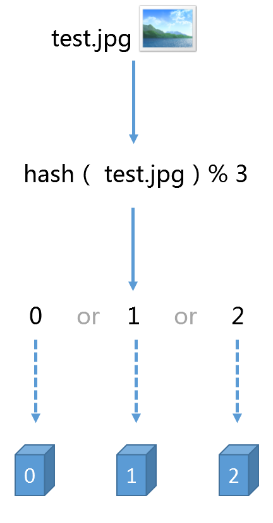
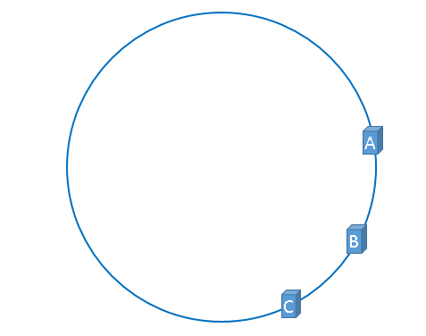

> 参考：
>
> 1. [白话解析：一致性哈希算法 consistent hashing](http://www.zsythink.net/archives/1182)
> 2. [[一致性哈希算法原理](https://www.cnblogs.com/lpfuture/p/5796398.html)](https://www.cnblogs.com/lpfuture/p/5796398.html)

### 场景：

假设我们有三台服务器来对图片进行缓存，示例如下：

如果增加了一台服务器，或者有一台服务器宕机了，那么就会造成大量的缓存失效，在请求量大的时候会造成缓存的雪崩，进而请求全部进入到数据库层，甚至会导致整个应用崩溃。

### 解决办法

将服务器的 hash 值映射为一个虚拟的圆环。示例如下：

那么在增加服务器或者服务器宕机的情况下，只有一部分缓存会失效，其它的不会受到影响。

但是在服务器数量较少的情况下，会有缓存倾斜的情况出现，示例如下：

为了解决这种情况的出现，可以通过增加虚拟节点来处理这个问题，示例如下：

通过增加虚拟节点，可以使缓存分布相对均匀。不会造成某些服务器缓存数量特别大，而某些服务器缓存数量特别少的情况出现。