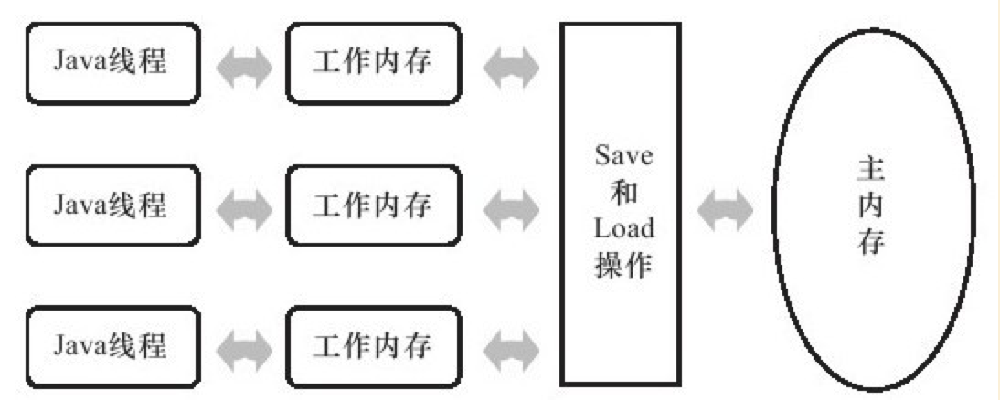
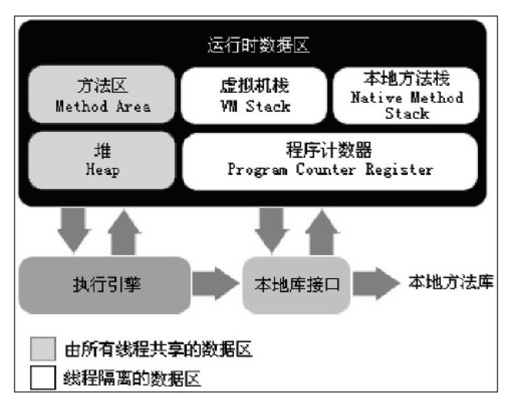

> https://mp.weixin.qq.com/s/dw3y948rqjUAjxSo_eN0gg


基础题目

1. Java线程的状态

   - 新建（New）

     创建后尚未启动的线程

   - 运行（Runnable）

     包括了操作系统线程状态中的Running和Ready。
   

  处于此状态中的线程有可能正在执行，有可能正在等待CPU为它分配执行时间

- 等待
  
  - 无限期等待（Waiting）
  
    处于此状态中的线程不会被分配CPU执行时间，需要等待被其他线程显式唤醒
  
  - 限期等待（Timed Waiting）
  
    处于此状态中的线程不会被分配CPU执行时间，不过无需等待被其他线程显式唤醒，在一定时间之后，会由系统自动唤醒
  
- 阻塞（Blocked）
  
  线程被阻塞了
  
     与等待的区别是：
  
     - 阻塞状态表示在等待获取一个排他锁
     - 等待状态表示在等待一段时间，或者唤醒动作的发生
  
   - 结束（Terminated）
  
     线程已经结束执行

2. 进程和线程的区别，进程间如何通讯，线程间如何通讯

   -  线程

     **是操作系统能够进行运算调度的最小单位**。是进程中的一个执行流程，一个进程中可以运行多个线程

   - 进程

     **一个执行中的程序的实例**

   - 区别

     **一个程序至少有一个进程,一个进程至少有一个线程**。

     **进程在执行过程中拥有独立的内存单元**，而**多个线程共享内存**。

     **线程是进程的一个实体,是CPU调度和分派的基本单位**。

     **一个线程可以创建和撤销另一个线程;同一个进程中的多个线程之间可以并发执行**
   
   - 进程间通信
   
     - **管道（Pipe）**
   
        管道可用于具有亲缘关系进程间的通信。
   
        速度慢，容量有限，只有父子进程能通讯
   
     - **有名管道（named pipe）**
   
        克服了管道没有名字的限制，因此，除具有管道所具有的功能外，它还允许无亲缘关系进程间的通信。
   
        任何进程间都能通讯，但速度慢
   
     - **信号（Signal）**
   
        信号是比较复杂的通信方式，用于通知接受进程有某种事件发生，除了用于进程间通信外，进程还可以发送信号给进程本身
   
     - **消息队列（Message）**
   
        消息队列是消息的链接表，包括Posix消息队列system V消息队列。有足够权限的进程可以向队列中添加消息，被赋予读权限的进程则可以读走队列中的消息。消息队列克服了信号承载信息量少，管道只能承载无格式字节流以及缓冲区大小受限等缺点。
   
        容量受到系统限制，且要注意第一次读的时候，要考虑上一次没有读完数据的问题
   
     - **共享内存**
   
        使得多个进程可以访问同一块内存空间，是最快的可用IPC形式。是针对其他通信机制运行效率较低而设计的。往往与其它通信机制，如信号量结合使用，来达到进程间的同步及互斥。
   
        能够很容易控制容量，速度快
   
     - **信号量（semaphore）**
   
        主要作为进程间以及同一进程不同线程之间的同步手段。
   
        不能传递复杂消息，只能用来同步
   
     - **套接口（Socket）**
   
        更为一般的进程间通信机制，可用于不同机器之间的进程间通信
   
   - 线程间通信
   
     - 锁机制
        - 互斥锁：提供了以排它方式阻止数据结构被并发修改的方法。
        - 读写锁：允许多个线程同时读共享数据，而对写操作互斥。
        - 条件变量：可以以原子的方式阻塞进程，直到某个特定条件为真为止。对条件测试是在互斥锁的保护下进行的。条件变量始终与互斥锁一起使用。
   
     - 信号量机制：包括无名线程信号量与有名线程信号量
   
     - 信号机制：类似于进程间的信号处理


3. HashMap的数据结构是什么？如何实现的。和HashTable，ConcurrentHashMap的区别

   数组+链表+红黑树。

   HashTable是线程安全的，且不允许键值为`null`

   ConcurrentHashMap是线程安全的。


4. Cookie和Session的区别

   cookie的作用就是为了解决HTTP协议无状态的问题。

   - cookie数据存放在客户的浏览器（客户端）上，session数据放在服务器上。

     但是服务端的session的实现对客户端的cookie有依赖关系。因为需要使用cookie来保存sessionid，如果cookie被禁用，则服务端session无法使用。

     但是可以通过URL重写，将sessionid附加到URL后面，或者通过表单隐藏字段，提交表单时将sessionid也一并提交

   - cookie不是很安全，别人可以分析存放在本地的COOKIE并进行COOKIE欺骗，考虑到安全应当使用session

   - session会在一定时间内保存在服务器上。当访问增多，会比较占用你服务器的性能。考虑到减轻服务器性能方面，应当使用COOKIE；

   - 单个cookie在客户端的限制是3K，就是说一个站点在客户端存放的COOKIE不能超过3K


5. ArrayList是如何实现的，ArrayList和LinedList的区别？ArrayList如何实现扩容。

   ArrayList基于数组实现。LinkedList基于双向链表实现。

   在第一次调用add方法的时候扩容为10，以后每次扩容，容量增加当前长度的一半。

   扩容时将旧数组中的值直接拷贝过去


6. equals方法实现

   ```java
   // Object
   public boolean equals(Object obj) {
     return (this == obj);
   }
   
   // Integer
   public boolean equals(Object obj) {
       if (obj instanceof Integer) {
           return value == ((Integer)obj).intValue();
       }
       return false;
   }
   
   // String
   public boolean equals(Object anObject) {
     if (this == anObject) {
       return true;
     }
     if (anObject instanceof String) {
       String anotherString = (String)anObject;
       int n = value.length;
       // 判断字符串的长度是否相等
       if (n == anotherString.value.length) {
         char v1[] = value;
         char v2[] = anotherString.value;
         int i = 0;
         // 判断各个位置的字符是否相等
         while (n-- != 0) {
           if (v1[i] != v2[i])
             return false;
           i++;
         }
         return true;
       }
     }
     return false;
   }
   ```


7. JVM如何加载字节码文件

- 通过类的全限定名来获取定义此类的二进制字节流
- 将这个字节流所代表的静态存储结果转化为方法区的运行时数据结构
- 在内存中生成一个代表着这个类的java.lang.Class对象，作为方法区这个类的各种数据的访问入口


8. JVM GC，GC算法。

- **哪些内存需要回收**

  程序计数器、虚拟机栈、本地方法栈随线程而生，随线程而灭。

  栈中的栈帧随着方法的进入和退出执行着出栈和入栈操作。每一个栈帧中分配多少内存基本上在类结构确定下来时就是已知的。

  因此这几个区域的内存分配和回收都具有确定性，方法结束或者线程结束时，内存自然就跟回收了。

  但是Java堆和方法区则不一样，一个接口中的多个实现类需要的内存可能不一样，一个方法中的多个分支需要的内存也可能不一样，我们只有在程序运行期间才知道创建了哪些对象，这部分内存的分配和回收是动态的

- **什么时候回收**

  - 引用计数算法

    主流的Java虚拟机没有选用引用计数算法来管理内存，因为它很难解决对象之间相互循环引用的问题

  - 可达性分析算法

    通过一系列称为“GC Roots"的对象作为起点，从这些节点开始向下搜索，搜索所走过的路径称为为引用链（Reference Chain），当一个对象到GC Roots没有任何引用链相连，即GC Roots到这个对象不可达时，则证明此对象不可用

    - GC Roots对象包括
      - 虚拟机栈（栈帧中的本地变量表）中引用的对象
      - 方法区中类静态属性引用的对象
      - 方法区中常量引用的对象
      - 本地方法栈中JNI（Native方法）引用的对象

  真正宣告一个对象死亡，至少要经历两次标记过程：

  - 如果对象在进行可达性分析后发现没有与GC Roots相连接的引用链，那么它将会被第一次标记并进行一次筛选

    - 筛选的条件是此对象是否有必要执行finalize()方法
      - 当对象没有覆盖finalize()方法，或者finalize()方法已经被虚拟机调用过，那么虚拟机将这两种情况都视为“没有必要执行”
      - 当对象被判定为有必要执行finalize()方法，那么该对象将会被放置在一个叫做F-Queue的队列中，并在稍后由虚拟机自动建立的、低优先级的Finalizer线程去执行它

    > 任何一个对象的finalize()方法都只会被系统自动调用一次，如果对象面临下一次回收，它的finalize()方法将不会再被执行

  - 稍后GC将对F-Queue中的对象进行第二次标记，如果对象在finalize()方法中重新与引用链上的任何一个对象建立关联，那么在第二次标记时，它将被移除出“即将回收“的集合。

    如果这时对象还没有逃脱，那么基本上它就真的被回收了

- **GC算法**

  - 复制算法
  - 标记-整理算法

  

9. 什么情况会出现Full GC，什么情况会出现yong GC

- Full GC

  - System.gc()
  - 老年代空间不足
  - 方法区空间不足

- Yong GC

  Eden区满了

  

10. JVM内存模型

屏蔽掉各种硬件和操作系统的内存访问差异，让Java程序在各种平台下都能达到一致的内存访问效果。



Java内存模型规定所有的变量都存储在主内存中。

每个线程都有自己的工作内存。工作内存中保存了该线程所使用到的变量的主内存副本拷贝，线程对变量的所有操作都必须在工作内存中进行，而不能直接读写主内存中的变量。

不同线程之间无法直接访问对方工作内存中的变量，线程间变量值的传递需要通过主内存来完成。


11. Java运行时数据区



12. 事务的实现原理

    ReadView与undo log版本链


13. ~~有没有看过JDK源码，看过的类实现原理是什么。~~

14. HTTP协议

    


14. TCP协议
15. ~~一致性Hash算法~~
16. 类加载器如何卸载字节码
17. IO和NIO的区别，NIO优点
18. Java线程池的实现原理，keepAliveTime等参数的作用。
19. HTTP连接池实现原理
20. 数据库连接池实现原理
21. 数据库的实现原理


1. 看过哪些开源框架的源码

2. 为什么要用Redis，Redis有哪些优缺点？Redis如何实现扩容？

3. Netty是如何使用线程池的，为什么这么使用

4. 为什么要使用Spring，Spring的优缺点有哪些

5. Spring的IOC容器初始化流程

6. Spring的IOC容器实现原理，为什么可以通过byName和ByType找到Bean

7. Spring AOP实现原理

   动态代理和字节码生成技术

8. 消息中间件是如何实现的，技术难点有哪些


1. 如何搭建一个高可用系统
2. 哪些设计模式可以增加系统的可扩展性
3. 介绍设计模式，如模板模式，命令模式，策略模式，适配器模式、桥接模式、装饰模式，观察者模式，状态模式，访问者模式。
4. 抽象能力，怎么提高研发效率。
5. 什么是高内聚低耦合，请举例子如何实现
6. 什么情况用接口，什么情况用消息
7. 如果AB两个系统互相依赖，如何解除依赖
8. 如何写一篇设计文档，目录是什么
9. 什么场景应该拆分系统，什么场景应该合并系统
10. 系统和模块的区别，分别在什么场景下使用


1. 分布式事务，两阶段提交。
2. 如何实现分布式锁
3. 如何实现分布式Session
4. 如何保证消息的一致性
5. 负载均衡
6. 正向代理（客户端代理）和反向代理（服务器端代理）
7. CDN实现原理
8. 怎么提升系统的QPS和吞吐量


1. 有没有处理过线上问题？出现内存泄露，CPU利用率标高，应用无响应时如何处理的。
2. 开发中有没有遇到什么技术问题？如何解决的
3. 如果有几十亿的白名单，每天白天需要高并发查询，晚上需要更新一次，如何设计这个功能。
4. 新浪微博是如何实现把微博推给订阅者
5. Google是如何在一秒内把搜索结果返回给用户的。
6. 12306网站的订票系统如何实现，如何保证不会票不被超卖。
7. 如何实现一个秒杀系统，保证只有几位用户能买到某件商品。


1. 如何学习一项新技术，比如如何学习Java的，重点学习什么
2. 有关注哪些新的技术
3. 工作任务非常多非常杂时如何处理
4. 项目出现延迟如何处理
5. 和同事的设计思路不一样怎么处理
6. 如何保证开发质量
7. 职业规划是什么？短期，长期目标是什么
8. 团队的规划是什么
9. 能介绍下从工作到现在自己的成长在那里


- zset跳表的数据结构

- Redis的LRU过期策略的具体实现

- 如何解决Redis缓存雪崩，缓存穿透问题

  - 降级，本地缓存，用备份恢复
  - 永不过期

- Redis的持久化机制

  - RDB
  - AOF

  

事务的基本要素

- 一致性
- 原子性
- 隔离性
- 持久性


事务隔离级别

- 读未提交（read uncommitted）
- 读已提交（read committed）
- 可重复读（repeatable read）
- 串行化（serializable）

如何解决事务的并发问题(脏读，幻读)？

MVCC多版本并发控制？

binlog, redolog, undolog都是什么，起什么作用？


InnoDB的行锁/表锁？

myisam和innodb的区别，什么时候选择myisam？

为什么选择B+树作为索引结构？

索引B+树的叶子节点都可以存哪些东西？

查询在什么时候不走（预期中的）索引？

sql如何优化?

explain是如何解析sql的？

order by原理


JDBC和双亲委派模型关系