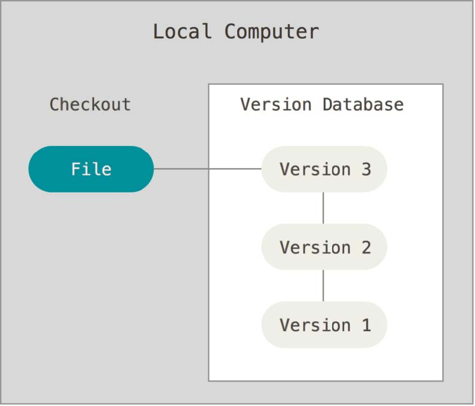
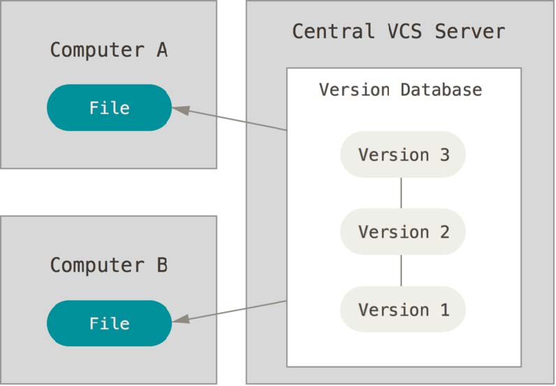
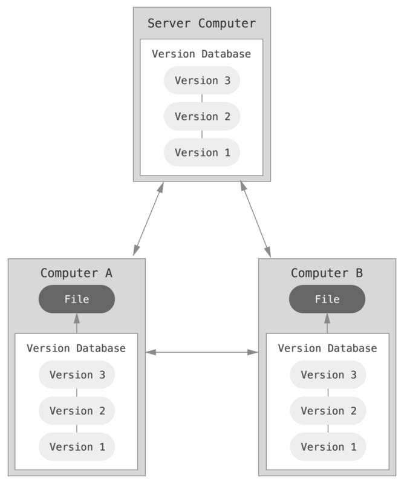
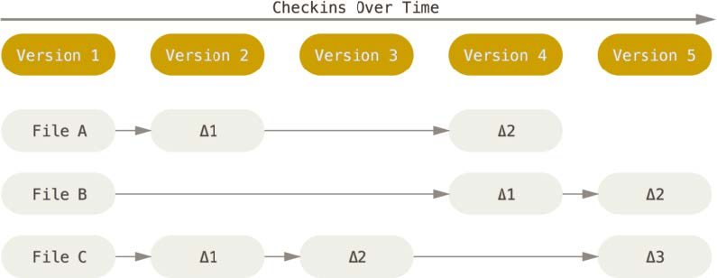
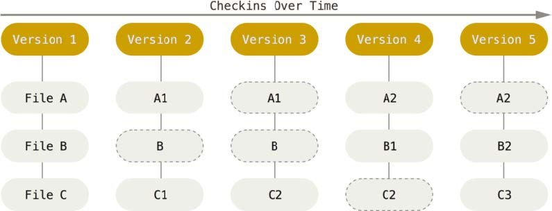

> 来源：[Pro Git book](https://git-scm.com/book/zh/v2)

## 关于版本控制

版本控制是一种记录一个或若干文件内容变化，以便将来查阅特定版本修订情况的系统。
可以将某个文件回溯到之前的某个状态，可以比较文件的变化，可以知道是谁修改了某个地方。

### 本地版本控制系统

复制整个项目目录的方式来保存不同的版本，或者再加上备份的时间加以区分。



### 集中化的版本控制系统

用一个单一的服务器进行集中管理，保存所有文件的修改，协同工作的人通过客户端连接到这台服务器，取出最新的文件或者提交更新。



但是如果中央服务器出现了单点故障，那么就无法进行协同工作。如果磁盘发生故障，并且没有备份，那么所有的历史记录都将会丢失。

### 分布式版本控制系统

客户端不仅仅只是提取最新版本的文件信息，而是把仓库完整的获取下来。
当协同工作的服务器发生故障时，都可以用任何一个本地仓库恢复。因为每一次克隆操作，实际上都是一次对仓库的完整备份。



## Git 基础

### 直接记录快照，而非差异比较

Git 不像其它的版本控制系统将保存的信息看作是一组文件和每个文件随时间逐步积累的差异。

> 其它版本控制保存信息的方式



而是把数据看作是一组快照，并保存这个快照的索引。如果文件没有修改，Git 不再重新存储该文件，只是保留一个链接指向之前存储的文件。

> Git 保存信息的方式



### Git 保证完整性

Git 在存储数据前都会计算一个校验码 (40 位)，然后通过检验码来进行引用。
Git 使用 SHA-1 散列来计算校验码。基于 Git 中文件的内容或目录结构来计算。
实际上，Git 数据库中保存的信息都是以文件内容的哈希值来进行索引，而不是文件名。

### 三种状态

**已提交 (committed)**：数据已经安全保存在本地数据库中。

**已修改 (modified)**：已经修改了文件，但是还没有保存到数据库中。

**已暂存 (staged)**：对一个已修改文件的当前版本做了标记，让它可以包含在下次提交的快照中。

Git 三个工作区域的概念：

**Git 仓库**：用来保存项目的元数据和对象数据库的地方。

**工作目录**：对项目的某个版本独立提出出来的内容。

**暂存区域**：一个文件，保存了下次将提交到文件列表信息，一般在 Git 仓库目录中。

## 初次运行 Git 前的配置

使用 `git config` 来对 Git 的配置变量进行设置。这些变量分别存储在三个地方：

1. `/etc/gitconfig` 文件：包含系统上每一个用户以及他们仓库的通用配置。使用 `--system` 选项时会从这里读取配置。
2. `~/.gitconfig` 或 `~/.config/git/config` 文件：只针对当前用户。使用 `--global` 选项时会从这里读取配置。
3. 当前仓库中 `.git/config` 文件：针对该仓库。

每一个级别覆盖上一个级别的配置。所以，`.git/config` 的配置变量会覆盖 `/etc/gitconfig` 中的配置变量。

在 Windows 系统中，Git 会查找 \$HOME 目录 (`C:\Users\$USER`) 中的 `.gitconfig` 文件。

### 用户信息

设置用户名称与邮箱。Git 的每一次提交都会使用这些信息，并且会将这些信息写入到每次的提交中，不可更改。

```git
git config --global user.name "YLongo"
git config --global user.email "YLongo@example.com"
```

如果使用了 `--global` 信息，那么只需要运行一次，之后 Git 都会使用这些信息。但是如果想要针对不同使用不同的用户名与邮箱时，可以在项目的目录下执行没有 `--global` 选项的命令来进行设置。

# Git 基础

## 获取 Git 仓库

获取 Git 仓库有两种方法：

1. 在现有项目或目录下导入所有文件到 Git 中
2. 从服务器上克隆一个现有的 Git 仓库

### 在现有目录中初始化仓库

在该目录下输入命令：

```git
git init
```

该命令将创建一个名为 `.git` 的子目录。这个子目录包含初始化 Git 仓库中所有必须的文件。

### 克隆现有的仓库

Git 会将该 Git 仓库服务器上的所有数据都克隆下来。默认情况下，远程 Git 仓库中的每一个文件的每一个版本都将被拉取下来。

使用如下命令进行克隆：

```git
git clone [url]
```

例：

```bash
git clone https://github.com/libgit2/libgit2
```

该命令会在当前目录下创建一个名为 "libgit2" 的文件夹。

```bash
git clone https://github.com/libgit2/libgit2 mylibgit
```

该命令会在当前目录下创建一个名为 "mylibgit" 的文件夹。

### 状态简览

使用 `git status -s` 可以看到更加简单的状态输出信息。

> `-s` 为 `--short` 的缩写

```bash
$ git status -s
M README
MM Rakefile
A lib/git.rb
M lib/simplegit.rb
?? LICENSE.txt
```

新添加的未跟踪文件前面有 `??` 标记。
新添加到暂存区的文件前面有 `A` 标记。
修改过的文件前面有 `M` 标记。
有两个 `MM` 的地方，右边的 `M` 表示该文件被修改了但是还没有放入暂存区，左边的 `M` 表示该文件被修改了并放入了暂存区。

> 虽然在工作区被修改后提交到了暂存区，但是之后又在工作区被修改了并且还没有被提交到暂存区

### 忽略文件

创建一个名为 `.gitignore` 的文件，列出需要忽略的文件模式。
`.gitignore` 的格式规范如下：

-   所有空行或者以 `#` 开头的行都会被忽略

-   可以使用通配符进行匹配

    >   `*` 匹配任意字符
    >
    >   `**` 匹配任意中间目录。例：a/\*\*/z 会匹配 a/z, a/b/z 等。
    >
    >   `[]` 匹配任意一个出现在方括号中的字符

-   以 `/` 开头可以防止递归

-   以 `/` 结尾指定目录

-   在指定模式前加 `!` 表示忽略指定模式以外的文件或者目录。

### 查看已暂存和未暂存的修改

`git diff` 比较的是工作目录中当前文件和暂存区之间的差异，也就是修改之后还没有暂存起来的变化内容。
如果想要查看已暂存中将要提交的内容，可以使用 `git diff --cached`。

### 移除文件

`git rm` 从已跟踪文件清单中 (暂存区) 移除，并且会从工作目录中删除，这样以后就不会出现在未跟踪文件清单了。

但是如果我们想把文件从 Git 中删除，但是希望保留在工作目录。或者说想让文件保留在磁盘上，但是不想让 Git 继续跟踪。那么可以使用 `git rm --cached`。

## 撤消操作

提交完了才发现漏掉了几个文件没有提交，或者提交信息写错了。可以使用 `git commit --amend` 重新提交。
只会将暂存区的文件提交，如果上次提交之后没有做任何修改，执行此命令只会修改提交信息。


