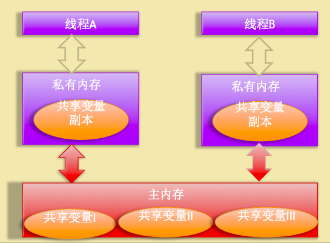
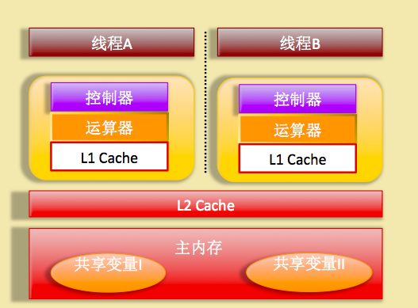
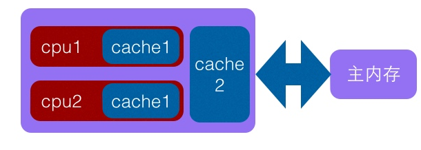
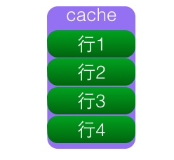

### 共享变量的内存可见性问题

Java 中多线程下处理共享变量时的内存模型：



Java 内存模型规定所有的变量都存放在主内存中，当线程使用变量时都是把主内存里面的变量拷贝到自己的工作空间或者叫做工作内存。



上图为双核 CPU 系统架构，每个核有自己的控制器和运算器，其中控制器包含一组寄存器和操作控制器，运算器执行算术逻辑运算，并且有自己的一级缓存，并且有些架构里面双核还有共享的二级缓存。

在这里 L1 或者 L2 缓存或者 CPU 的寄存器对应 Java 内存模型里面的工作内存。

### Java 中 synchronized 关键字

synchronized 块是 Java 提供的一种原子性内置锁，Java 中的每个对象都可以当做一个同步锁的功能来使用，这些   Java 内置的、使用者看不到的锁被称为内部锁。

线程在进入 synchronized 代码块前会自动尝试获取内部锁，如果这时内部锁没有被其它线程占有，则当前线程就获取到了内部锁，这时其它企图访问改代码的线程将会阻塞。

拿到内部锁的线程会在正常退出同步代码块，或者抛出异常后，或者在同步快内调用了该内置锁资源的 wait 系列方法时，会释放该内置锁。

内置锁是排它锁，当一个线程获取了这个锁后，其它线程必须等待该线程释放锁才能获取该锁。

synchronized 的内存语义可以解决共享变量内存不可见性问题。

线程进入 synchronized 块的语义会把在 synchronized 快内使用到的变量从线程的工作内存中清除，在 synchronized 块内使用该变量时就不会从线程的工作内存中获取，而是直接从主内存中获取。

退出 synchronized 块的内存语义是会把 synchronized 块内对共享变量的修改刷新到主内存。

除了解决共享变量内存可见性问题外， synchronized 经常被用来实现原子性操作。

由于Java 中的线程是与操作系统的原生线程是一一对应的，所以当阻塞一个线程时，需要从用户态切换到内核态执行阻塞操作，这是很耗时的操作，而且synchronized的使用会导致上下文切换。

> [上下文切换详解](http://ifeve.com/context-switch-definition/)

### Java 中 volatile 关键字

当线程获取 volatile 修饰的变量的值时，会首先清空线程工作内存中该变量的值，然后从主内存获取该变量的值。

当线程写入 volatile 修饰的变量的值时，会先把修改后的值写入工作内存，然后刷新到主内存。这保证了对一个变量的更新，其它线程马上可见。

volatile 只提供了可见性，但是并没有保证操作的原子性。

变量被声明为 volatile 还可以避免重排序的发生。

### Java 中的 CAS 操作和 AtomicLong 实现原理

#### CAS 来源

`CAS` 即比较并交换 (Compare And Swap)，是 JDK 提供的非阻塞原子性操作，它通过硬件保证了比较-更新操作的原子性，JDK 里面的 `Unsafe` 类提供了一系列的 `compareAndSwap*` 方法。

例：`compareAndSwapLong` 方法

```java
boolean compareAndSwapLong(Object obj,long valueOffset,long expect, long update)
```

操作含义为：如果对象 `obj` 的内存偏移量为 `valueOffset` 位置的变量值为 `expect` 则使用新值 `update` 替换旧的值 `expect`。这个是处理器提供的一个原子性指令。

### 伪共享

#### 什么是伪共享

计算机系统为了解决主内存与 CPU 运行速度的差距，在 CPU 与主内存之间添加了一级或者多级高速缓冲存储器 (Cache)，这个 Cache 一般是集成到 CPU 内部的，所以也叫 CPU Cache。下图为两级 Cache 结构：



Cache 内部是按行存储的，其中每一行称为一个 Cache 行，Cache 行是 Cache 与主内存进行数据交换的单位，Cache 行的大小一般为 2 的幂次数字节。



当 CPU 访问某一个变量的时候，首先会去看 CPU Cache 内是否有该变量，如果有则直接从中获取，否则就去主内存里面获取该变量，然后把该变量所在内存区域的一个 Cache 行大小的内存拷贝到 Cache (Cache 行是 Cache 与主内存进行数据交换的单位)。

由于存放到 Cache 行的是内存块而不是单个变量，所以可能会把多个变量存放到一个 Cache 行。

当多个线程同时修改一个缓存行里面的多个变量时，由于同时只能有一个线程操作缓存行，所以相比将每个变量放到一个缓存行时的性能会有所下降，这就是伪共享。

> 每一级缓存中所储存的全部数据都是下一级缓存的一部分，越靠近 CPU 的缓存越快也越小。
>
> 缓存行有效地引用主内存中的一块地址 。
>
> 见：https://www.cnblogs.com/cyfonly/p/5800758.html


如上图，变量 x, y 同时被放到了 CPU 的一级和二级缓存，当线程1 使用 CPU 1 对变量 x 进行更新的时候，首先会修改 CPU 1 的一级缓存变量 x 所在的缓存行，这时候缓存一致性协议会导致 CPU 2 中变量 x 对应的缓存行失效。

线程2 写入变量 x 的时候只能去二级缓存中查找，这就破坏了一级缓存，而一级缓存比二级缓存更快，这也说明了多个线程不可能同时去修改自己所使用的 CPU 中相同缓存行里面的变量。

更坏的情况下，如果 CPU 只有一级缓存，那么会导致频繁的直接访问主内存。

#### 为何会出现伪共享

伪共享的产生是因为多个变量被放入了一个缓存行，并且多个线程同时去写入缓存行中不同的变量。

为何多个变量会被放入一个缓存行，因为 Cache 与内存交换数据的单位就是 Cache 行，当 CPU 要访问的变量没有在 Cache 命中时，根据程序运行的局部性原理会把该变量在内存中大小为 Cache 行的内存放入缓存行。

也就是地址连续的多个变量才有可能会被放到一个缓存行中，当创建数组的时候，数组里面的多个元素就会被放入到同一个缓存行。

正常情况下，单线程访问的时候，由于数组元素被放入到了一个或者多个 Cache 行，对代码执行是有利的，因为数据都在缓存中，代码执行会更快。

以为数组内数组元素之间内存地址是连续的，当访问数据第一个元素时，会把第一个元素后续若干个元素一块放入到 Cache 行，这样顺序访问数组的时候会在 Cache 中直接命中，就不会去主内存中读取，后续访问也是这样。

#### 如何避免伪共享

JDK 8 之前一般是通过字节填充的方式来避免，也就是创建一个变量时，使用填充字段填充该变量所在的缓存行，这样就避免了多个变量存在同一个缓存行。如下：

```java
  public final static class FilledLong {
            public volatile long value = 0L;
            public long p1, p2, p3, p4, p5, p6;     
  }
```

假如 Cache 行为 64 个字节，那么我们在 FilledLong 类里面填充了 6 个 long 类型变量，每个 long 类型占用 8 个字节，加上 value 变量的 8 个字节总共 56 个字节，另外这里 FilledLong 是一个类对象，而类对象的字节码的对象头占用了 8 个字节，所以当 new 一个 FilledLong 对象时候实际会占用 64 个字节的内存，这个正好可以放入 Cache 的一个行。 

在 JDK 8 中提供了一个 `sun.misc.Contended` 注解，用来解决伪共享问题。上面的代码可修改为：

```java
@sun.misc.Contended 
public final static class FilledLong {
    public volatile long value = 0L;
}
```

`@Contended` 注解既可以修饰类，也可以修饰变量。默认情况下，只用在 Java 核心类。比如 rt.jar 包下的类。

如果需要在用户 classpath 下的类使用这个注解需要添加 JVM 参数：`-XX:-RestrictContended`，另外默认填充的宽度为 128，如果你想要自定义宽度可以设置 `-XX:ContendedPaddingWidth` 参数。 

### Java 中的指令重排序

Java 内存模型允许编译器和处理器对指令进行重排序以提高运行性能，并且重排序只会对不存在数据依赖性的指令进行重排序。

在单线程下重排序可以保证最终执行的结果是与程序顺序执行的结果一致，但是在多线程下就会存在问题。 

使用 volatile 修饰的变量可以避免重排序和内存可见性问题。

当写 volatile 变量时，可以确保 volatile 写之前的操作不会被编译器重排序到 volatile 写之后。

当读 volatile 变量时，可以确保 volatile 读之后的操作不会被编译器重排序到 volatile 读之前。

### 锁的概述

##### **悲观锁**

悲观锁指对数据被外界修改持保守态度，在整个数据处理过程中，将数据处于锁定状态。 

使用悲观锁的一个常用的例子： `select * from 表 where .. for update;` 

##### **乐观锁**

乐观锁是相对悲观锁来说的，它认为数据一般情况下不会造成冲突，所以在访问记录前不会加排它锁，而是在数据进行提交更新的时候，才会正式对数据的冲突与否进行检测。 

例如： `update 表 set comment='***',status='operator',version=version+1 where version = 1 and id = 1;` 

乐观锁并不会使用数据库提供的锁机制，一般在表添加 version 字段或者使用业务状态来做。乐观锁直到提交的时候才去锁定，所以不会产生任何锁和死锁 

#### 公平锁与非公平锁

根据线程获取锁的抢占机制锁可以分为公平锁和非公平锁。

公平锁表示线程获取锁的顺序是按照线程请求锁的时间长短来分决定的的，也就是最早获取锁的线程将最早获取到锁，也就是先来先得的 FIFO 顺序。

非公平锁则运行时候闯入，也就是先来不一定先得。

ReentrantLock 提供了公平和非公平锁的实现：

- 公平锁：`ReentrantLock pairLock = new ReentrantLock(true);`
- 非公平锁：`ReentrantLock pairLock = new ReentrantLock(false);`

如果构造函数不传递参数，则默认是非公平锁。 

在没有公平性需求的前提下尽量使用非公平锁，因为公平锁会带来性能开销。

#### 独占锁与共享锁

根据锁只能被单个线程持有还是能被多个线程共同持有，锁分为独占锁和共享锁。 

独占锁保证任何时候都只有一个线程能得到锁，ReentrantLock 就是以独占方式实现的。

共享锁则同时有多个线程可以持有，例如 ReadWriteLock 读写锁，它允许一个资源可以被多线程同时进行读操作。 

独占锁是一种悲观锁，每次访问资源都先加上互斥锁，这限制了并发性，因为读操作并不会影响数据一致性，而独占锁只允许同时一个线程读取数据，其它线程必须等待当前线程释放锁才能进行读取。 

共享锁则是一种乐观锁，它放宽了加锁的条件，允许多个线程同时进行读操作。 

#### 可重入锁

当一个线程要获取一个被其它线程持有的独占锁时候，该线程会被阻塞，那么当一个线程再次获取它自己已经获取的锁时候不会被阻塞，那么我们说该锁是可重入的。

synchronized 内部锁是可重入锁，可重入锁的原理是在锁内部维护了一个线程标示，用来标示该锁目前被那个线程占用，然后关联一个计数器。一开始计数器值为 0，说明该锁没有被任何线程占用，当一个线程获取了该锁，计数器会变成 1，其它线程在获取该锁时候发现锁的所有者不是自己就会被阻塞挂起。 

但是当获取该锁的线程再次获取锁时候发现锁拥有者是自己，就会把计数器值 +1， 当释放锁后计数器会 -1，当计数器为 0 时候，锁里面的线程标示重置为 null，这时候阻塞的线程会获取被唤醒来竞争获取该锁。 