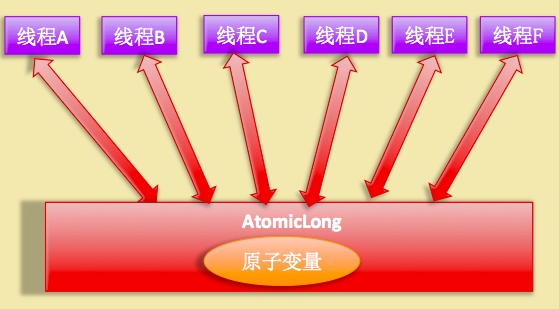
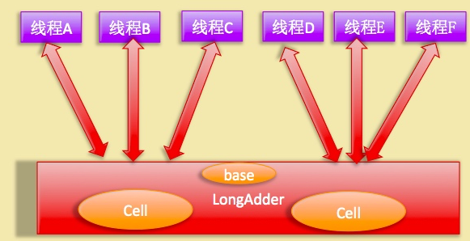

> 来源：https://gitbook.cn/books/5ac70a26d60a134e37dafdd7/index.html

### Unsafe 类探究

JDK 的 rt.jar 包中的 Unsafe 类提供了硬件级别的原子操作。Unsafe 里面的方法都是 native 方法，通过使用 JNI 的方式来访问本地 C++ 实现库。

#### 主要方法介绍

- `long objectFieldOffset(Field field)`

返回指定变量在所属类的内存偏移地址，偏移地址仅仅在该 Unsafe 函数中访问指定字段时使用。

> 例：使用 unsafe 获取 AtomicLong 中变量 value 在 AtomicLong 对象中的内存偏移地址

```java
static {
        try {
            valueOffset = unsafe.objectFieldOffset
                (AtomicLong.class.getDeclaredField("value"));
        } catch (Exception ex) { throw new Error(ex); }
}
```

- `int arrayBaseOffset(Class arrayClass)`

获取数组中第一个元素的地址。

- `int arrayIndexScale(Class arrayClass)`

获取数组中单个元素占用的字节数 

- `compareAndSwapLong(Object obj, long offset, long expect, long update)`

比较对象 `obj` 中偏移量为 `offset` 的变量的值是不是和 `expect` 相等，相等则使用 `update` 值更新，然后返回 `true`，否者返回 `false`。

- `public native long getLongVolatile(Object obj, long offset)`

获取对象 obj 中偏移量为 offset 的变量对应的 volatile 内存语义的值。

- `void putLongVolatile(Object obj, long offset, long value)`

设置 obj 对象中内存偏移为 offset 的 long 型变量的值为 value，支持 volatile 内存语义。 

- `void putOrderedLong(Object obj, long offset, long value)`

设置 obj 对象中 offset 偏移地址对应的 long 型 field 的值为 value。

这是有延迟的 putLongVolatile 方法，并不保证值修改对其它线程立刻可见。变量只有使用 volatile 修饰并且期望被意外修改的时候使用才有用。 

- `void park(boolean isAbsolute, long time)` 

isAbsolute 等于 false 时候，time 等于 0 表示一直阻塞，time 大于 0 表示等待指定的 time 后阻塞线程会被唤醒，这个 time 是个相对值，是个增量值，也就是相对当前时间累加 time 后当前线程就会被唤醒。

 如果 isAbsolute 等于 true，并且 time 大于 0 表示阻塞后到指定的时间点后会被唤醒，这里 time 是个绝对的时间，是某一个时间点换算为 ms 后的值。

另外当其它线程调用了当前阻塞线程的 interrupt 方法中断了当前线程时候，当前线程也会返回，当其它线程调用了 unpark 方法并且把当前线程作为参数时候当前线程也会返回。 

- `void unpark(Object thread)`

唤醒调用 park 后阻塞的线程，参数为需要唤醒的线程。

下面为 JDK 8 新增的方法：

- `long getAndSetLong(Object obj, long offset, long update)`

获取对象 obj 中偏移量为 offset 的变量 volatile 语义的值，并设置变量 volatile 语义的值为 update。 

- `long getAndAddLong(Object obj, long offset, long addValue)`

获取对象 obj 中偏移量为 offset 的变量 volatile 语义的值，并设置变量值为原始值 +addValue。 

#### 如何使用 Unsafe 类

详情见：[TestUnsafe](https://github.com/YLongo/javademo/blob/master/src/main/java/github/io/YLongo/jcpb/TestUnSafe.java) 与 [TestUnsafe1](https://github.com/YLongo/javademo/blob/master/src/main/java/github/io/YLongo/jcpb/TestUnsafe1.java)

### LockSupport 类探究

`rt.jar` 中的 `LockSupport` 类是个工具类，主要作用是挂起和唤醒线程，它是创建锁和其它同步类的基础。

`LockSupport` 类与每个使用它的线程都会关联一个许可证，**默认调用 `LockSupport` 类的方法的线程是不持有许可证的。**`LockSupport` 内部使用 `Unsafe` 类实现。

`LockSupport` 类的几个主要函数如下：

- `void park()` 

如果调用 `park()` 的线程已经拿到了与 `LockSupport` 关联的许可证，则调用 `LockSupport.park()` 会马上返回，否则调用线程会被禁止参与线程的调度，也就是会被阻塞挂起。

其它线程调用 `unpark(Thread thread)` 方法并且以当前线程作为参数时，调用 `park` 方法被阻塞的线程会返回。

其它线程调用了阻塞线程的 `interrupt()` 方法，设置了中断标志时或者由于线程的虚假唤醒时，阻塞线程也会返回。所以调用 `park()` 最好用循环条件判断方式。

> 注意：调用 `park()` 方法被阻塞的线程被其它线程中断后，阻塞线程返回时并**不会**抛出 `InterruptedException` 异常

- `void unpark(Thread thread)`

  当一个线程调用 `unpark()` 时，如果参数 `thread` 没有持有 `thread` 与 `LockSupport` 类关联的许可证，则让 `thread` 线程持有。

  如果 `thread` 之前调用了 `park()` 被挂起，则调用 `unpark()` 后，该线程会被唤醒。

  如果 `thread` 没有调用 `park()`，则在调用 `unpark()` 方法后，再调用 `park()` 方法，会立刻返回。

`park()` 方法不会告诉你是因为什么原因返回，所以调用者需要再次检查条件是否满足，如果不满足，则需要再次调用 `park()` 方法。

- `void parkNanos(long nanos)`

与 `park()` 类似，如果调用 `park()` 的线程已经拿到了与 `LockSupport` 关联的许可证，则调用 `LockSupport.park()` 会马上返回。但是如果没有拿到许可证，调用线程在被挂起 `nanos` 时间后返回。

`park()` 还支持三个带有 `blocker` 参数的方法：

- `void park(Object blocker)`
- `void parkNanos(Object blocker, long nanos)`
- `void parkUntil(Object blocker, long deadline)`

如果当前线程因为没有持有许可证的情况下调用 `park` 被阻塞而挂起的时候，`blocker` 对象会被记录到该线程内部。`Thread` 类有个成员变量 `volatile Object parkBlocker` 用来存放调用 `park()` 传递的 `blocker` 对象。

使用诊断工具可以观察线程被阻塞的原因，因为诊断工具是通过调用 `getBlocker(Thread)` 方法来获取该 `blocker` 对象的，所以 JDK 推荐我们使用带有 `blocker` 参数的 `park()`，并且设置 `blocker` 为 `this`。当内存 dump 的时候就可以知道哪个类被阻塞了。

### [LongAdder](https://github.com/YLongo/jdk1.8.0_111/blob/master/src/java/util/concurrent/atomic/LongAdder.java) 和 LongAccumulator 原理探究

[AtomicLong](https://github.com/YLongo/jdk1.8.0_111/blob/master/src/java/util/concurrent/atomic/AtomicLong.java) 通过 `CAS` 提供了非阻塞的原子性操作，但是在高并发的情况下会导致 `CAS` 失败而处于自旋状态，浪费了 CPU 资源，降低并发性。

`AtomicLong` 多个线程同时竞争同一个变量的情景如下：



`LongAdder` 内部维护了多个 `Cell` 变量，每个 `Cell` 变量里面有一个初始值为 0 的 `long` 型变量。在同等并发量的情况下，争夺单个变量的线程量会减少，这就减少了争夺共享变量的并发量。

而且如果多个线程在争夺同一个原子变量的时候如果 `CAS` 失败，并不会自旋重试，而是尝试获取其它原子变量的锁。最后在获取当前值的时候把所有变量的值累加后再加上 `base` 的值返回。

`LongAdder` 多个线程同时竞争同一个变量的情景如下：



`LongAdder`会将Cell数组的大小初始化为2，每次扩容后的大小为当前的2倍。即Cell数组的大小为2的N次方。

扩容的时机为：当前Cell数组元素的数量少于CPU的个数，且有多个线程操作同一位置的元素，即有冲突。

#### LongAccumulator 类原理探究

`LongAdder` 类是 `LongAccumulator` 的一个特例。

`LongAccumulator` 类的构造函数如下：

```java
public LongAccumulator(LongBinaryOperator accumulatorFunction, long identity) {
    this.function = accumulatorFunction;
    base = this.identity = identity;
}
```

`accumulatorFunction` 是一个双目运算器接口，根据输入的两个参数返回一个计算值。`identity` 是初始值。

`LongBinaryOperator` 接口如下：

```java
public interface LongBinaryOperator {
    //根据两个参数计算返回一个值
    long applyAsLong(long left, long right);
}
```

调用 `LongAdder` 与调用 `LongAccumulator` 方式比较如下：

```java
LongAdder adder = new LongAdder()
    
LongAccumulator accumulator = new LongAccumulator(new LongBinaryOperator() {

	@Override
    public long applyAsLong(long left, long right) {
    	return left + right;
    }
}, 0);
```

- `LongAdder` 的初始值默认为 0，`LongAccumulator` 可以自定义默认值。
- `LongAdder` 的累加规则只能是相加，`LongAccumulator` 可以自定义运算规则。

#### [CopyOnWriteArrayList](https://github.com/YLongo/jdk1.8.0_111/blob/master/src/java/util/concurrent/CopyOnWriteArrayList.java)
`CopyOnWriteArrayList`是一个线程安全的`List`，正如名字一样，在写（write）的时候才会复制（copy)。增删改都会先使用独占锁（`ReentrantLock`）来保证只有一个线程可以对其进行操作，然后复制当前数组再进行操作。  
`CopyOnWriteArrayList`提供的是弱一致性保证，即在获取迭代器之后或者在get操作时，其他线程的增删改对当前线程不可见。
