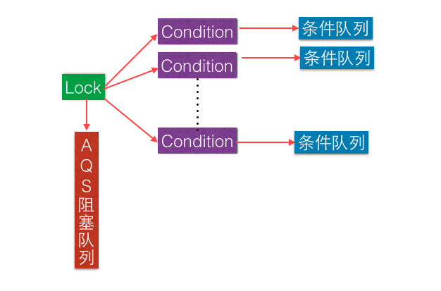
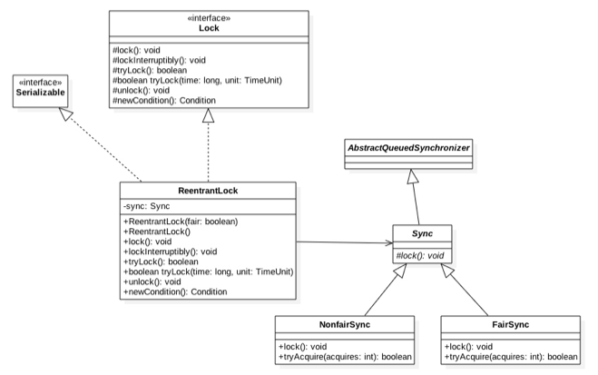
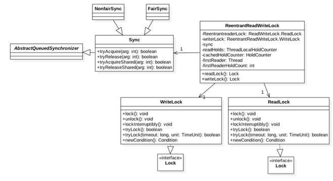
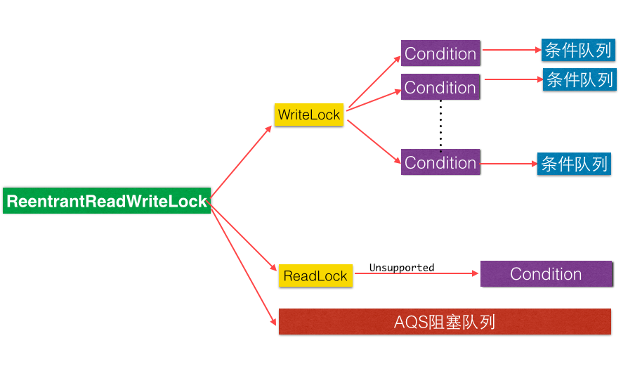
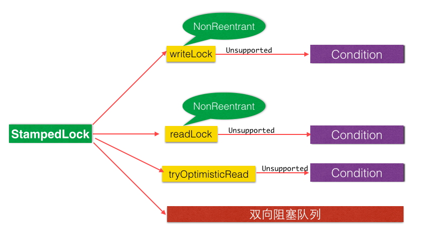

> 来源： https://gitbook.cn/books/5ac8a7e72a04fd6c83713956/index.html

#### 2.1 AQS - 锁的底层支持

AQS 是一个 FIFO 的双向队列。维持了一个单一的状态信息 `state`。对 AQS 来说，线程同步的关键是对状态值 `state` 进行操作，操作 `state` 的方式分为**独占模式**与**共享模式**。

独占方式下获取和释放资源的方法为：

```java
void acquire(int arg)
void acquireInterruptibly(int arg)
boolean release(int arg)
```

共享模式下获取和释放资源的方法为：

```java
void acquireShared(int arg)
void acquireSharedInterruptibly(int arg)
boolean releaseShared(int arg)
```

获取资源的方法中都有一个带有 `Interruptibly` 关键字的方法。

**不带** `Interruptibly` 关键字的方法不对中断进行响应。也就是线程在获取资源或者获取资源失败的时候，其它线程中断了该线程，那么该线程不会因为被中断而抛出异常，还是继续获取资源或者被挂起。即不会中断进行响应，忽略中断。

**带** `Interruptibly` 关键字的方法会对中断进行响应。即抛出 `InterruptedException` 异常而返回。

#### 2.2 AQS - 条件变量的支持

在调用共享变量的 `notify` 和 `wait` 方法前必须先获取该共享变量的内置锁，同理在调用条件变量的 `signal` 和 `await` 方法前必须先获取条件变量对应的锁。示例如下：

```java
ReentrantLock lock = new ReentrantLock();		
// 创建一个条件变量，一个 lock 可以对应多个条件变量
Condition condition = lock.newCondition();
// 如果在没有获取到锁前调用了条件变量的 await 方法会抛 java.lang.IllegalMonitorStateException 异常。
lock.lock();
				
try {
    // 阻塞当前线程
    condition.await();
    
} catch (Exception e) {
    e.printStackTrace();
} finally {
    lock.unlock();
}
```

```java
// 获取独占锁
lock.lock();
try {
    condition.signal();
} catch (Exception e) {
    e.printStackTrace();
} finally {
    lock.unlock();
}
```

如下图所示：一个锁对应一个 AQS 阻塞队列 (等待队列)，对应多个条件变量，每个条件变量都有一个各自的条件队列。



### 三、独占锁 ReentrantLock 原理

`ReentrantLock` 是可重入的独占锁，只能有一个线程可以获取该锁，其它获取该锁的线程会被阻塞后放入该锁的 AQS 阻塞队列 (等待队列) 中。

#### 3.1 类图结构简介



`ReentrantLock` 可以根据参数来决定使用公平锁还是非公平锁。默认使用公平锁。

```java
public ReentrantLock() {
    sync = new NonfairSync();
}

public ReentrantLock(boolean fair) {
    sync = fair ? new FairSync() : new NonfairSync();
}
```

`NonfairSync` 与 `FairSync` 分别实现了获取锁的非公平与公平策略。
非公平策略是指先尝试获取锁的线程并不一定比后尝试获取锁的线程优先获取到锁。

#### 3.2 获取锁

-   `void lock()` 
当一个线程调用该方法，如果没有其它线程获取该锁，并且当前线程之前没有获取该锁，则当前线程会获取到该锁，并设置当前锁的拥有者为当前线程，并且设置 AQS 的 `state` 的值为 `1`。
如果当前线程已经获取过该锁，则将 AQS 的状态值加 `1`。
如果该锁已经被其它线程持有，则当前线程会被放入 AQS 的阻塞队列 (等待队列) 中。

-   `void lockInterruptibly()` 
与 `lock()` 方法类似，只不过该方法会对中断进行响应。如果当前线程在调用该方法时，如果其它线程调用了当前线程 `interrupt()` 方法，则当前会抛出 `InterruptedException` 异常然后返回。

-   `boolean tryLock()` 
尝试获取锁，成功则返回 `true`，否则返回 `false`。该方法并不会引起线程阻塞。

-   `boolean tryLock(long timeout, TimeUnit unit)`
与 `tryLock()` 类似，不同之处在于设置了超时时间，如果超时没有获取到锁，则返回 `false`。

#### 3.3 释放锁

-   `void unlock()`
如果当前线程持有该锁，调用该方法会让 `AQS` 的 `state` 的值减 `1`。如果减去 `1` 之后，`state` 的值为 `0`，则释放该锁。
如果当前线程没有持有锁，调用该方法会抛出 `IllegalMonitorStateException` 异常。

### 读写锁 ReentrantReadWriteLock 原理
`ReentrantReadWriteLock` 采用读写分离，多个线程可以同时获取读锁。

#### 4.1 类图结构介绍



AQS 中维护了 `state` 状态来表示是否获取到了锁，但是 `ReentrantReadWriteLock` 需要维护读状态与写状态，一个 `state` 无法做到。所以 `ReentrantReadWriteLock` 使用 `state` 的高 `16` 位表示获取到读锁的线程个数，低 `16` 位表示获取到写锁的线程的可重入次数。

##### 4.1.1 写锁的获取与释放

`ReentrantReadWriteLock` 写锁通过内部类 `WriteLock` 来实现。

-   `void lock()`
    独占锁，只有一个线程可以获取该锁。
    如果当前线程没有获取到读锁或写锁，那么当前线程可以获取到写锁。
    如果已经有其它线程获取到读锁或写锁，那么当前线程将会被阻塞。
    写锁是可重入锁。

-   `void lockInterruptibly()`
    与 `lock` 方法类似。不同之处在于当前线程被中断，会抛出 `InterruptedException`。

-   `boolean tryLock()`
    尝试获取写锁。
    如果没有其它线程持有写锁或者读锁，那么当前线程获取写锁成功，并返回 `true`。
    如果已经有其它线程持有写锁或者读锁，那么会返回 `false`，当前线程不会被阻塞。
    如果当前线程已经持有了写锁，那么 AQS 的 `state` 的增加相应的计数并返回 `true`。

- `boolean tryLock(long timeout, TimeUnit unit)`
  与 `ReentrantLock` 类似。

- `void unlock()`
  与 `ReentrantLock` 类似。

##### 4.1.2 读锁的获取与释放

- `void lock()`
  获取读锁。
  如果没有其它线程获取写锁，则当前线程可以获取读锁，AQS 的高 `16` 位增加 `1`。
  如果有其它线程获取了写锁，则当前线程会被阻塞。

- `void lockInterruptibly()`
  上同

- `boolean tryLock()`
  尝试获取读锁。
  如果没有其它线程获取了写锁，则当前线程获取读锁会成功，并返回 `true`。
  如果已经有其它线程获取了写锁，则直接返回 `false`，当前线程不会被阻塞。
  如果其它线程已经获取了读锁，则将 AQS 的 `state` 高 `16` 位加 `1`，并返回 `true`。 

- `boolean tryLock(long timeout, TimeUnit unit)`
  上同

- `void unlock()`
  上同

`ReentrantReadWriteLock` 底层使用 AQS 实现，利用 `state` 的高 `16` 位表示获取读锁的线程个数，低 `16` 位表示获取写锁的线程的可重入次数。通过 CAS 操作进行操作，实现了读写分离，适用于在读多写少的场景。



#### 4.2 JDK8 新增的 StampedLock 锁探究
`StampedLock` 是 JDK 8 新增的一个锁，该锁提供了三种模式的读写控制。
当调用获取锁的函数时，会返回一个 `long` 型的 `stamp (标记)` 变量。这个 `stamp` 代表了锁的状态。
其中，当调用 `try` 系列函数时，获取锁失败之后会返回为 0 的 `stamp` 值。
当调用释放锁与转换锁的方法时，需要传入获取锁时返回的 `stamp` 值。

三种读写模式的锁如下：

- 写锁 (`writeLock`)：独占锁。

  同时只有一个线程可以获取该锁，当一个线程获取该锁后，其它请求读锁与写锁的线程必须等待。请求锁成功会返回一个 `stamp` 变量来表示该锁的版本。当释放锁时需要将 `stamp` 当作参数传递给 `unlockWrite()` 方法。

- 悲观锁 (`readLock`)：共享锁。适用于读少写多的情况。

  在没有现成获取独占锁的情况下，同时多个线程可以获取该锁。

  如果已经有线程持有写锁，其它线程获取该读锁会被阻塞。

  请求锁成功会返回一个 `stamp` 变量表示该锁的版本，当释放该锁时需要调用 `unlockRead()` 方法并传递该版本号。并且提供了非阻塞的 `tryReadLock()` 方法。

- 乐观读锁 (`tryOptimisticRead`)：使用读多些少的情况。

  通过位运算判断锁的状态，如果当前没有线程持有写锁，则返回一个非 0 的 `stamp` 变量表示版本信息，在具体操作数据之前还需要调用 `validate()` 方法验证 `stamp` 是否可用。如果 `validate()` 返回 `0`，则表示已经有其它线程获取了写锁，否则没有。

  由于 `tryOptimisticRead()` 方法并没使用使用 `CAS` 设置锁的状态，所以不需要显式的释放锁。

  因为没有涉及 `CAS` 操作，所以效率会高很多。但是由于没有使用真正锁，所以在实际操作数据时是拷贝了一份要操作的变量到方法栈中，也就是操作的一份快照。

`StampedLock` 支持这三种锁进行相互转换。并且读写锁都是不可重入的，所以在获取锁后不要再调用获取锁的操作，否则可能会产生死锁。

`StampedLock` 没有实现 `Lock` 或 `ReadWriteLock` 接口，而是内部维护了一个双向阻塞队列。

使用乐观读锁时需要保证如下的使用顺序：

```java
long stamp = lock.tryOptimisticRead(); // 非阻塞获取版本信息
copyVariable2ThreadMemory(); // 拷贝变量到线程本地堆栈
if (!lock.validate(stamp)) {
    long stamp = lock.readLock(); // 获取读锁
    try {
        copyVariable2ThreadMemory(); // 拷贝变量到本地方法堆栈
    } finally {
        lock.unlock(stamp); // 释放锁
    }
}

useThreadMemoryVaribale(); // 使用线程本地堆栈中的数据进行操作
```

`StampedLock` 提供的读写锁与 `ReentrantReadWriteLock` 类似，只是前者都是不可重入锁。但是前者通过乐观读锁在多线程读多的情况下有更好的性能，这是因为获取乐观读锁时不需要进行 `CAS` 操作设置锁的状态，只是简单的对状态进行测试。




